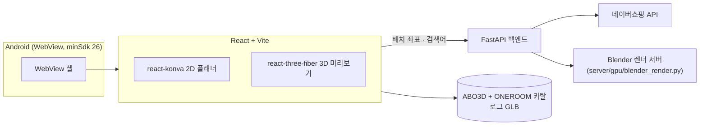

# 🧚 방꾸요정 — 원룸 실치수 가구배치

**방꾸요정**은 가구를 사기 전에 "이게 내 방에 들어갈까"를 실치수로 확인하는 앱입니다.
방 도면이나 치수를 넣으면 실제 상품 치수의 3D 가구를 겹치지 않게 자동 배치하고, 그 방을 포토리얼 사진으로 렌더해 보여준 뒤, 네이버쇼핑 실상품으로 연결합니다.

📱 **https://bangkku-fairy.madcamp-kaist.org** · 안드로이드 APK 제공([android/README.md](android/README.md)) · 3D 가구 203종


## 목차

- [팀원 소개](#팀원-소개)
- [핵심 기능](#핵심-기능)
- [기술 스택](#기술-스택)
- [아키텍처](#아키텍처)
- [기능 명세서](#기능-명세서)
- [실행 방법](#실행-방법)
- [폴더 구조](#폴더-구조)
- [KPT](#kpt)

## 팀원 소개

| GitHub | 이름 | 학교 |
|---|---|---|
| [omok00](https://github.com/omok00) | 이유담 | POSTECH 22 |
| [ywlee1127](https://github.com/ywlee1127) | 이예원 | SMWU 23 |

## 핵심 기능

- **방 만들기** — 평수 입력 추정 / 벽 한 변 실측 입력 / 도면 사진 업로드(AI 판독), 세 가지 방식 중 편한 대로
- **실치수 2D·3D 배치** — 드래그로 가구 배치, 90° 회전, 겹침·문/창문 간섭·방 밖 이탈 실시간 판정, 3D로도 둘러보기
- **AI 자동배치 & 채팅 편집** — AI가 알아서 배치하거나, "침대 더 크게 해줘"처럼 말로 바로 수정
- **가구 검색 & 구매 연동** — 분위기·사이즈·가격대 필터, 네이버쇼핑 실상품과 연결해 바로 구매
- **포토리얼 합성 미리보기** — 시간대·각도·조명 색온도별로 실제 사진처럼 확인, 360° 둘러보기
- **배치함 저장 & 재편집** — 완성한 배치를 저장해두고 언제든 불러와 이어서 편집
- **방꾸 이야기 커뮤니티** — 완성한 방 자랑·꿀팁·질문 공유, 좋아요·댓글

## 기술 스택

| | |
|---|---|
| Frontend | React + Vite · react-konva(2D 플래너) · react-three-fiber(3D 미리보기) |
| Backend | FastAPI · 네이버쇼핑 API grounding |
| Android | 배포된 웹앱을 감싸는 WebView 셸 |
| 3D 에셋 | [Amazon Berkeley Objects](https://amazon-berkeley-objects.s3.amazonaws.com/) 실측 GLB(치수 내장) |

## 아키텍처



배치·치수 판정(겹침/방밖 이탈)은 프런트에서 실치수 좌표로 직접 계산하고, FastAPI는 네이버쇼핑 grounding과 GPU 렌더 서버 호출만 중계합니다. 서버에는 리라이팅(`/api/relight`) 엔드포인트도 있지만 현재 화면 어디서도 호출하지 않는 미사용 경로입니다.

## 기능 명세서

### 화면 흐름

| 화면 | 컴포넌트 | 기능 |
|---|---|---|
| 스플래시 · 로그인 | `Splash.jsx`, `Login.jsx` | 카카오·구글 소셜 로그인 또는 건너뛰기 |
| 온보딩 | `Onboarding.jsx` | 무드·예산 등 취향 태그 선택 |
| 홈 | `HomeTab.jsx` | 진행 중이던 배치 이어하기, 방꾸 이야기 커뮤니티 피드 |
| 방 입력 | `RoomInput.jsx` | 평수 추정 / 벽 실측 입력 / 도면 사진 업로드(AI 판독) 3가지 |
| 배치 플래너 | `PlannerScreen.jsx`, `Planner.jsx`, `Room3D.jsx`, `CatalogPanel.jsx`, `OpeningsBar.jsx`, `LayoutChat.jsx` | 2D·3D 드래그 배치, 가구 담기, 문/창 설정, AI 자동배치·채팅 편집 |
| 합성 결과 | `CompositeResult.jsx`, `PanoViewer.jsx` | 배치를 포토리얼 사진으로 렌더, 시간대·각도·조명 변경, 360° 둘러보기 |
| 마켓 | `MarketTab.jsx` | 가구 검색·필터, 닮은 상품 추천 |
| 마이 | `MyTab.jsx` | 배치함 저장/삭제, 찜한 상품, 좋아요한 글 |

### 주요 API (`server/app/main.py`)

| 구분 | 엔드포인트 | 하는 일 |
|---|---|---|
| 방 입력 | `POST /api/floorplan` | 도면 사진 → 편집 가능한 방 초안(치수·문/창) |
| 배치 | `POST /api/layout` | AI 자동배치 — 겹침은 프런트가 기하로 재검증 |
| 배치 | `POST /api/chat-layout` | 대화형 배치 수정("침대 더 크게 해줘" 등) |
| 가구 | `GET /api/search` | 네이버쇼핑 가구 검색 |
| 가구 | `POST /api/recommend` | 닮은 상품 추천(LLM 검색어 생성 → 네이버 결과 병합) |
| 가구 | `GET /api/dims` | 상품 URL → 실치수 자동 채우기 |
| 렌더 | `POST /api/render` | 3D 배치 → Blender Cycles 포토리얼 사진(시간대/각도/360°) |
| 계정 | `GET/POST /api/auth/*` | 카카오·구글 소셜 로그인 |
| 배치함 | `POST/GET/DELETE /api/rooms` | 배치 저장·목록·삭제 |
| 커뮤니티 | `POST/GET/PUT/DELETE /api/community/*` | 글쓰기·피드·좋아요·수정·삭제 |

기획 초기 버전 문서는 [docs/방꾸요정-기능명세서.md](docs/방꾸요정-기능명세서.md)에 있습니다 — 위 표는 실제 코드(컴포넌트·엔드포인트)를 기준으로 다시 정리한 것이라, IKEA·오늘의집 등 이후 바뀐 부분과는 다를 수 있어요.

## 실행 방법

```bash
./run.sh            # 빌드 + 백엔드(8000) + 프런트(5173) 전부 시작
./run.sh stop        # 전부 중지
```

`run.sh`는 멱등이라 이미 떠 있는 건 재시작하지 않습니다. 백엔드는 선택 사항 — 없어도 프런트는 로컬 시드 카탈로그로 동작합니다.
개별 실행·API 키 설정·GPU 리라이팅 연동 등 자세한 옵션은 `run.sh`·`server/.env.example` 주석 참고.

## 폴더 구조

```
web/     React + Vite 프런트엔드 (2D/3D 플래너, 마켓, 커뮤니티)
server/  FastAPI 백엔드 — 네이버쇼핑 grounding, 배치함·커뮤니티 API
android/ 배포된 웹앱을 감싸는 WebView 네이티브 앱
docs/    기획서 · 기능 명세서 · 회의록
```

## KPT

**Keep** (계속할 것)
- 필터 기준·사이즈 임계값 같은 UI 설계를 감으로 정하지 않고, 실제 카탈로그 데이터 분포를 코드로 뽑아본 뒤 반영했다.

**Problem** (아쉬웠던 것)
- AI가 요구사항을 기대한 수준으로 반영하지 못하는 점이 아쉬웠다.
- 개발 서버 VM이 두 차례나 다운됐는데 정확한 원인을 찾지 못했다.

**Try** (다음에 시도할 것)
-실제 판매할 수 있는 가구들을 가져올 수 있었으면 좋겠다.
