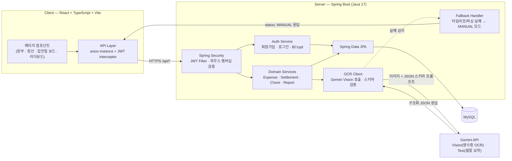
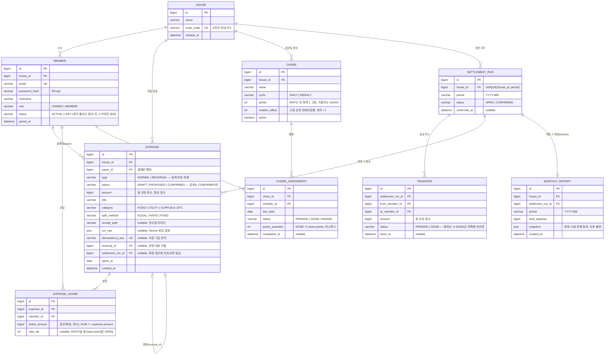

# 🏠 HouseLedger — 공동생활 운영 보드

> **"룸메이트 갈등의 90%는 기록이 없어서 생긴다."**

영수증 사진 한 장으로 시작하는 공동 장부 + 집안일 로테이션 + 월말 회고. 룸메이트 2~6명의 반복되는 공동생활을 기록하고, 투명하게 보여주고, 갈등이 되기 전에 청산하는 상시 운영형 서비스.

---

## 📖 프로젝트 소개

룸메이트 생활비 관리에 쓰이는 기존 도구는 셋 다 같은 지점에서 무너진다.

| 기존 도구 | 무너지는 지점 |
|---|---|
| 카카오톡 정산하기 | **1회성 이벤트 정산**에 최적화. "오늘 치킨값 나누기"는 되지만 "이번 달 휴지·세제·쌀의 누적 잔액"은 채팅 로그를 거슬러 올라가 수동으로 재구성해야 한다. |
| Splitwise | 정산 장부로는 훌륭하지만 **돈만 다룬다**. "설거지 내가 3번 연속 했는데?"를 적을 곳이 없고, 품목 15개짜리 마트 영수증을 수동 타이핑하다 지쳐 "대충 3만원 낸 걸로 치자"가 된다. |
| 엑셀/구글 시트 | **운영을 강제하는 구조가 없다**. 한 명이 빼먹는 순간 시트의 신뢰가 깨지고, 정정 이력이 없어 누가 언제 숫자를 고쳤는지 알 수 없다. |

공통 원인: **공동생활은 1회성 정산이 아니라 끝나지 않는 운영(operation)이다.** 매주 장을 보고, 매일 집안일이 돌고, 매달 관리비가 나온다. 필요한 것은 "이번 건 얼마씩" 계산기가 아니라 — 입력 마찰을 최소화하고(영수증 사진 한 장), 노동까지 포함해 기여를 누적 기록하고, 월 단위로 청산·회고를 강제하는 **운영 보드**다.

## 🎯 기획 의도

핵심 루프는 하나의 체인이다:

**영수증 사진 촬영 → Gemini Vision OCR로 품목·금액 추출 → 품목별 분담 지정 → 공동 장부 자동 기입 → 누적 잔액·기여도 갱신 → 집안일 로테이션과 합산된 리더보드 → 월말 정산·Wrap-up("이번 달 우리 집") → 잔액 청산 후 다음 달 루프 재시작**

설계 철학은 **기록 → 투명성 → 갈등 예방**이다.

- **기록**: 기록이 안 되는 이유는 게을러서가 아니라 귀찮아서다. 영수증은 사진 한 장(OCR 실패 시에도 동일 화면의 수동 입력 폼으로 흐름이 이어진다), 집안일은 완료 버튼 한 번으로 입력 비용을 극단적으로 낮춘다.
- **투명성**: 잔액은 "A가 B에게 12,300원" 형태의 최소 송금 쌍으로 상시 노출되고, 확정된 기록은 덮어쓰기 없이 정정 이력(reversal)으로만 바뀐다.
- **갈등 예방**: "느낌"이 아니라 숫자로 말하게 한다. 리더보드가 돈과 노동의 기여를 나란히 보여주고, 월말 정산이 감정이 쌓이기 전에 공식적인 청산·리셋 지점을 만든다.

## ✨ 주요 기능

| 기능 | 설명 | 단계 |
|---|---|---|
| 하우스 생성·초대 | 하우스 생성 시 6자리 초대 코드 발급, 코드 입력으로 합류(2~6인). 모든 API가 하우스 멤버십 검증으로 격리된다. | MVP |
| 영수증 OCR 정산 | 사진 업로드 → Gemini Vision이 품목·금액을 JSON으로 추출(타임아웃 10초 + 재시도 1회) → 사용자가 확인·수정·분담 지정 → 확정 시 장부 기입. 실패 시 같은 화면이 수동 입력 폼으로 전환된다. | MVP |
| 공동 장부 (Ledger) | 모든 지출의 단일 원장. **append-only** — 확정분은 수정·삭제 대신 정정(reversal)만 가능. 잔액은 매번 원장에서 재계산해 파생한다(캐시 컬럼 없음). MVP의 장부 목록은 지출만 표시하며, 집안일·정산 이벤트까지 섞인 활동 피드는 Stretch에서 이벤트 타입 확장으로 구현한다. | MVP |
| 정산 (최소 송금 상계) | 월 단위 순잔액을 그리디 상계로 압축해 "누가 누구에게 얼마" 송금 지시를 생성. OWNER 확정 후 잠금, 송금 완료는 **받는 사람**이 확인. | MVP |
| 집안일 로테이션 보드 | 집안일 등록 시 멤버 고정 순번으로 매주 자동 배정. 상태는 `PENDING / DONE / MISSED` 3개. 완료는 담당자 본인의 버튼 한 번. | MVP |
| 기여도 리더보드 | 이번 달 멤버별 **실부담액 합계**(지출 분담 기준)와 **집안일 포인트 합계** 두 지표만 집계. "돈은 A가, 몸은 B가" 같은 상호 기여가 한 화면에 드러난다. | MVP |
| 정정 처리 (Reversal) | 확정 지출의 취소는 `reversal_of`로 원본을 가리키는 정정 지출 추가로만 가능. 정정은 `PROPOSED`로 생성되고 **원 결제자가 승인해야** 잔액 집계에 반영된다. 원본과 정정이 모두 남아 "누가 몰래 고쳤다"는 의심을 구조적으로 차단한다. | MVP |
| 월말 Wrap-up ("이번 달 우리 집") | 정산 확정 시점의 카테고리별 지출·집안일 완수율·최다 기여자를 불변 스냅샷으로 동결. Gemini 텍스트 총평은 실패 시 템플릿 문장으로 대체. | Stretch |
| 집안일 고급 기능 | 난이도 가중치(1~5점), 포인트 균형 배정, 담당 스왑. | Stretch |

## 🏗️ 시스템 아키텍처



- **Client**: 단일 axios 인스턴스가 `Authorization: Bearer <JWT>`를 자동 첨부하고, 401 응답 시 로그인 화면으로 리다이렉트한다.
- **Server**: 컨트롤러 → 서비스 → JPA 리포지토리의 표준 3계층. Gemini 호출은 `OcrClient` 한 클래스로 격리해 도메인 로직이 외부 API 형식에 오염되지 않게 한다.
- **Fallback Handler**: Gemini 관련 실패는 예외를 던지지 않고 `{"status": "MANUAL"}` 정상 응답으로 변환한다. 클라이언트는 이 status만 보고 수동 입력 폼으로 전환하므로 AI 장애가 사용자 플로우를 끊지 않는다.
- **스케줄러는 단 하나**: 매주 월요일 00:00 집안일 배정 배치. 정산은 배치가 아니라 사용자 액션으로만 생성·확정된다.

## ⭐ Main Features

### 1. 정산 엔진 — 돈 계산은 결정적이어야 한다

금액은 전 구간(요청 DTO → 서비스 → DB)에서 **원 단위 정수 `BIGINT`(KRW)** 로만 다룬다. 부동소수점 금지 — 잔액 검증(`Σ balance == 0`)이 비트 단위로 성립해야 한다.

#### 1-1. 분할과 원 단위 나머지

| 방식 | 입력 | 계산 |
|---|---|---|
| `EQUAL` | 분담 멤버 목록 | 각자 `floor(amount / n)` |
| `RATIO` | 멤버별 basis point(합계 10000 검증) | 각자 `floor(amount × bp / 10000)` |
| `FIXED` | 멤버별 지정 금액 | 합계가 `amount`와 다르면 **400 에러** — 서버가 임의로 메꾸지 않는다 |

**나머지 규칙 (EQUAL·RATIO 공통, 결정적):** `remainder = amount − Σ floor분담액`은
1. 결제자(payer)가 분담 대상에 포함되어 있으면 → **결제자 share에 가산**
2. 결제자가 분담 대상 밖이면("제외" 분할 등) → **분담액이 가장 큰 멤버, 동률이면 `member_id` 최소인 멤버에게 가산**

예: 10,000원 3인 균등(결제자 포함) → 3,333 / 3,333 / **3,334(결제자)**. 10,001원을 결제자 제외 2인 분담 → 5,000 / **5,001(member_id 작은 쪽)**. 나머지는 건당 최대 `n−1`원(6인 기준 5원)이라 공정성 손실이 무시 가능하므로, "지난번 나머지를 누가 받았나"를 추적하는 상태 테이블을 만들지 않는다. 이 규칙 문구는 API 문서와 UI 툴팁에 **동일 문장**으로 노출해 "왜 1원 다르냐" 분쟁을 차단한다.

저장 시점에 서비스 레이어가 `SUM(share_amount) == amount`를 검증하고 위반 시 트랜잭션 롤백. 이 불변식이 아래 정산 알고리즘의 전제(`Σ balance == 0`)를 보장한다.

#### 1-2. Append-only 장부와 정정(Reversal)

- Expense의 라이프사이클: `DRAFT → CONFIRMED` (정정 지출은 `PROPOSED → CONFIRMED`). **잔액·정산·리더보드·통계는 `CONFIRMED`만 집계한다.**
- `DRAFT`는 업로더 본인이 수정·삭제 가능. **`CONFIRMED`에는 UPDATE·DELETE가 없다.** 취소는 `POST /expenses/{id}/reverse`로 `reversal_of`가 원본을 가리키는 정정 지출을 추가하는 것뿐이다.
- 부호 처리: `amount`와 `share_amount`는 **항상 양수**로 저장하고, `type` 컬럼(`NORMAL | REVERSAL`)에서 집계 부호를 파생시킨다. 양수 CHECK 제약과 음수 정정이 충돌하지 않는다.
- 정정은 `PROPOSED` 상태로 생성되고 **원 결제자가 승인(approve)해야 `CONFIRMED`가 되어 잔액에 반영**된다. 승인 대기 중인 정정은 어떤 집계에도 포함되지 않는다.
- 이미 `CONFIRMED`된 SettlementRun에 잠긴 지출의 정정은 다음 정산 주기에 귀속된다 — 지난달 리포트를 소급 변조하지 않는다.
- 이유 한 줄: 돈 분쟁에서 앱이 근거가 되려면 "어느 시점의 잔액이든 기록 재생으로 재현 가능"해야 하고, 제자리 수정은 그 감사 가능성을 파괴한다.

#### 1-3. 월 정산: 순잔액 → 최소 송금 상계

정산은 달력 월(`YYYY-MM`) 고정 주기다. 흐름은 전부 수동: **멤버 누구나 `POST /settlements`로 생성 → OWNER가 confirm → 받는 사람이 송금 확인.** 배치 자동 생성·72시간 자동 확정은 없다.

1. **중복 생성 차단** — `SETTLEMENT_RUN`에 `(house_id, period)` UNIQUE 제약. `POST /settlements`는 멱등이라 이미 있으면 기존 run을 200으로 반환한다. 두 멤버가 동시에 눌러도 run은 하나다.
2. **순잔액 계산** — 멤버별로 `balance(m) = Σ(m이 payer인 CONFIRMED expense의 부호 적용 amount) − Σ(m의 부호 적용 share_amount)`. 양수면 채권자, 음수면 채무자. `Σ balance == 0` assert가 깨지면 정산을 중단하고 에러를 낸다 — **돈 계산에서 침묵 실패 금지.**
3. **DONE Transfer 선반영** — `OPEN` 상태에서 재계산할 때 기존 `PENDING` Transfer는 삭제·재생성하지만, 이미 `DONE`된 Transfer는 **잔액에 먼저 반영**한다: `balance[from] += done.amount`, `balance[to] −= done.amount`. 이 규칙이 없으면 "이미 보낸 20,000원"이 무시되고 새 Transfer가 전액으로 다시 생겨 이중 송금이 발생한다.
4. **그리디 상계**:

```text
function settle(balances):            # Σ balances == 0 전제 (assert)
    balances ← applyDoneTransfers(balances)   # DONE 송금 선반영
    creditors ← [(m, b)  | b > 0]  금액 내림차순
    debtors   ← [(m, -b) | b < 0]  금액 내림차순
    transfers ← []
    i ← 0; j ← 0
    while i < |debtors| and j < |creditors|:
        pay ← min(debtors[i].amt, creditors[j].amt)
        transfers.add(from: debtors[i].m, to: creditors[j].m, amount: pay)
        debtors[i].amt   -= pay
        creditors[j].amt -= pay
        if debtors[i].amt   == 0: i++
        if creditors[j].amt == 0: j++
    return transfers                  # 항상 ≤ (멤버 수 − 1)건
```

- 이론상 최소 송금 횟수 탐색은 NP-hard지만 그리디는 `n−1`건 이하를 보장하고 n ≤ 6에서는 사실상 최적. 구현 단순성 > 이론적 최적. 순수 함수로 두고 단위 테스트로 검증한다 — AI가 개입할 자리가 아니다.
- OWNER가 confirm하면 소속 지출과 Transfer가 잠기고 되돌릴 수 없다. 송금 완료는 **받는 사람**이 확인 버튼으로 `DONE` 처리한다 — 돈이 오간 사실의 증인은 받은 쪽이다.

#### 1-4. 이중 기입 방지 (멱등성)

- `POST /expenses`, `POST /expenses/receipt`에 클라이언트 생성 **`Idempotency-Key` 헤더**(UUID)를 받아 `EXPENSE.idempotency_key` UNIQUE로 중복 삽입을 차단한다. 네트워크 타임아웃 후 재시도가 DRAFT 2건을 만들지 못한다.
- `POST /expenses/{id}/confirm`은 이미 `CONFIRMED`면 에러가 아니라 **no-op 200**이다.

#### 1-5. 입주·퇴거 (설계 기록 — MVP 범위 밖)

- **입주**: `EQUAL` 분할의 기본 분담 대상은 "지출 `spent_at` 시점의 `ACTIVE` 멤버". 신규 멤버는 입주 전 지출에 자동으로 엮이지 않는다.
- **퇴거는 MVP·Stretch 모두 미지원**(2주 캠프 범위 밖). 다만 구현 시의 규칙을 기록해 둔다: 퇴거 시점까지의 미정산 지출로 즉시 중간 정산을 돌리고, 관련 Transfer가 전부 `DONE`이어야 `LEFT` 전환. 이후 **`LEFT` 멤버를 분담 대상에 포함하는 지출·정정 생성은 서버가 400으로 거부**하고 등록자가 현 ACTIVE 멤버 간 `FIXED`로 재분배한다. `settle()` 입력에서 LEFT 멤버 잔액 ≠ 0이면 assert 실패 — 회수 불가능한 채권·채무를 만들지 않는다.

### 2. OCR 파이프라인 — "AI 결과는 확인 전까지 draft"

```
UPLOADED → PARSING → DRAFT → (사용자 확인·수정) → CONFIRMED
                └─ 실패 시 → MANUAL (수동 입력 폼, 상태는 여전히 DRAFT)
```

**1) 업로드 & Gemini Vision 호출** — 이미지(JPEG/PNG, 최대 10MB)를 받으면 원본을 디스크에 저장 후 Gemini Vision 호출. **타임아웃 10초, 재시도 1회** — 이 값은 문서·코드·UI 전체에서 단일 기준이다. 프롬프트에 응답 스키마를 명시하고 `responseMimeType: application/json`으로 강제한다:

```json
{
  "storeName": "string | null",
  "purchasedAt": "YYYY-MM-DD | null",
  "items": [
    { "name": "string", "quantity": "int", "price": "int(원 단위, 할인·포인트 행은 음수 허용)", "confidence": "0.0~1.0" }
  ],
  "totalAmount": "int",
  "confidence": "0.0~1.0"
}
```

재시도까지 실패하거나 스키마 검증(Jackson 역직렬화 + 필수 필드 체크)에 실패하면 Fallback Handler가 `MANUAL`을 반환한다.

**2) 검증 기준은 OCR이 아니라 사용자다** — 확정 게이트는 **"항목 합계 == 사용자가 확정한 총액 필드"** 다. OCR의 `totalAmount`는 총액 필드의 초기값일 뿐인 **수정 가능한 참고값**이며, 항목 합과 불일치하면 경고 배지를 띄운다. OCR이 총액을 오인식해도 사용자가 총액 필드를 고치면 확정할 수 있다 — 오인식 값이 검증의 '정답'이 되는 역설을 차단한다. 할인·포인트는 음수 `price` 항목 행으로 반영하되, 지출 총액(`amount`)은 항상 양수여야 한다.

**3) 확인·수정 UI (DRAFT)** — `confidence < 0.8` 필드는 노란 하이라이트 + "확인 필요" 배지. 인식 실패 셀은 빈 칸으로 둔다 — **그럴싸한 값을 지어내지 않는다.** 항목 추가/삭제/수정과 항목별 분담 지정이 자유롭다. **DRAFT는 정산·리더보드·어떤 집계에도 포함되지 않으며**, `confirm` 호출로만 `CONFIRMED`가 된다.

**4) Fallback (MANUAL)** — 수동 입력 폼은 확인·수정 UI와 **동일한 컴포넌트를 빈 값으로 렌더링**한 것이다. "AI가 채워준 폼"과 "직접 채우는 폼"이 같은 화면이므로 실패해도 흐름이 끊기지 않는다. 원본 이미지는 폼 옆에 나란히 띄워 보고 베끼며 입력할 수 있다. "다시 시도" 버튼은 옵션이지 관문이 아니다.

### 3. 집안일 로테이션 — MVP는 고정 순번, 상태 3개

- **배정**: 매주 월요일 00:00 배치가 그 주의 `ChoreAssignment`를 생성한다. 순서는 **고정 순번 로테이션** — ACTIVE 멤버를 `joined_at` 순으로 정렬하고, chore별 오프셋을 매주 1씩 증가시켜 순환한다. 결정적이고 상태 테이블이 필요 없다.
- **상태**: `PENDING → DONE / MISSED` 3개뿐. 완료는 담당자 본인의 버튼 한 번. `due_date` + 유예 24시간이 지난 `PENDING`은 보드 조회 시점에 서버가 `MISSED`로 전이한다(별도 스케줄러 불필요).
- **포인트**: MVP에서는 **모든 chore가 1점 고정** — 사실상 완료 횟수이며 리더보드의 집안일 지표가 된다. 난이도 가중치(1~5점)·포인트 균형 배정·담당 스왑은 묶어서 Stretch.
- **벌금 등 돈으로의 전환은 하지 않는다** — 집안일 포인트가 정산 장부에 섞이는 순간 `Σ balance == 0` 불변식 검증이 오염된다. MISSED 기록은 리더보드와 Wrap-up에 표시하는 것으로 충분하다.

### 4. 월말 Wrap-up ("이번 달 우리 집") — Stretch

`SettlementRun`이 `CONFIRMED`되는 순간 같은 트랜잭션에서 `MonthlyReport`를 생성한다.

- **스냅샷(불변, `snapshot` JSON에 동결)**: 멤버별 순잔액과 확정 Transfer 목록, 당시 멤버 구성(닉네임 포함), 멤버별 집안일 포인트·순위·MISSED 건수, 총지출·카테고리별 합계, 전월 대비 증감률(전월 리포트 없으면 생략), 이달의 MVP(포인트 1위, 동점 시 MISSED 적은 쪽).
- **AI 총평**: Gemini Text로 3문장 요약을 생성하되, 실패 시 템플릿 문장("이번 달 총지출 XX원, 지난달 대비 X%")으로 대체 — Wrap-up도 fallback 원칙의 예외가 아니다.
- **불변인 이유**: 마감 후 들어오는 정정은 다음 달 장부에 반영될 뿐 지난달 리포트를 다시 쓰지 않는다. 소급 변경되는 회고는 신뢰를 잃는다. 라이브 수치(진행 중 잔액, 이번 주 집안일)는 리포트가 아니라 보드 화면에서 매 요청 시 재집계한다.

## 🗃️ DB 스키마

금액 컬럼은 전부 **원 단위 정수 `BIGINT`(KRW), 양수 저장 + `type`으로 부호 파생**이다.



| 엔티티 | 한 줄 설명 |
|---|---|
| **House** | 정산 단위가 되는 집. 초대 코드로 멤버를 모은다. |
| **Member** | 계정 겸 하우스 구성원. 삭제하지 않는 설계(과거 지출 FK 보존)로 `LEFT` 상태만 예약해 둔다. |
| **Expense** | 지출 1건. OCR 결과는 `ocr_raw`에 원본만 보관하고, 장부에 반영되는 것은 사용자가 확정한 값뿐이다. |
| **ExpenseShare** | 지출 1건을 멤버별 분담액으로 쪼갠 행. 항상 `SUM(share_amount) == expense.amount`. |
| **SettlementRun** | 한 달의 정산. `(house_id, period)` UNIQUE로 중복 생성 차단, 확정 시 소속 지출 잠금. |
| **Transfer** | 정산 결과 "누가 누구에게 얼마" 송금 지시. 받는 사람이 DONE 처리. |
| **Chore** | 집안일 정의. MVP는 전 항목 1점·고정 순번. |
| **ChoreAssignment** | 특정 주의 집안일 배정·수행 기록. |
| **MonthlyReport** | 월말 Wrap-up 스냅샷(Stretch). 생성 이후 불변. |

## 🔌 핵심 API 명세

공통 prefix `/api`, 인증 필요 구간은 JWT 필수. `/houses/{houseId}/**`는 커스텀 어노테이션 `@HouseMemberOnly` + HandlerInterceptor 한 곳에서 멤버십을 검증하고 실패 시 403. JWT payload는 `userId`, `nickname`만 담는다(역할은 매 요청 DB 확인 — 토큰 재발급 없이 역할 변경 반영). Access token 24시간, refresh 없음(2주 범위 단순화). 비밀번호는 BCrypt(strength 10).

| # | Method | Path | 설명 |
|---|---|---|---|
| 1 | POST | `/auth/signup` | 회원가입 (email, password, nickname) |
| 2 | POST | `/auth/login` | 로그인 → JWT 발급 |
| 3 | GET | `/auth/me` | 내 정보 + 소속 하우스 조회 |
| 4 | POST | `/houses` | 하우스 생성, 생성자가 OWNER |
| 5 | POST | `/houses/join` | 초대 코드(6자리)로 가입, 6인 초과 시 409 |
| 6 | GET | `/houses/{houseId}` | 하우스 정보 + 초대 코드 |
| 7 | GET | `/houses/{houseId}/members` | 멤버 목록 (역할 포함) |
| 8 | POST | `/houses/{houseId}/expenses/receipt` | 영수증 업로드 → OCR → DRAFT 생성. 실패 시 `status: MANUAL`. `Idempotency-Key` 필수 |
| 9 | POST | `/houses/{houseId}/expenses` | 수동 지출 등록(DRAFT). `Idempotency-Key` 필수 |
| 10 | GET | `/houses/{houseId}/expenses?month=&status=` | 지출 목록 (월·상태 필터) |
| 11 | GET | `/houses/{houseId}/expenses/{id}` | 지출 상세 (항목·분담·정정 이력) |
| 12 | GET | `/houses/{houseId}/expenses/{id}/receipt-image` | 영수증 원본 이미지 — JWT 인증된 일반 GET |
| 13 | PATCH | `/houses/{houseId}/expenses/{id}` | **DRAFT만** 수정 — 업로더 본인 |
| 14 | DELETE | `/houses/{houseId}/expenses/{id}` | **DRAFT만** 삭제. CONFIRMED는 삭제 불가 — reverse만 가능 |
| 15 | POST | `/houses/{houseId}/expenses/{id}/confirm` | DRAFT → CONFIRMED. 이미 CONFIRMED면 no-op 200 |
| 16 | POST | `/houses/{houseId}/expenses/{id}/reverse` | 정정 지출 생성 (`PROPOSED`, 사유 포함) |
| 17 | POST | `/houses/{houseId}/expenses/{id}/approve` | 정정 승인 → CONFIRMED, 잔액 반영 — **원 결제자만** |
| 18 | GET | `/houses/{houseId}/settlements/preview?month=` | 정산 미리보기 (DB 변경 없음) |
| 19 | POST | `/houses/{houseId}/settlements` | 해당 월 정산 생성(OPEN). 멱등 — 이미 있으면 기존 run 200 반환 |
| 20 | POST | `/houses/{houseId}/settlements/{id}/confirm` | **정산 확정 — OWNER, 되돌릴 수 없음.** 소속 지출 잠금 |
| 21 | POST | `/houses/{houseId}/settlements/{id}/transfers/{tid}/complete` | 송금 완료 확인 — **받는 사람 본인** |
| 22 | GET | `/houses/{houseId}/settlements` | 정산 이력 목록 |
| 23 | POST | `/houses/{houseId}/chores` | 집안일 정의 — OWNER |
| 24 | PATCH | `/houses/{houseId}/chores/{id}` | 집안일 수정·비활성화 — OWNER |
| 25 | GET | `/houses/{houseId}/chores/board?week=` | 주간 로테이션 보드 (조회 시 기한 경과 PENDING → MISSED 전이) |
| 26 | POST | `/houses/{houseId}/chores/assignments/{id}/complete` | 할당 완료 — 담당자 본인 |
| 27 | GET | `/houses/{houseId}/leaderboard?month=` | 멤버별 실부담액 합계 + 집안일 포인트 합계 |
| 28 | GET | `/houses/{houseId}/reports/{month}` | 월말 Wrap-up 스냅샷 (Stretch) |
| 29 | POST | `/houses/{houseId}/reports/{month}/summary` | AI 총평 재생성, 실패 시 템플릿 반환 (Stretch) |

- 정산 확정처럼 되돌릴 수 없는 작업은 반드시 별도 `confirm` POST로 분리한다 — PATCH의 상태 필드로 처리하지 않는다. 클라이언트는 confirm 전 "확정 후 되돌릴 수 없습니다" 모달을 강제한다.
- 권한 요약: OWNER 전용은 **정산 확정, 집안일 정의·수정, 하우스 설정**. 그 외(지출 등록·확정, 정정 요청, 본인 할당 완료, 정산 생성·preview)는 전 멤버 가능. 정정 승인은 역할 무관 **원 결제자**. OWNER 탈퇴 시 가입일이 가장 오래된 멤버에게 자동 승계(별도 위임 UI 없음).

## 📱 화면 구성

| 화면 | 설명 |
|---|---|
| **① 대시보드 — "오늘 우리 집"** | 내 잔액 카드(`-12,400원 · 민수에게 보낼 돈 있음`, 0원이면 "정산 완료 ✓"), 오늘 내 당번 칩(탭 → 즉시 완료 체크), 이번 달 총지출·전월 대비 증감. 플로팅 버튼으로 영수증 업로드 진입. |
| **② 영수증 업로드·확인** | 원본 사진과 OCR 추출 테이블을 나란히. 저신뢰 셀은 노란 하이라이트, 인식 실패 셀은 빈 칸. 모든 셀 인라인 수정 + 항목별 분담 지정. "항목 합 ≠ 확정 총액"이면 확정 버튼 비활성 + 사유 표시. OCR 실패 시 같은 화면이 빈 폼으로 전환. |
| **③ 공동 장부 — 타임라인** | 시간 역순 지출 목록(썸네일 + 금액 + `4명 균등` 분할 요약), 월 구분선. 정정된 지출은 취소선으로 남고 사라지지 않는다. 필터(내가 낸 것만/멤버별). Stretch에서 집안일·정산 이벤트로 타입 확장. |
| **④ 정산 화면** | 최소 송금 쌍(`지연→민수 23,000원`)과 각 금액 아래 "지출 7건에서 계산됨" 드릴다운 링크. 받는 사람이 송금 확인 버튼으로 DONE 처리, OWNER만 확정 버튼 노출. |
| **⑤ 집안일 보드** | 주간 캘린더 그리드 — 행은 집안일, 셀은 담당자 아바타 + 상태(PENDING/DONE/MISSED). 로테이션 규칙이 행 헤더에 명시. "놓침"은 시스템이 기록한다 — 잔소리를 사람이 아니라 시스템이 하게. |
| **⑥ 리더보드** | 이번 달 멤버별 실부담액 합계와 집안일 포인트, 두 지표를 나란히 놓은 카드 배열. 각 수치 탭 → 근거 목록 드릴다운. 꼴찌 강조·벌칙 UI는 없다 — 소규모 공동체에서 공개 망신은 갈등을 만든다. |
| **⑦ 월말 Wrap-up (Stretch)** | 총지출·카테고리 상위 3개·전월 대비·집안일 완수율·미정산 경고 + AI 3문장 총평(실패 시 템플릿). 지난달 리포트 넘겨보기. "회고 → 다음 달" 순환이 종료 없는 서비스의 리듬을 만든다. |

**신뢰 UX 원칙 — 모든 돈 숫자는 근거로 내려간다**: 화면의 모든 금액은 탭 가능하며 드릴다운이 끊기지 않는다. `내 잔액 -12,400원` → 구성 지출 3건 → 개별 지출 분할 상세 → 원본 영수증 + 수정 이력. AI가 만든 값(`자동 인식` 배지)과 사람이 확정한 값(연필 아이콘)을 시각적으로 구분하고, **확정되지 않은 숫자는 어떤 집계에도 포함되지 않는다.** 검증 비용이 0에 수렴할 때 기록이 갈등을 대체한다.

## 🛠️ Tech Stack

| 구분 | 기술 | 용도 |
|---|---|---|
| Frontend | React + TypeScript + Vite + React Router | SPA, 온보딩 라우트 가드, mock 데이터 병행 개발 |
| HTTP | axios (단일 인스턴스 + interceptor) | JWT 자동 첨부, 401 → 로그인 리다이렉트 |
| Backend | Java 17 + Spring Boot | 컨트롤러–서비스–리포지토리 3계층 |
| 인증 | Spring Security + JWT + BCrypt(strength 10) | access token 24h, 멤버십 검증 인터셉터 |
| ORM / DB | Spring Data JPA + MySQL | 금액은 전부 BIGINT(원), UNIQUE 제약으로 멱등성 |
| AI | Gemini API — Vision(영수증 OCR) · Text(월말 총평) | 항상 local fallback 동반, `OcrClient`로 격리 |
| 배포 | KCloud VM + Nginx + systemd | 정적 파일 서빙 + `/api/*` reverse proxy, 환경 파일로 시크릿 주입 |

**배포 구성**: KCloud VM 한 대. Nginx가 80/443을 받아 Vite 빌드 정적 파일을 서빙하고 `/api/*`만 `localhost:8080`으로 프록시. MySQL은 같은 VM의 localhost 인스턴스(외부 포트 미개방). Spring Boot는 systemd 서비스로 자동 재시작, `GEMINI_API_KEY`·`JWT_SECRET`·DB 비밀번호는 `/etc/houseledger/env`로 주입(레포 커밋 금지). 영수증 이미지는 `/var/houseledger/uploads`에 저장하고 JWT 인증된 API(#12)로만 접근. **백업은 첫 주에 건다** — 새벽 4시 cron으로 `mysqldump` + 업로드 디렉토리 tar, 주 단위 순환 보관. 돈 기록을 다루는 서비스이므로 단일 VM이라도 백업은 MVP다.

## 🚧 개발 로드맵

**MVP 완료 기준 — 1주차 종료 시 이 시나리오가 데모 가능해야 한다:** "회원가입 → 하우스 생성 → 룸메이트가 코드로 합류 → 영수증 업로드 → OCR 결과 확인·분담 지정 → 확정 → 장부에서 '누가 누구에게 얼마' 확인 → 집안일 완료 처리 → 리더보드 갱신." **그리고 Gemini API 키를 뽑아도 같은 시나리오가 수동 입력으로 성립해야 한다.**

### MVP (1주차)
- [ ] **0일차: API 명세 + ERD 확정** — merge 이후 기준을 잃지 않기 위한 선행 작업, 이후 각자 착수
- [ ] 회원가입·로그인 (JWT + BCrypt), 하우스 생성·초대 코드 합류
- [ ] 지출 등록: 영수증 OCR(10초 + 재시도 1회) + **수동 입력 fallback** — fallback은 Stretch가 아니라 MVP다
- [ ] DRAFT → CONFIRMED 라이프사이클, `Idempotency-Key` 이중 기입 방지
- [ ] 공동 장부 + 잔액 계산 (CONFIRMED만 집계, `Σ balance == 0` assert)
- [ ] 정산: preview → 생성(멱등) → OWNER 확정 → 받는 사람 송금 확인, DONE 선반영 재계산
- [ ] 정정(reversal): PROPOSED 생성 → 결제자 승인 → 잔액 반영
- [ ] 집안일: 등록·주간 고정 순번 배정·완료/MISSED 처리
- [ ] 리더보드 (실부담액 + 집안일 포인트)
- [ ] KCloud 배포 + DB 백업 cron
- [ ] `settle()`·분할·나머지 규칙 단위 테스트

역할 분담: 백엔드는 인증·하우스·장부·잔액 계산을 먼저 뚫고 OCR 연동은 그다음(프론트가 수동 입력 폼으로 먼저 통합 테스트 가능). 프론트는 장부·보드 화면을 mock 데이터로 병행 개발하다 명세 기준으로 접합.

### Stretch (2주차) — 우선순위순, 시간 부족 시 아래부터 자른다
- [ ] 월말 Wrap-up: MonthlyReport 스냅샷 + AI 총평(템플릿 fallback)
- [ ] 활동 피드: 장부 타임라인의 이벤트 타입 확장 (집안일 완료·정산·멤버 합류)
- [ ] 집안일 고급: 난이도 가중치(1~5) + 포인트 균형 배정 + 담당 스왑
- [ ] 카테고리별 지출 차트
- [ ] ~~퇴거 정산~~ — 범위 제외, 설계만 기록 (1-5절)

## ⚠️ 리스크와 대응

| 리스크 | 시나리오 | 대응 |
|---|---|---|
| OCR 실패·장애 | 데모 당일 Gemini 타임아웃/쿼터 초과 | Fallback Handler가 `MANUAL` 정상 응답으로 변환, 동일 컴포넌트의 수동 입력 폼으로 무단절 전환. fallback 경로를 데모 리허설에 포함 |
| OCR 오인식 | 총액 45,200원을 4,520원으로 인식 | 검증 기준은 OCR이 아니라 **사용자 확정 총액**. 저신뢰 필드 하이라이트, 실패 셀은 빈 칸(값을 지어내지 않음) |
| 이중 기입 | 업로드 재시도로 DRAFT 2건 → 둘 다 확정 | `Idempotency-Key` UNIQUE 제약, confirm은 no-op 200 |
| 이중 송금 | OPEN 정산 재계산이 이미 보낸 돈을 무시 | DONE Transfer를 잔액에 선반영 후 그리디 재실행 (1-3절 3항) |
| 정산 분쟁 | "누가 몰래 숫자를 고쳤다" | append-only + 정정 승인 워크플로 + 모든 금액의 근거 드릴다운. `Σ balance == 0` assert로 침묵 실패 금지 |
| 정산 중복 생성 | 두 멤버가 동시에 정산 생성 | `(house_id, period)` UNIQUE + 멱등 POST |
| 스코프 초과 | 2인×2주에 기능이 넘침 | 퇴거·고정비·게이미피케이션·공유 링크·이의 제기는 애초에 범위 제외. Stretch는 자르는 순서를 미리 합의 |
| 데이터 유실 | 단일 VM 장애 | 1주차부터 mysqldump + 업로드 tar 주간 백업 cron |
| merge 기준 상실 | 프론트·백엔드가 다른 가정으로 개발 | 0일차에 API 명세·ERD 확정, 타임아웃(10초)·나머지 규칙 등 모든 수치는 문서 단일 기준 |