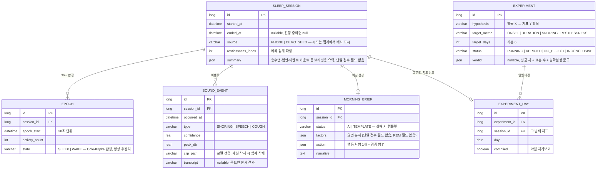
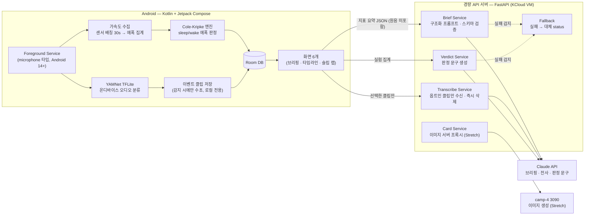

# 🌙 NightRecap — 기능 계획서

> **개발 2인 팀을 위한 "무엇을 · 어떻게 · 언제" 문서.** 왜 이 제품인지(시장·차별화·경쟁분석)는 기획서(`NightRecap.md`)에서 끝냈다. 이 문서는 실제로 짤 기능과 그 동작·데이터·일정, 그리고 **원칙을 코드/스키마로 어떻게 강제하는가**만 다룬다. 스펙 문서의 하드 넘버(에폭 30초, 브리핑 10초+재시도 1회, 코골이 94~95%, sleep/wake 78~80%, 배터리 시간당 1~3%, MVP/Stretch 경계)를 단일 기준으로 그대로 따른다. 근거 수치의 정본·인용은 **§10에 모아 둔다.**

---

## 1. 개요 & 핵심 사용자 루프

폰 하나로 밤새 소리 이벤트(코골이·잠꼬대·기침)와 뒤척임을 온디바이스로 기록하고, 아침에 "들리는 증거 + 서사 브리핑 + 검증 가능한 행동 처방 1개"로 돌려준 뒤, 그 처방이 나에게 실제로 통하는지를 N일 자기실험으로 판정하는 앱이다.

핵심 루프는 하나의 체인이다:

**취침 버튼(또는 충전+심야 자동 제안) → 온디바이스 측정(가속도 액티그래피 + YAMNet 소리 게이트) → 아침 브리핑(타임라인·클립 재생·요인 분해·행동 처방 1개) → 슬립 랩에 가설 등록 → 매일 준수/비준수 태깅 → N일 후 효과 판정 → 검증된 습관만 아카이브에 남는다**

이 문서가 강제하는 세 축은 스펙 문서와 동일하다: **정직한 측정**(방어 가능한 수치만 화면에 올린다) · **들리는 증거**(점수가 아니라 오디오·타임스탬프가 주인공) · **검증된 처방**(LLM은 요약이 아니라 구조화 출력만 낸다). 세 축 모두 하나의 엔지니어링 원칙으로 수렴한다: **AI·GPU 장애는 예외가 아니라 대체 status로 흡수되어 사용자 플로우를 끊지 않는다.**

---

## 2. 기능 목록 (우선순위)

| 기능 | 설명 | 단계 |
|---|---|---|
| 수면 세션 기록 | 취침 버튼 1회(또는 "충전 중 + 00시 이후" 자동 제안)로 포그라운드 서비스 시작. 가속도 센서 30초 배칭 수집, 배터리 시간당 1~3%. | MVP |
| 소리 이벤트 게이트 | 16kHz mono 마이크 → dB 1차 게이트 → YAMNet(TFLite) 분류 → `Snoring/Speech/Cough` 감지 시에만 전후 수초 클립 저장. 원음은 기기 밖으로 안 나간다. | MVP |
| 밤 타임라인 | 뒤척임 강도 밴드 + 소리 이벤트 마커를 한 축에. 마커 탭 → 클립 재생. 코골이 중단-재개 패턴 표시. | MVP |
| 히프노그램(추정치) | Cole-Kripke/Sadeh 가중합 Kotlin 이식으로 30초 에폭 sleep/wake → light/deep 휴리스틱. **"추정치" 배지 상시, REM 미표시.** | MVP |
| 아침 브리핑 | Claude가 지표·이벤트 시퀀스를 받아 스키마 강제 브리핑 생성(요인 분해 + 행동 처방 1개 + 내일 검증법). 실패 시 로컬 템플릿. | MVP |
| 잠꼬대 옵트인 전사 | 밤중 `Speech` 클립 중 **사용자가 명시적으로 고른 것만** 서버 STT 전사. 옵트인 전 어떤 클립도 업로드 안 됨. | MVP |
| 슬립 랩(자기실험) | 처방을 가설 카드로 등록 → 매일 준수 태깅 → 목표일 충족 시 준수일 vs 비준수일 지표 비교 판정(효과 크기 + 불확실성). | MVP |
| 데모 모드 | 발표장 오디오 릴 라이브 감지 + 팀 실측 6~7일치 시드 뷰 + 개발자 시드 토글. **발표 필수 → MVP.** | MVP |
| 수면 카드 | 그 밤을 요약한 이미지 카드를 camp-4 3090 서버로 생성. 실패 시 텍스트 카드. | Stretch |
| Health Connect 오버레이 | 갤럭시워치/삼성헬스 수면 단계·심박을 폰 추정과 3-way 대조. **코어 비의존, 죽어도 앱 성립.** | Stretch |
| 주간 리듬 리포트 | 소셜 제트래그·규칙성 지수·수면부채 추세. 타임스탬프만으로 계산되어 가볍다. | Stretch |

Stretch는 위→아래 우선순위순이며, 시간 부족 시 아래부터 자른다(자르는 순서는 D0에 합의).

---

## 3. 기능 상세

### 3-(a). 측정 파이프라인 — 방어 가능한 숫자만 만든다

#### 3-(a)-1. 가속도 액티그래피

- `TYPE_ACCELEROMETER`를 `maxReportLatencyUs ≥ 30초` 센서 배칭으로 등록한다. CPU를 밤새 깨우지 않고 하드웨어 FIFO에 모았다 배치로 flush → 배터리 시간당 1~3% 유지. Android 9+는 백그라운드 앱에 연속 센서 이벤트를 주지 않으므로 **포그라운드 서비스(상시 알림)가 필수**이고, Android 14+에서는 `FOREGROUND_SERVICE_MICROPHONE` 타입을 선언한다.
- 30초 에폭별 움직임 카운트에 **Cole-Kripke/Sadeh 가중 커널**을 적용해 sleep/wake를 판정한다. 알고리즘은 "가중합 + 임계값"이라 Kotlin 수십 줄로 끝난다. 판정 로직은 **순수 함수**로 격리하고 단위 테스트로 검증한다(에폭 배열 입력 → sleep/wake 배열 출력, 골든 케이스 고정). 원본 가속도 스트림은 에폭 집계 후 폐기하고 `Epoch` 행만 남긴다.
- light/deep은 sleep 구간 내부의 움직임 밀도로 나눈 **휴리스틱**이며 별도 검증 근거가 없으므로 히프노그램은 접힌 섹션에 두고 배지를 단다.

**정직 3계명(REM 미계산·추정치 배지·단일점수 폐지)의 정본·근거 수치는 §10.** 측정 파이프라인은 이 불변식을 다음과 같이 **구조로 강제**한다 — 규칙을 지키는 게 아니라 어길 경로 자체를 없앤다:

1. sleep/wake·light/deep 값은 **"추정치" 배지 컴포넌트를 거쳐서만** 렌더링된다(배지 없는 렌더 경로 부재).
2. **스키마·산출물 어디에도 REM 필드를 두지 않는다** — 계산할 자리가 없으므로 표시될 수도 없다.
3. `summary`·`MorningBrief`에 **단일 점수 필드가 존재하지 않는다** — 브리핑은 요인 분해 JSON(§3-(b))만 생성한다.

#### 3-(a)-2. 소리 이벤트 게이트 (YAMNet · 클립만 저장)

```
마이크 16kHz mono ─→ dB 1차 게이트 (임계값 미만 프레임 즉시 폐기, 분류기 미호출)
                    └→ YAMNet TFLite 분류 (AudioSet 521클래스 학습)
                        └→ Snoring / Speech / Cough 중 confidence ≥ τ 인 경우에만
                            전후 수초 링버퍼를 클립으로 flush + SoundEvent 기록
```

- YAMNet은 **TFLite Task Library(Audio) + Google 공식 안드로이드 오디오 분류 코드랩** 기반으로 통합한다 — 사실상 플러그앤플레이(16kHz mono 고정). 코골이 이진 감지는 정확도 **94~95%(검증됨 — §10 하드 넘버 표)로 재현되는 쉬운 문제**라 데모 신뢰의 축이다.
- dB 게이트가 조용한 프레임에서 분류기 호출 자체를 막아 연산·오탐을 동시에 줄인다. dB 임계값과 confidence 임계값 `τ`는 개발 첫 주 자가측정으로 튜닝하고 **Kaggle 코골이 ~1,000샘플로 오프라인 검증**한다. 튜닝 결과 수치는 이 문서와 앱 설정에 **단일 기준**으로 기록한다(코드에 매직넘버 금지).
- **감지 대상은 코골이·잠꼬대·기침 3종으로 고정한다.** 이갈이는 원거리 폰 마이크 검증 사례가 없어 코어에서 제외한다.
- 무호흡 관련 산출물은 **"코골이 중단-재개 패턴" 표시 + "호흡 불규칙성 힌트" 표현 + 병원 검사 권유 문구**까지만이다. 진단·치료·의료기기성 표현은 스키마·UI·발표 어디서도 금지한다(§10 의료 표현 상한).

#### 3-(a)-3. 프라이버시 — 밤새 녹음 앱이 신뢰받는 조건

- 연속 원음은 어디에도 저장하지 않는다. 저장 대상은 이벤트 전후 수초 클립뿐이며, 클립은 앱 내부 저장소에만 존재하고 세션 삭제 시 함께 삭제된다.
- 서버 업로드는 두 경우뿐: ① 집계된 **지표 요약 JSON**(이벤트 횟수·시각·에폭 집계 — 원음 없음), ② 사용자가 아침에 **개별 선택한 전사 대상 클립**. 선택 전 어떤 클립도 기기를 떠나지 않으며, 전사 후 서버 측 클립은 응답 직후 폐기한다.
- 기숙사(룸메이트 있음)를 기본 시나리오로 상정한다: 온보딩에서 "같은 방 사람의 소리도 녹음될 수 있음"을 고지하고, **클립 일괄 삭제 버튼을 세션 화면 1뎁스**에 둔다.

### 3-(b). 아침 브리핑 — "지표 낭독 금지"를 스키마로 강제한다

지표 낭독("Python 스크립트로도 됨")을 막기 위해 브리핑 출력을 스키마로 강제한다 — 왜 자유 요약이 시장에서 실패하는지의 경쟁분석 논증은 기획서에 있다. 이 문서가 정하는 것은 **낭독을 코드에서 어떻게 불가능하게 만드는가**다. `/api/brief`는 자유 텍스트가 아니라 다음 스키마만 받는다:

```json
{
  "narrative": "그 밤의 서사 브리핑 3~5문장 — 이벤트 시퀀스를 인과로 엮는다",
  "factors": [
    { "name": "REGULARITY | SOUND | RESTLESSNESS | DURATION",
      "state": "GOOD | MIXED | BAD",
      "evidence": "근거 한 줄 (클립·수치 참조)" }
  ],
  "action": { "what": "오늘 밤 바꿀 행동 딱 1개", "why": "내 데이터 기반 근거", "verify": "내일 아침 무엇으로 확인할지" },
  "hypothesis_candidate": "슬립 랩에 등록할 만하면 가설 문장, 아니면 null"
}
```

- **행동은 반드시 1개다** — 처방 목록은 곧 무시 목록이다.
- **출력 강제 3중 방어**: ① 프롬프트에 스키마 명시 + JSON 응답 강제, ② 서버가 Pydantic으로 역직렬화·필수 필드·enum 검증, ③ 통과분만 클라이언트로. 하나라도 어긋나면 실패로 취급한다.
- **타임아웃 10초 + 재시도 1회.** 재시도까지 실패하거나 스키마 검증에 실패하면 서버는 예외 대신 `{"status": "TEMPLATE"}`를 200으로 반환한다. 앱은 로컬 지표로 템플릿 브리핑("총 수면 X시간(추정치), 코골이 N회, 어제보다 뒤척임 M% 감소")을 렌더링한다. **Claude 키를 뽑아도 아침 브리핑 화면은 성립해야 한다.** 템플릿 fallback은 Stretch가 아니라 MVP다.
- 지난 브리핑의 `action` 이력을 요청 컨텍스트에 포함해 같은 조언의 반복을 막는다 — 반복 추천→피로→이탈이 왜 이탈의 핵심인지는 기획서 경쟁분석 참조. 엔지니어링적으로는 최근 `action` 배열을 프롬프트에 주입하는 것으로 끝난다.
- 화면 구분: AI가 만든 문장(`narrative`)과 측정 사실(클립·타임스탬프)을 시각적으로 분리하고, 브리핑이 템플릿 경로면 상단에 표시한다(숨기지 않는다).

### 3-(c). 슬립 랩 — 조언하는 앱이 아니라 검증하는 앱

SleepCoacher(UIST 2016)의 1인 자기실험 프레임을 LLM과 결합한다 — 왜 이 조합이 시장 공백인지의 차별화 논증은 기획서에 있다. 이 문서가 정하는 것은 그 프레임을 **어떤 스키마·순수 함수로 구현하는가**다.

- **가설 등록**: 브리핑의 `hypothesis_candidate` 또는 수동 입력으로 실험 카드를 만든다. 형식 고정 — "행동 X를 하면 지표 Y가 개선된다"(예: "15시 이후 카페인 금지 → 입면 시각 앞당겨짐"). `target_metric`은 `ONSET | DURATION | SNORING | RESTLESSNESS` 중 하나로 강제한다.
- **매일 태깅**: 아침 브리핑 하단에서 어제 준수 여부를 버튼 한 번으로 기록한다. 측정과 달리 이것만은 자기보고다 — 마찰을 최소화한다(`ExperimentDay.complied`).
- **판정**: 목표 일수(**기본 6일, 준수·비준수 각 최소 2일**)가 차면 준수일 vs 비준수일의 대상 지표를 비교한다. **통계 계산은 로컬 순수 함수 + 단위 테스트**이고, Claude에는 `/api/verdict`로 판정 **문구 생성만** 맡긴다. 표본이 극소라는 사실을 숨기지 않는다 — 평균 차이와 함께 불확실성을 명시한다("준수 3일 평균 입면 00:41 vs 비준수 3일 01:12 — 31분 차이, 표본이 작아 참고용").
- **결과 축적**: 판정 완료 실험은 `VERIFIED / NO_EFFECT / INCONCLUSIVE` 라벨로 아카이브된다. 이 아카이브가 곧 "나에게 실제로 통하는 수면 습관 목록"이며 제품의 최종 산출물이다.

### 3-(d). 데모 모드 — "하룻밤 자야 보인다" 문제의 정면 해결

발표장에서 잘 수 없다는 구조적 난제를 세 축으로 푼다. **데모 모드는 Stretch가 아니라 MVP다.**

1. **라이브 감지**: 발표장 스피커로 코골이·한국어 잠꼬대·기침이 섞인 오디오 릴을 재생 → 무대 위 폰이 실시간 감지해 타임라인에 마커가 찍히고, 탭하면 방금 잡힌 클립이 재생된다. 코골이 이진 분류가 94~95%(§10) 재현되므로 라이브 실패 확률이 낮고, 심사자가 직접 소리를 내보게 할 수도 있다. 라이브 감지 경로는 반드시 리허설에 포함한다.
2. **실측 시드**: 팀 2인이 **개발 0일차 밤부터 매일 실측**해 발표일에 6~7일치 진짜 데이터를 확보한다(`source = PHONE`). 슬립 랩 데모는 "우리가 캠프 기간 직접 돌린 실험" 판정 카드를 실데이터로 보여준다 — "하룻밤에 데이터 하나"라는 제약을 약점이 아니라 제품 전제(진짜 실험은 며칠 걸린다)로 프레이밍한다.
3. **백업 시드 토글**(개발자 메뉴, `source = DEMO_SEED`): 리허설·스크린샷용이며, 발표에서 시드임을 숨기지 않는다(집계·화면에서 배지로 구분 표시).

---

## 4. 화면 명세

| 화면 | 핵심 요소 | 동작·제약 |
|---|---|---|
| **① 홈 — "오늘 밤"** | 취침 시작 버튼(화면의 전부) + 어젯밤 브리핑 카드 + 진행 중 실험 칩 | 충전 + 심야 감지 시 "측정 시작할까요?" 알림 제안. 버튼 → 포그라운드 서비스 시작 → ②로 전환. |
| **② 야간 화면** | 경과 시간 · 이벤트 카운트만 저휘도로 | 측정 중 상태를 알리는 최소 정보. 종료는 오조작 방지 슬라이드. 서비스 생존을 상시 알림으로 노출. |
| **③ 아침 브리핑** | 서사 3~5문장 → 요인 분해 카드(단일 점수 없음) → **행동 처방 1개** → 어제 실험 준수 태깅 버튼 | 템플릿 경로면 상단 배지 표시. AI 문장과 측정 사실을 시각 분리. 처방/요인 탭 → 원천 드릴다운. |
| **④ 밤 타임라인** | 뒤척임 밴드 + 소리 이벤트 마커 | 마커 탭 → 클립 재생. `Speech` 클립엔 "전사하기" 버튼(옵트인). 히프노그램은 **"추정치" 배지 + 접힌 섹션** — 증거가 주인공, 추정은 참고. 세션 화면 1뎁스에 클립 일괄 삭제. |
| **⑤ 슬립 랩** | 실험 카드 목록(진행 중/완료) | 카드에 준수 캘린더 점 + 현재까지 차이. 완료 카드는 `VERIFIED / NO_EFFECT / INCONCLUSIVE` 라벨. 판정 수치 탭 → 준수/비준수 날짜별 드릴다운. |
| **⑥ 기록** | 주간 캘린더 + 규칙성·소셜 제트래그 추세(Stretch) | 시드 데이터는 배지로 구분. Stretch 미구현 시 주간 캘린더만. |

**신뢰 UX 원칙 — 모든 판정은 증거로 내려간다:** 화면의 모든 분석 결과는 탭 가능하며 원천으로 드릴다운된다. "코골이 심한 밤" → 이벤트 12건 목록 → 개별 클립 재생. "31분 개선" → 준수/비준수 날짜별 수치. AI가 만든 문장과 측정 사실을 시각적으로 구분하고, **추정치는 항상 추정치라고 말한다.** 검증 비용이 0에 수렴할 때 분석이 신뢰를 얻는다.

---

## 5. 데이터 모델 (Room)



| 엔티티 | 한 줄 설명 |
|---|---|
| **SleepSession** | 하룻밤 1행. `summary` JSON이 서버로 가는 유일한 측정 데이터다(원음 없음). `source`로 실측/시드 구분. |
| **Epoch** | 30초 판정 단위. 히프노그램·뒤척임 밴드의 원천. 원본 가속도 스트림은 판정 후 폐기하고 이 행만 남는다. REM 상태값은 스키마에 없다. |
| **SoundEvent** | 감지된 소리 이벤트 + 로컬 클립 경로. `transcript`는 옵트인 전사 후에만 채워진다. |
| **MorningBrief** | 아침 브리핑. `status`로 AI/템플릿 경로를 구분해 데모·디버깅 시 추적 가능. `factors`에 단일 점수 필드는 없다(정직 3계명의 스키마 강제). |
| **Experiment / ExperimentDay** | 슬립 랩 실험과 일별 준수 기록. 판정은 로컬 계산, `verdict` 문구만 LLM이 생성한다. |

원칙: 로컬 우선. 측정·판정·클립은 전부 온디바이스 Room에 있고, 계정 시스템은 없다(데이터가 기기에 있으므로).

---

## 6. API 명세

로컬 우선 설계라 서버 API는 4개뿐이다. 공통 prefix `/api`, 앱 빌드에 포함된 고정 토큰으로 인증(캠프 범위 단순화 — 계정 없음). **모든 엔드포인트는 실패를 예외가 아니라 대체 status로 반환한다.**

| # | Method | Path | 입력 → 출력 | 실패 처리 |
|---|---|---|---|---|
| 1 | POST | `/api/brief` | 세션 `summary` JSON + 최근 `action` 이력 → 스키마 검증된 브리핑 JSON | 타임아웃 10초 + 재시도 1회, 실패·스키마 위반 시 `status: TEMPLATE` |
| 2 | POST | `/api/transcribe` | 옵트인 클립 1개 → 전사 텍스트 | 실패 시 빈 전사 + 재시도 안내. **서버 측 파일은 응답 직후 삭제** |
| 3 | POST | `/api/verdict` | 실험의 준수/비준수 지표 집계(계산은 로컬 완료) → 판정 문구 | 실패 시 로컬 템플릿 문구("N일 기준 평균 차 X, 참고용") |
| 4 | POST | `/api/card` | 세션 요약 → 3090 이미지 서버로 수면 카드 (Stretch) | 실패 시 `status: TEXT_CARD` |

- 서버는 **프록시 + 프롬프트 저장소**다. API 키를 앱에 심지 않기 위한 경량 FastAPI 한 대(KCloud VM, 기존 madcamp 인프라). Claude 호출 실패는 `{"status": "TEMPLATE"}` 등 정상 응답으로 변환해 클라이언트가 로컬 대체 경로로 전환한다 — **AI·GPU 장애가 사용자 플로우를 끊지 않는다**는 원칙의 API 표현.
- 에이슬립 SDK(`beginSleepTracking()` 2함수로 4단계 분석, 무료 60일·500세션)는 **비상 대체 경로로 기록만** 한다. 블랙박스·트라이얼 약관("실서비스 금지")·원음 서버 업로드가 자체 파이프라인의 프라이버시 스토리와 충돌하므로, 자체 측정이 D3까지 실패할 경우에만 검토한다.

---

## 7. 아키텍처 & 기술 스택



- **로컬 우선**: 측정·판정·클립은 전부 온디바이스. 서버로 가는 것은 ① 집계 지표 요약 JSON, ② 옵트인 전사 클립, ③ 실험 집계(문구 생성용)뿐이다. "전량 온디바이스, 원음 미업로드"가 프라이버시 셀링포인트이자 발표 방어선이다.
- 판정 코어(Cole-Kripke, 실험 통계)는 **Claude가 개입하지 않는 순수 함수 + 단위 테스트**다. LLM은 서사·전사·문구 생성만 맡는다.

| 구분 | 기술 | 용도 |
|---|---|---|
| App | Kotlin + Jetpack Compose | 단일 액티비티, 화면 6개 |
| 측정 | Foreground Service(microphone 타입) + SensorManager 배칭 | 밤새 수집, 배터리 시간당 1~3% |
| 온디바이스 ML | TFLite Task Library(Audio) + YAMNet | 코골이·잠꼬대·기침 게이트(16kHz mono), 서버 미의존 |
| 판정 엔진 | Cole-Kripke/Sadeh Kotlin 이식 (순수 함수) | sleep/wake 에폭, 단위 테스트 대상 |
| 로컬 DB | Room | 세션·에폭·이벤트·실험, 클립은 내부 저장소 |
| 서버 | FastAPI (KCloud VM) | Claude 프록시 4개 엔드포인트 + 대체 status fallback |
| AI | Claude API — 브리핑·전사·판정 문구 | 항상 로컬 템플릿 fallback 동반 |
| 이미지 | camp-4 3090 이미지 서버 (Stretch) | 수면 카드 생성, 기존 파이프라인 재활용 |

---

## 8. 개발 로드맵

**MVP 완료 기준 — 1주차 종료 시 이 시나리오가 데모 가능해야 한다:** "취침 버튼 → (밤새 또는 데모 오디오 릴로) 측정 → 아침 브리핑에서 서사·요인 분해·행동 처방 확인 → 타임라인에서 코골이 클립 재생 → 잠꼬대 클립 선택 전사 → 슬립 랩에 가설 등록 → 준수 태깅." **그리고 Claude 키를 뽑아도 같은 시나리오가 템플릿 브리핑으로 성립해야 한다.**

### MVP (1주차, 일자별)

- [ ] **D0 — 기준 확정 + 실측 개시.** 이 문서의 스키마·API·임계값을 확정하고, **그날 밤부터 팀 2인 실측 개시.** A: 포그라운드 서비스 스켈레톤 + 가속도 배칭 수집 → Room 저장. B: Compose 6화면 네비게이션 골격 + Room 엔티티 + FastAPI 스캐폴딩. *실측 데이터 확보는 코드보다 급하다.*
- [ ] **D1.** A: Cole-Kripke/Sadeh Kotlin 이식 + 단위 테스트(에폭 → sleep/wake → 뒤척임 지수). B: 시드 데이터로 타임라인·브리핑 화면 렌더.
- [ ] **D2.** A: YAMNet TFLite 통합(코드랩 기반) → dB 게이트 → 분류 → 클립 저장. B: `/api/brief` + 스키마 검증 + **템플릿 fallback(MVP)**.
- [ ] **D3 — 접합.** 실데이터 파이프라인(A) → Room → 화면(B) 통합. 시드로 개발하던 UI를 실측 세션에 접합. 이 시점까지 자체 측정이 안 서면 에이슬립 SDK 비상 경로 검토.
- [ ] **D4.** 슬립 랩: 실험 카드 등록 → 준수 태깅 → 로컬 판정 순수 함수 + 단위 테스트 + `/api/verdict` 문구. 잠꼬대 옵트인 전사(`/api/transcribe`, 서버 측 즉시 삭제).
- [ ] **D5.** 데모 모드: 오디오 릴 라이브 감지 리허설 + 시드 토글. Kaggle 코골이 샘플로 게이트 임계값 오프라인 검증 + `τ`·dB 확정(단일 기준 기록).
- [ ] **D6.** MVP 통합 리허설 + **fallback 경로 리허설(Claude 키 뽑고 시나리오 재현)** + 배터리 최적화 제외 사전 설정 + 버그 정리.

### 2인 역할 분담

| | 개발자 A — 측정 파이프라인 | 개발자 B — 화면·서버 |
|---|---|---|
| 담당 | 포그라운드 서비스·센서 배칭·YAMNet·Cole-Kripke 판정 엔진·클립 저장 | Compose 6화면·Room·FastAPI 4엔드포인트·슬립 랩 UI |
| 시작 | **D0부터 측정을 뚫는다** — 실측이 매일 밤 돌아야 하기 때문 | 시드 데이터로 화면·서버 병행 개발 |
| 접합 | D3에 실데이터로 접합 | D3에 A의 실측 파이프라인과 통합 |

### Stretch (2주차) — 우선순위순, 시간 부족 시 아래부터 자른다

- [ ] 수면 카드: 3090 이미지 생성(`/api/card`) + 공유 (기존 초상 파이프라인 재활용, 실패 시 텍스트 카드)
- [ ] 주간 리듬 리포트: 소셜 제트래그·규칙성 지수·수면부채 추세 (타임스탬프만으로 계산)
- [ ] Health Connect 오버레이: 워치 수면 단계·심박 3-way 대조 뷰 (`stage=Unknown`·세션 누락 동기화 버그 방어 필수, **코어 비의존**)
- [ ] 자동 시작 제안 고도화 (충전 + 시간대 + 무음 감지)
- [ ] ~~이갈이 감지~~ — 범위 제외, 원거리 폰 마이크 검증 불가 (3-(a)-2)
- [ ] ~~무호흡 진단~~ — 범위 제외, 힌트 + 병원 권유 문구까지만 (3-(a)-2)

---

## 9. 기능별 완료 기준 (Acceptance Criteria)

| 기능 | 완료 기준 (검증 가능한 조건) |
|---|---|
| 수면 세션 기록 | 취침 버튼 → 화면 꺼진 상태로 6시간 이상 연속 수집이 끊기지 않고, 세션당 배터리 소모가 시간당 1~3% 범위. 서비스 강제 종료 시 그 시점까지의 부분 세션으로도 브리핑 성립. |
| 소리 이벤트 게이트 | Kaggle 코골이 샘플 오프라인 검증에서 코골이 감지가 94~95%대 재현. 조용한 프레임은 dB 게이트에서 폐기되어 분류기 미호출. 감지 클립이 `SoundEvent` + 로컬 파일로 저장되고 타임라인 마커 탭 시 재생. |
| 히프노그램(추정치) | Cole-Kripke 순수 함수 단위 테스트 골든 케이스 통과. 화면에 **"추정치" 배지 상시 노출, REM 필드 부재, 단일 점수 부재**를 코드 리뷰로 확인. |
| 아침 브리핑 | Claude 응답이 강제 스키마(narrative·factors·action 1개·hypothesis_candidate)를 만족. **Claude 키 제거 상태에서 앱이 템플릿 브리핑을 렌더**(status=TEMPLATE 배지 노출). 타임아웃 10초 + 재시도 1회 동작 확인. |
| 잠꼬대 옵트인 전사 | 사용자가 고른 `Speech` 클립만 업로드되고, 미선택 클립은 네트워크 로그상 기기를 떠나지 않음. 전사 후 서버 측 파일 삭제 확인. |
| 슬립 랩 | 6일(준수·비준수 각 ≥2일) 충족 시 준수/비준수 평균 차 + 표본 수 + "참고용" 문구가 함께 출력. 통계 계산 단위 테스트 통과, 문구만 LLM. |
| 데모 모드 | 발표장 스피커 오디오 릴 재생 → 무대 폰 타임라인에 마커 실시간 표시 + 탭 재생. 실측 6~7일치 슬립 랩 판정 카드 표시. 시드 토글 시 배지 구분. |

**MVP 데모 시나리오 (D6 리허설에서 무단절 통과해야 함):**
1. 취침 버튼 → (오디오 릴 또는 실측 세션) 측정 시작
2. 아침 브리핑에서 서사 3~5문장 + 요인 분해(점수 없음) + 행동 처방 1개 확인
3. 타임라인에서 새벽 코골이 클립 탭 재생
4. 잠꼬대 클립 1개 선택 전사 → 텍스트 확인
5. 브리핑의 `hypothesis_candidate`를 슬립 랩 실험 카드로 등록
6. 어제 준수 태깅 → 판정 진행 상태 갱신
7. **Claude 키를 뽑고 1~6을 재현** → 브리핑이 템플릿 경로(배지 노출)로, 판정 문구가 로컬 템플릿으로 성립

---

## 10. 엔지니어링 제약 (불변식 정본)

이 문서 전체를 관통하는 불변식이며, **§3 등 본문은 여기를 참조만 한다**(전문·인용 수치는 여기 한 곳에만 둔다). 화면·발표·코드 어디서도 어기지 않는다.

**정직 3계명 (측정)**
1. sleep/wake·light/deep은 항상 **"추정치" 배지**와 함께 표시한다. 근거: 손목 액티그래피 sleep/wake 판별 약 78~80%(npj Digital Medicine) — 침대 위 폰은 이보다 낮을 수 있음을 전제한다.
2. **REM은 계산·표시하지 않는다.** 폰 단독 REM 스코어링 불가는 검증 연구의 일관된 결론이다. 스키마·UI에 REM 필드 자체를 두지 않는다(§3-(a)-1·§5에서 구조로 강제).
3. **단일 수면 점수를 만들지 않는다.** 오소섬니아(트래커발 수면 스트레스) 역효과가 문서화돼 있다 — 18~35세 약 23% vs 66세+ 약 2.4%(npj Digital Medicine). 점수 대신 요인 분해로 보여준다.

**의료 표현 상한.** 무호흡은 "코골이 중단-재개 패턴 + 호흡 불규칙성 힌트 + 병원 검사 권유"까지만이다. 진단·치료·의료기기성 표현은 스키마·UI·발표 전면 금지.

**Fallback 원칙.** 모든 서버 응답은 실패를 예외가 아니라 대체 status(`TEMPLATE` / `TEXT_CARD` / 빈 전사)로 반환한다. Claude 키·GPU를 뽑아도 핵심 사용자 플로우(취침→브리핑→슬립 랩)는 로컬 경로로 성립해야 한다. **템플릿 fallback은 Stretch가 아니라 MVP다.** fallback 경로는 데모 리허설에 포함한다.

**판정 코어는 LLM 밖.** Cole-Kripke sleep/wake 판정과 슬립 랩 실험 통계는 순수 함수 + 단위 테스트다. LLM은 서사·전사·판정 문구 생성만 맡는다. 실험 판정에는 표본 수·불확실성·"참고용"을 필수로 붙인다.

**프라이버시.** 연속 원음 미저장, 이벤트 클립만 로컬, 서버 업로드는 지표 요약 JSON과 옵트인 클립뿐(전사 후 서버 즉시 삭제), 클립 일괄 삭제 1뎁스. 이 원칙을 온보딩·발표에 동일 문장으로 노출한다.

**모든 수치는 단일 기준.** 아래 하드 넘버는 이 문서·코드·UI·발표에서 하나의 값으로만 존재한다. 임의로 바꾸지 않으며, 바꾸려면 이 문서를 먼저 고친다.

| 항목 | 값 | 출처·근거 |
|---|---|---|
| 에폭 | 30초 | Cole-Kripke/Sadeh 이식 판정 단위 (스펙 NightRecap.md) |
| 센서 배칭 | `maxReportLatencyUs ≥ 30초` | Android 배칭, CPU 상시 기상 회피 |
| 배터리 | 시간당 1~3% | 포그라운드 서비스 + 배칭, 스펙 NightRecap.md 하드 넘버 |
| 브리핑/판정 타임아웃 | 10초 + 재시도 1회 | 스펙 NightRecap.md — 초과 시 대체 status |
| 코골이 감지 정확도 | 94~95%(검증됨) | 스펙 NightRecap.md 하드 넘버 — 코골이 이진 감지 재현치. 세부 민감도/특이도는 출처 정합 확인 전까지 명시하지 않는다. |
| sleep/wake 판별 | 78~80% | 손목 액티그래피, npj Digital Medicine (폰은 그 이하 가정) |
| 마이크 입력 | 16kHz mono | YAMNet(AudioSet 521클래스) 요구 포맷 |
| 슬립 랩 목표일 | 기본 6일, 준수·비준수 각 ≥2일 | 판정 최소 표본 (스펙 NightRecap.md) |
| 감지 대상 | 코골이·잠꼬대·기침 3종 | 이갈이·무호흡 진단은 범위 제외 |

**merge 기준.** 두 개발자가 다른 가정으로 갈라지지 않도록 D0에 스키마·API·임계값을 확정하고, 위 표의 모든 수치를 문서 단일 기준으로 고정한다. Stretch를 자르는 순서도 D0에 미리 합의한다.