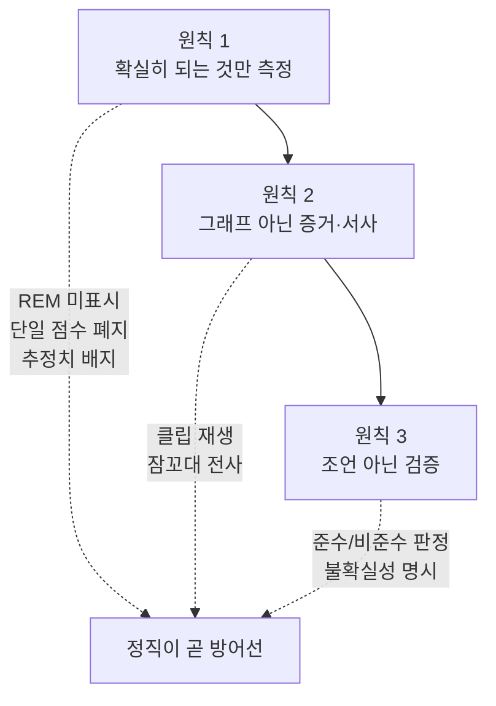
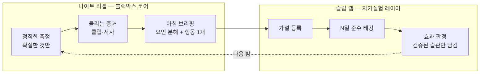
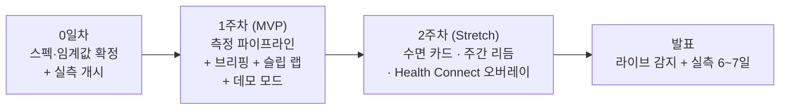

# 🌙 NightRecap — 기획서

> **"수면 앱의 문제는 측정이 부정확한 게 아니라, 아무도 안 믿고 아무것도 안 바뀐다는 것이다."**

---

## 📌 제품 개요

**폰 하나로 밤의 소리 증거를 기록하고, 뻔한 조언 대신 나에게 맞는지 검증해 주는 수면 분석 앱.**

NightRecap은 밤새 소리 이벤트(코골이·잠꼬대·기침)와 뒤척임을 온디바이스로 기록하고, 아침에 "들리는 증거"와 함께 그 밤을 한 편의 브리핑으로 돌려준다. 시중 앱이 REM·깊은잠 그래프로 신뢰를 깎고 단일 점수로 스트레스를 주는 자리에서, NightRecap은 폰이 확실히 잘 재는 것만 재고 그 위에 증거·서사를 얹는다. 그리고 수면 조언을 "주는" 대신, 그 조언이 나에게 효과 있는지 **N일 자기실험으로 검증**하는 슬립 랩 레이어로 마무리한다. 조언하는 앱이 아니라 검증하는 앱이다.

---

## 🔍 배경 — 문제 정의

### 시장의 3대 실패

기존 수면 앱은 서로 다른 카테고리인데도 셋 다 같은 방식으로 무너진다.

| 실패 | 무엇이 무너지는가 | 근거 |
|---|---|---|
| **① 정확도 불신** | 폰 단독 수면 단계 추정을 사실처럼 그래프로 그린다. REM·4단계 정밀 분류는 폰 단독으로 불가능하다는 게 검증 연구의 일관된 결론인데도 유지한다. | 폰 기반 sleep/wake 판별은 손목 액티그래피 기준 **약 78~80%**(npj Digital Medicine), REM/깊은잠 정밀 분류는 폰 단독 불가. 유저 스스로 "숫자를 안 믿는다"고 말한다. |
| **② 점수 스트레스(오소섬니아)** | 단일 수면 점수로 매일 아침 겁을 준다. 트래킹이 오히려 수면을 악화시키는 역효과가 문서화돼 있다. | **18~35세의 약 23%**가 수면 트래커 때문에 오히려 수면 스트레스를 받는다(66세+는 2.4%). 불면증군에서 불안 증가 관찰(Euronews 2026.3). 우리 타깃 연령대가 정확히 가장 취약한 구간이다. |
| **③ 실행 불가능한 피드백** | "수면 효율 낮네요, 일찍 주무세요" 식 지표 낭독과 일반론. 재볼 수는 있는데 뭘 바꿔야 할지로 이어지지 않는다. | 학술 연구가 수면 앱의 병목을 측정 정확도가 아니라 **실행 가능성(actionability)**으로 지목(UW, CHI 2017). Whoop 코치는 지표 낭독으로 "Python 스크립트로도 되는 소리"라는 평가를 받는다. |

세 실패의 공통 교훈은 하나다: **더 정확한 그래프를 그리는 방향은 이미 막혔다.** 폰의 물리적 한계 위에서 정확도 경쟁을 벌이면 ①에 지고, 점수로 승부하면 ②에 진다. 남은 승부처는 ③, 즉 **믿을 수 있는 증거와 실행 가능한 검증**뿐이다.

### 한국 20대의 수면 현실

우리 타깃은 오소섬니아에 가장 취약하면서 동시에 수면이 가장 망가진 집단이다.

| 지표 | 수치 | 출처 |
|---|---|---|
| 20대 평균 취침 시각 | **0시 51분** (전 연령 중 유일하게 자정 넘겨 취침) | 뉴시스 2026.3 |
| 20대 평균 수면 시간 | **5시간 25분** | 뉴시스 2026.3 |
| 18~24세 doomscrolling으로 수면 악화 | **46%** | AASM |

> 대학생 수면장애 유병률·취침 직전 폰 사용률 등 항간에 도는 추가 수치는 출처를 확인하지 못해 표에서 뺐다. 정직 원칙을 방어선으로 내세우는 문서에서 출처 없는 숫자를 근거로 삼는 것 자체가 자기모순이기 때문이다. 위 세 지표만으로도 "20대는 가장 늦게 자고 가장 적게 잔다"는 결론은 성립한다.

즉 이들은 "잠을 못 자는데(현실), 그걸 재면 스트레스받고(오소섬니아), 재봐야 뭘 바꿀지 모른다(실행 불가능)." NightRecap은 이 세 겹의 문제를 한 제품 안에서 각각 다른 설계로 받아친다.

---

## 👤 타깃 사용자 & 페르소나

**핵심 타깃: 한국 20대 대학생 — 특히 룸메이트/기숙사 환경에서 자는 사람.**

이들은 수면이 나쁘다는 자각은 있으나, 점수로 겁주는 앱에는 이탈하고, 그래프는 믿지 않으며, 조언은 이미 다 안다("일찍 자라"). 반면 "내가 자면서 뭐라고 했는지", "룸메이트가 말한 내 코골이가 진짜인지"에는 강하게 반응한다 — 증거가 있기 때문이다.

### 페르소나 1 — 지훈 (24세, 공대 3학년, 2인실 기숙사)

- **상황**: 새벽 2시까지 유튜브를 보다 자고, 룸메이트에게 "너 코골이 심하다"는 말을 듣지만 본인은 기억이 없다. Sleep Cycle을 써봤지만 "깊은잠 12%" 같은 숫자를 믿지 않아 2주 만에 지웠다.
- **니즈**: 점수 말고 **증거**. "진짜 코골았어?"에 새벽 3시 클립을 직접 들려주면 그게 aha 모먼트다.
- **NightRecap이 주는 것**: 코골이 감지 정확도 **94~95%**(검증됨)의 클립 재생 + "룸메이트가 있는 환경"을 기본 시나리오로 상정한 프라이버시 설계.

### 페르소나 2 — 서연 (22세, 자취, 카페인 의존)

- **상황**: 오후 늦게 마신 커피가 잠을 망친다고 막연히 느끼지만 확신이 없다. 수면 앱의 "카페인을 줄이세요" 조언은 잔소리로만 들린다.
- **니즈**: 일반론이 아니라 **나에게 그게 사실인지**의 판정.
- **NightRecap이 주는 것**: "15시 이후 카페인 금지" 가설을 슬립 랩에 등록 → 준수일 vs 비준수일 입면 시각 비교 → "너에게 효과 있었는지" 판정. 조언을 검증으로 바꾼다.

---

## ⚔️ 경쟁 분석

각 앱이 장악한 것과, 정확히 어디서 무너지는지.

| 앱 | 장악한 것 | 무너지는 지점 | 근거 |
|---|---|---|---|
| **Sleep Cycle** | 수면 단계 트래킹의 대중 인지도 | **정확도 불신 + 구독 반발.** 폰 단독 단계 추정을 사실처럼 그려 신뢰를 깎고, 무료는 예고편 수준. | 수면·명상 앱 30일 리텐션 약 5%, Calm 연 $79.99에 "무료가 예고편"이 리뷰 최다 불만 |
| **SnoreLab** | 코골이 강도 점수화 | **점수에서 멈춘다.** 그 소리가 뭐였는지, 그래서 뭘 바꿀지로 이어지지 않는다. | 소리 증거는 있으나 서사·처방·검증으로 확장 안 됨 |
| **에이슬립 슬립루틴** | 마이크 기반 4단계 분석의 기술력 | **블랙박스 + 트라이얼 벽.** 벤치마크는 앞서지만 폰의 물리적 한계를 넘지는 못하고, 무료는 60일·500세션 한정이며 트라이얼 약관이 실서비스 사용을 금지한다. | 분당서울대+스탠포드 공동 벤치마크에서 F1 **0.6863**(핏빗 센스2 0.5814·아마존 헤일로 0.6242 상회)으로 앞서지만, **자사 논문 실측 정확도는 76.2%**(에이슬립 자체 발표치) — 이는 폰 단독 4단계 추정의 일반 범위(임상 대비 **50~76%**, 스펙 문서) 상단에 걸쳐 있어, 벤치마크 우위가 폰의 물리적 한계 자체를 넘지는 못함을 보여준다. 무료 60일·500세션 한정, 원음 서버 업로드 |
| **삼성 수면 동물유형** | 유형화의 재미 | **고정 8종의 낙인.** 20대가 가장 불규칙해 재미가 자책으로 뒤집힌다. | 고정 8종 유형은 규칙적 패턴을 전제로 하는데, 20대는 취침·기상이 가장 불규칙한 연령대(취침 0시 51분·수면 5시간 25분, 뉴시스 2026.3)라 유형이 자주 바뀌고 '재미'가 자책으로 뒤집힌다 |
| **Pokémon Sleep** | 게이미피케이션 리텐션 | **정확도 없이 성공했으나 치팅·피로로 이탈.** 날짜 조작 치팅이 가능하고 반복 뽑기가 피로를 만든다. | 정확도 없이 성공한 유일 사례이지만, 데이터 신뢰가 아니라 게임이 목적이라 수면 개선으로 이어지지 않음 |

**시장의 빈칸**: 소리 증거(SnoreLab)와 자기실험 검증(SleepCoacher, UIST 2016)을 결합한 상용 앱은 없다. 정확도 경쟁은 이미 포화이고, 게이미피케이션은 수면 개선과 무관하다. NightRecap은 "믿을 수 있는 증거 + 나에게 맞는지의 검증"이라는 비어 있는 축을 점유한다.

---

## 🎯 차별화 전략 — "정직한 우회" 3원칙

정면 돌파(더 정확한 그래프)가 막혔으므로 우회한다. 우회의 원칙은 정직이다.

### 원칙 1 — 확실히 되는 것만 측정한다

폰이 방어 가능한 것만 화면에 올린다. 코골이 감지(**94~95%** 검증)·뒤척임·취침/기상 시각·규칙성은 측정하고, **REM·4단계 정밀 분류는 주장 자체를 하지 않는다.** sleep/wake 추정은 항상 "추정치" 배지를 달고(78~80%는 **손목 액티그래피 문헌치일 뿐 우리 앱 정확도가 아니다** — 폰은 매트리스 진동이라는 다른 신호이며 정확도는 자체 검증 전까지 미상), **단일 수면 점수는 만들지 않는다**(오소섬니아 역효과 방어). "왜 REM이 없냐"는 질문이 오면 그게 우리의 차별점이다.

### 원칙 2 — 그래프가 아니라 증거·서사를 준다

유저의 aha 모먼트는 점수가 아니라 오디오 재생이라는 게 SnoreLab·Sleep Cycle에서 반복 확인된 사실이다. 새벽 3시 코골이 클립을 탭해서 직접 듣고, 잠꼬대는 텍스트로 전사되며, 밤 전체가 아침 브리핑 한 편으로 요약된다. 화면의 모든 판정은 탭하면 원천 증거(클립·타임스탬프)로 드릴다운된다. **검증 비용이 0에 수렴할 때 분석이 신뢰를 얻는다.**

### 원칙 3 — 조언이 아니라 검증을 준다

"카페인 15시 컷오프"를 주는 게 아니라, 그게 **나에게** 효과 있는지 준수/비준수 날의 데이터로 판정한다. 표본이 작다는 사실을 숨기지 않고 불확실성을 명시한다("참고용"). 조언하는 앱은 이미 시장에 넘치고 다 무시당한다. 검증하는 앱은 아직 없다.

---

## 💎 제품 컨셉 & 핵심 가치

NightRecap은 두 겹이다. 아래층이 신뢰를 만들고, 위층이 행동을 바꾼다.

### 아래층 — 나이트 리캡(블랙박스 코어)

내 밤의 블랙박스. 확실히 되는 것만 재고(코골이 94~95% 검증, sleep/wake는 손목 문헌 참고치 기반 추정—앱 정확도 미검증, 30초 에폭 뒤척임), 소리 이벤트 감지 시에만 수초 클립을 남긴다. 아침에는 **단일 점수 대신 요인 분해**(규칙성/소리/뒤척임/시간) + **행동 처방 딱 1개** + 내일 검증 방법으로 브리핑한다. 핵심 가치는 **"믿을 수 있는 증거"** — 심사 Q&A에서 "그 숫자 정확해요?"에 문헌 인용으로 답할 수 있는 것만 화면에 올린다.

### 위층 — 슬립 랩(자기실험 레이어)

브리핑의 처방을 가설 카드로 등록하고, N일간 준수/비준수를 태깅해, "너에게 효과 있었는지"를 판정한다. SleepCoacher(UIST 2016)의 1인 자기실험 프레임을 LLM과 결합한 것으로, 상용 앱에 이 조합은 없다. 판정 완료된 실험은 "검증됨 / 효과 없음 / 판정 불가"로 아카이브되며, **이 아카이브가 곧 "나에게 실제로 통하는 수면 습관 목록"이자 제품의 최종 산출물**이다. 핵심 가치는 **"나에게 맞는지의 검증"**.

두 층을 관통하는 한 문장: **정직한 측정 → 들리는 증거 → 검증된 처방.**

---

## 🎯 목표 & 성공 지표

이 프로젝트의 목표는 실사용 데이터 확보가 아니다(2주 캠프에서 성립 불가). **발표 데모에서 제품의 논리가 성립하는 것**, 그리고 **정직 원칙이 방어선으로 작동하는 것**이다.

### 발표 데모 성립 기준 (정량)

1주차 종료 시 아래 시나리오가 무대에서 재현 가능해야 한다:

> "취침 버튼 → (데모 오디오 릴로) 측정 → 아침 브리핑에서 서사·요인 분해·행동 처방 확인 → 타임라인에서 코골이 클립 재생 → 잠꼬대 클립 선택 전사 → 슬립 랩에 가설 등록 → 준수 태깅." **그리고 Claude 키를 뽑아도 같은 시나리오가 템플릿 브리핑으로 성립해야 한다.**

- 발표장 스피커 오디오 릴 → 무대 위 폰 **라이브 감지**(1초 클립 이진 분류 94~95% 재현이므로 실패 확률 낮음).
- 팀 2인이 **개발 0일차 밤부터 매일 실측**해 발표일에 6~7일치 진짜 데이터 확보 — 슬립 랩 판정 카드를 실데이터로 시연한다.
- "하룻밤에 데이터 하나"라는 제약을 약점이 아니라 **제품 전제**(진짜 실험은 며칠 걸린다)로 프레이밍한다.

### 정성 지표

- 심사 Q&A "그 정확해요?"에 정직 프레이밍으로 방어되는가: "78~80%는 **손목 액티그래피 문헌치**(npj Digital Medicine)이지 우리 앱 정확도가 아니다 — 우리 신호는 매트리스 진동이라 다른 도메인이고, 그래서 추정치 배지·REM 미표시·점수 폐지. 우리 분석 코어는 94~95% 검증된 소리 이벤트 + 슬립 랩 행동 실험이다." (심사위원이 지적하기 전에 우리가 먼저 강등한다.)
- "다른 수면 앱과 뭐가 다르냐"에 한 문장으로 답되는가: **조언하는 앱이 아니라 검증하는 앱.**
- 클립 재생이 심사자에게 aha 모먼트를 만드는가(직접 소리를 내보게 할 수 있음).

**명시적 비목표**: 실사용자 확보, 리텐션 수치, REM 정확도 경쟁 — 모두 이 프로젝트의 목표가 아니다.

---

## ⚠️ 제품 관점 리스크 개요

구현 세부 대응은 기능계획서로 미루고, 여기서는 제품이 안고 가는 세 가지 구조적 리스크만 짚는다.

| 리스크 | 왜 위험한가 | 제품 차원의 대응 |
|---|---|---|
| **정확도 공격** | "그 히프노그램 정확해요?"는 수면 앱 데모의 단골 킬러 질문이고, 그래프를 사실처럼 그린 순간 답이 궁해진다. | **정직이 곧 방어.** REM 미표시·추정치 배지·단일 점수 폐지를 처음부터 제품 정체성으로 내세운다. 분석의 축은 문헌으로 방어되는 소리 이벤트(94~95% 검증)에 둔다. 정확도를 숨기지 않는 것이 정확도 공격의 답이다. |
| **프라이버시** | "밤새 녹음하는 앱?"은 즉각적 거부감을 부른다. 특히 룸메이트가 있는 기숙사 환경에선 타인의 소리도 녹음된다. | 연속 원음은 어디에도 저장하지 않고 이벤트 전후 수초 클립만 로컬 저장. 서버로 가는 것은 원음 없는 요약 지표와 **사용자가 개별 선택한 전사 클립**뿐. 온보딩에서 "같은 방 사람의 소리도 녹음될 수 있음"을 고지하고 일괄 삭제를 1뎁스에 둔다. "전량 온디바이스, 원음 미업로드"가 셀링포인트이자 방어선. |
| **의료 규제·과잉 주장** | 무호흡·수면장애를 "진단"하는 순간 의료기기 규제와 허위 주장 리스크에 노출된다. | 표현 상한을 **"호흡 불규칙성 힌트 + 병원 검사 권유"까지로 고정**하고, 진단·치료 워딩을 문서·화면·발표에서 일관되게 금지한다. 스크리닝 힌트이지 진단이 아니다. |

이 세 리스크에 대한 답이 모두 "정직 원칙"으로 수렴한다는 점이 NightRecap의 설계적 일관성이다 — 정직이 마케팅 수사가 아니라 리스크 관리 전략이다.

---

## 🗓️ 팀 & 추진 일정 개요

2인 × 2주. 상세 로드맵·역할 분담·태스크는 기능계획서로 미루고, 여기서는 고수준 리듬만 밝힌다.

- **0일차가 코드보다 급하다**: 이 날 스키마·임계값을 단일 기준으로 확정하고, **그날 밤부터 팀 2인이 실측을 개시**한다. 실측 데이터는 하루에 하나씩만 쌓이므로 첫날을 놓치면 발표일에 표본이 부족하다.
- **MVP는 1주차에 닫는다**: 측정 파이프라인 + 아침 브리핑(+ 템플릿 fallback) + 슬립 랩 + 데모 모드까지가 MVP. **데모 모드는 Stretch가 아니라 MVP** — 발표에서 잘 수 없다는 구조적 난제의 정면 해결책이기 때문이다.
- **Stretch는 자르는 순서를 미리 합의한다**: 수면 카드 → 주간 리듬 리포트 → Health Connect 오버레이 순. 오버레이는 워치 1대라 재현성이 약하고 동기화 버그가 있어 **코어 의존을 금지**하고 대조 뷰로만 둔다. 이갈이 감지와 무호흡 진단은 애초에 범위 밖이다.
- **핵심 진실**: fallback(Claude 키를 뽑아도 성립)과 데모 모드(발표장에서 잘 수 없어도 성립)는 부가 기능이 아니라 이 제품이 무대에서 살아남는 조건이다. 그래서 둘 다 MVP다.