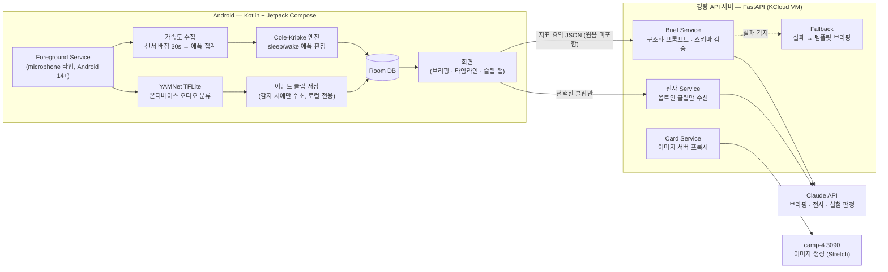
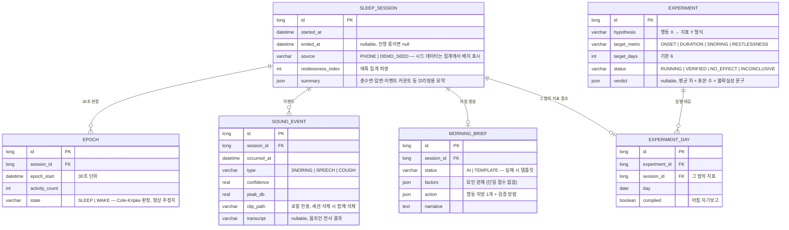

# 🌙 NightRecap — 내 밤의 블랙박스

> **"수면 앱의 문제는 측정이 부정확한 게 아니라, 아무도 안 믿고 아무것도 안 바뀐다는 것이다."**

폰 하나로 밤새 소리 이벤트(코골이·잠꼬대·기침)와 뒤척임을 기록하고, 아침에 "들리는 증거"와 함께 그 밤을 한 편의 브리핑으로 돌려주는 수면 분석 앱. 그 위에 뻔한 수면 조언을 "주는" 대신 나에게 효과가 있는지 **N일 자기실험으로 검증**하는 슬립 랩 레이어를 얹는다.

---

## 📖 프로젝트 소개

시중 수면 분석 앱은 셋 다 같은 지점에서 무너진다.

| 기존 도구 | 무너지는 지점 |
|---|---|
| Sleep Cycle · 에이슬립 (수면 단계 트래커) | **정확도 불신.** 폰 기반 수면 단계 추정은 임상 대비 50~76% 수준이고, 유저 스스로 "숫자를 안 믿는다"고 말한다. 그런데도 REM·깊은잠 그래프를 사실처럼 그려서 신뢰를 더 깎는다. |
| SnoreLab (코골이 분석) | **점수에서 멈춘다.** 코골이 강도 점수는 주지만 "그 소리가 실제로 뭐였는지"(잠꼬대 내용, 방해 소음의 정체)와 "그래서 뭘 바꿔야 하는지"로 이어지지 않는다. |
| Oura·Whoop AI 코치 (해석 레이어) | **지표 낭독과 일반론.** "수면 효율이 낮네요, 일찍 주무세요" — 유저 평가는 "Python 스크립트로도 되는 소리"다. 학술 연구도 수면 앱의 병목을 측정 정확도가 아니라 **실행 불가능한 피드백(unactionable feedback)**으로 지목한다. |

공통 원인이 하나 더 있다: **단일 수면 점수는 역효과가 문서화돼 있다.** 18~35세의 약 23%가 수면 트래커 때문에 오히려 수면 스트레스를 받는다(오소섬니아). 점수로 겁주는 설계는 우리 타깃(한국 20대)에게 이탈 기계다.

NightRecap의 전략은 정면 돌파가 아니라 **정직한 우회**다:

- 폰이 **확실히 잘 재는 것만 잰다** — 소리 이벤트(코골이 감지 정확도 95%대 검증됨), 뒤척임, 취침·기상 시각, 규칙성. REM·4단계 정밀 분류는 폰 단독으로 불가능하다는 게 문헌의 일관된 결론이므로 **주장 자체를 하지 않는다.**
- 산출물은 그래프가 아니라 **증거와 서사**다 — 새벽 3시 코골이 클립을 탭해서 직접 듣고, 잠꼬대는 텍스트로 전사되며, 밤 전체가 아침 브리핑 한 편으로 요약된다.
- 조언은 주는 게 아니라 **검증한다** — "카페인 15시 컷오프"가 나에게 효과 있는지 준수/비준수 날의 데이터 비교로 판정한다. 조언하는 앱이 아니라 검증하는 앱.

## 🎯 기획 의도

핵심 루프는 하나의 체인이다:

**취침 버튼(또는 충전+시간대 자동 시작) → 밤새 온디바이스 측정(가속도 액티그래피 + YAMNet 소리 이벤트 게이트) → 아침 브리핑(타임라인 + 클립 재생 + 요인 분해 + 행동 처방 1개) → 슬립 랩에 가설 등록 → N일 준수/비준수 데이터 축적 → 효과 판정 → 검증된 습관만 남는다**

설계 철학은 **정직한 측정 → 들리는 증거 → 검증된 처방**이다.

- **정직한 측정**: 표시하는 모든 수치는 방어 가능해야 한다. sleep/wake 추정(~78–80%)은 "추정치" 배지를 달고, 무호흡은 진단이 아니라 "호흡 불규칙성 힌트 + 병원 검사 권유"까지만 간다. 심사 Q&A에서 "그 숫자 정확해요?"에 문헌 인용으로 답할 수 있는 것만 화면에 올린다.
- **들리는 증거**: 유저의 aha 모먼트는 점수가 아니라 오디오 재생이라는 게 SnoreLab·Sleep Cycle에서 반복 확인된 사실이다. 이벤트 감지 시에만 수초 클립을 저장하는 구조가 배터리·용량·프라이버시를 동시에 해결한다.
- **검증된 처방**: LLM에게 "요약"이 아니라 **오늘 데이터 → 수정 가능한 행동 1개 → 내일 검증 방법**의 구조화 출력을 강제한다. 이미 준 조언 이력을 컨텍스트로 유지해 중복 잔소리를 막는다(Oura Advisor에서 유저 호평 87%를 받은 "기억" 기능의 재현).

## ✨ 주요 기능

| 기능 | 설명 | 단계 |
|---|---|---|
| 수면 세션 기록 | 취침 버튼 한 번(또는 "충전 중 + 00시 이후" 자동 제안)으로 포그라운드 서비스 시작. 가속도 센서 배칭(30초 배치)으로 밤새 수집, 배터리 시간당 1~3% 수준. | MVP |
| 소리 이벤트 블랙박스 | 16kHz 마이크 스트림을 온디바이스 YAMNet(TFLite)이 1차 게이트 — `Snoring`/`Speech`/`Cough` 감지 시에만 전후 수초 클립 저장. 원음은 **기기 밖으로 나가지 않는다.** | MVP |
| 밤 타임라인 | 뒤척임 강도 밴드 + 소리 이벤트 마커를 한 축에 그린 타임라인. 마커 탭 → 클립 재생. 이벤트 군집·코골이 중단-재개 패턴 표시. | MVP |
| 히프노그램(추정치) | Cole-Kripke/Sadeh 가중합을 Kotlin으로 이식해 30초 에폭 sleep/wake → light/deep 휴리스틱. **"추정치" 배지 상시 표시, REM은 그리지 않는다.** | MVP |
| 아침 브리핑 | Claude가 이벤트 시퀀스·지표를 받아 서사형 브리핑 생성. 출력 스키마 강제: 요인 분해(규칙성/소리/뒤척임/시간) + **행동 처방 1개** + 내일 검증 방법. 실패 시 템플릿 문장으로 대체. | MVP |
| 잠꼬대 전사 | 밤중 `Speech` 클립을 아침에 **사용자가 명시적으로 선택한 것만** 서버 경유 STT/Claude로 전사 — "내가 자면서 뭐라고 했는지"를 텍스트로. 옵트인 전까지 어떤 클립도 업로드되지 않는다. | MVP |
| 슬립 랩 (자기실험) | 브리핑의 처방을 가설 카드로 등록("카페인 15시 컷오프") → 매일 준수/비준수 체크 → N일 후 준수일 vs 비준수일 지표 비교로 **"너에게 효과 있었는지" 판정**(효과 크기 + 불확실성 표시). | MVP |
| 데모 모드 | 발표장 스피커로 트는 오디오 릴(코골이·잠꼬대·기침)을 실시간 감지해 무대에서 타임라인이 그려지는 라이브 데모 + 팀 실측 6일치 시드 데이터 뷰. **발표 필수 기능이므로 MVP다.** | MVP |
| 수면 카드 | 그 밤을 요약한 이미지 카드를 자체 3090 이미지 서버로 생성(밤의 장면·수면 캐릭터). 공유용. 실패 시 텍스트 카드 대체. | Stretch |
| Health Connect 오버레이 | 갤럭시워치/삼성헬스 보유자는 수면 단계·심박을 읽어 폰 추정과 나란히 대조("3-way: 폰 vs 워치 vs 내 느낌"). `stage=Unknown`·세션 누락 등 동기화 버그 방어 처리 전제. **코어 의존 금지 — 죽어도 앱이 성립해야 한다.** | Stretch |
| 주간 리듬 리포트 | 소셜 제트래그(주중-주말 취침 편차)·규칙성 지수·수면부채 추세. 타임스탬프만으로 계산되므로 구현이 가볍다. | Stretch |

## 🏗️ 시스템 아키텍처



- **로컬 우선**: 측정·판정·클립은 전부 온디바이스. 서버로 가는 것은 ① 집계된 지표 요약 JSON(브리핑용), ② 사용자가 명시적으로 선택한 전사 대상 클립뿐이다. "전량 온디바이스, 원음 미업로드"가 프라이버시 셀링포인트이자 발표 방어선이다.
- **서버는 프록시 + 프롬프트 저장소**: API 키를 앱에 심지 않기 위한 경량 FastAPI 한 대. Claude 호출 실패는 예외가 아니라 `{"status": "TEMPLATE"}` 정상 응답으로 변환해 클라이언트가 템플릿 브리핑으로 전환한다 — AI 장애가 아침 브리핑 플로우를 끊지 않는다.
- **에이슬립 SDK는 대안으로 기록만**: `beginSleepTracking()` 두 함수로 4단계 분석(무료 60일·500세션)을 얻을 수 있으나, 블랙박스·트라이얼 약관("실서비스 금지")·원음 서버 업로드가 자체 파이프라인의 프라이버시 스토리와 충돌한다. 자체 측정이 D3까지 실패할 경우의 비상 대체 경로로만 유지한다.

## ⭐ Main Features

### 1. 측정 파이프라인 — 방어 가능한 숫자만 만든다

#### 1-1. 가속도 액티그래피

- `TYPE_ACCELEROMETER`를 `maxReportLatencyUs ≥ 30초` 센서 배칭으로 등록 — CPU를 밤새 깨우지 않고 캐시로 수집한다. Android 9+는 백그라운드 앱에 연속 센서 이벤트를 주지 않으므로 포그라운드 서비스(상시 알림)가 필수다.
- 30초 에폭별 움직임 카운트에 Cole-Kripke/Sadeh 가중 커널을 적용해 sleep/wake 판정. 알고리즘은 "가중합 + 임계값"이라 Kotlin 수십 줄이며, 순수 함수로 두고 단위 테스트로 검증한다.
- **정직 원칙 3계명 (화면·발표·문서 공통)**
  1. sleep/wake·light/deep은 항상 **"추정치" 배지**와 함께 표시한다 (손목 검증 기준 78~80%이며 침대 위 폰은 그보다 낮을 수 있음을 안다).
  2. **REM은 표시하지 않는다** — 폰 단독 REM 스코어링은 검증 연구상 불가능하다. "왜 REM이 없냐"는 질문이 오면 그게 우리의 차별점이다.
  3. **단일 수면 점수를 만들지 않는다** — 오소섬니아(18~35세 23%가 트래커발 수면 스트레스) 역효과가 문서화돼 있다. 점수 대신 요인 분해(2-3절)로 보여준다.

#### 1-2. 소리 이벤트 게이트

```
마이크 16kHz mono ─→ dB 1차 게이트(임계값 미만 폐기)
                    └→ YAMNet TFLite 분류 ─→ Snoring / Speech / Cough
                                             confidence ≥ τ 인 경우에만
                                             전후 수초 클립 저장 + 이벤트 기록
```

- YAMNet은 TFLite Task Library로 통합한다(Google 공식 Android 오디오 분류 코드랩 존재 — 사실상 플러그앤플레이). 코골이 이진 분류는 정확도 94~95%로 재현되는 "검증된 쉬운 문제"라 데모 신뢰의 축이 된다.
- 임계값 `τ`와 dB 게이트는 개발 첫 주 자가측정으로 튜닝하고, Kaggle 코골이 1,000샘플로 오프라인 검증한다. 수치는 이 문서와 앱 설정에 **단일 기준**으로 기록한다.
- **이갈이는 코어에서 제외한다** — 원거리 폰 마이크 검증 사례가 없다. 발표에서 감지 대상은 코골이·잠꼬대·기침 3개만 약속한다.
- 무호흡 관련 산출물은 "코골이 중단-재개 패턴" 표시까지만 — **"호흡 불규칙성 힌트"라는 표현과 병원 검사 권유 문구를 함께 출력하고, 진단·의료기기성 표현은 금지한다.**

#### 1-3. 프라이버시 — 밤새 녹음 앱이 신뢰받는 조건

- 연속 원음은 어디에도 저장하지 않는다. 저장되는 것은 이벤트 전후 수초 클립뿐이고, 클립은 앱 내부 저장소에만 있으며 세션 삭제 시 함께 삭제된다.
- 서버 업로드는 두 경우뿐: ① 지표 **요약 JSON**(이벤트 횟수·시각·에폭 집계 — 원음 없음), ② 사용자가 아침에 **개별 선택한 전사 대상 클립**. 선택 전 어떤 클립도 기기를 떠나지 않으며, 전사 후 서버 측 클립은 즉시 폐기한다.
- 룸메이트가 있는 환경(기숙사)을 기본 시나리오로 상정한다: 온보딩에서 "같은 방 사람의 소리도 녹음될 수 있음"을 고지하고, 클립 일괄 삭제 버튼을 세션 화면 1뎁스에 둔다.

### 2. 아침 브리핑 — "지표 낭독 금지"를 스키마로 강제한다

Whoop 코치가 욕먹는 이유("Python으로도 됨")는 LLM에게 자유 요약을 시켰기 때문이다. NightRecap은 Claude 호출에 응답 스키마를 강제한다:

```json
{
  "narrative": "그 밤의 서사 브리핑 3~5문장 — 이벤트 시퀀스를 인과로 엮는다",
  "factors": [
    { "name": "REGULARITY | SOUND | RESTLESSNESS | DURATION", "state": "GOOD | MIXED | BAD", "evidence": "근거 한 줄 (클립·수치 참조)" }
  ],
  "action": { "what": "오늘 밤 바꿀 행동 딱 1개", "why": "내 데이터 기반 근거", "verify": "내일 아침 무엇으로 확인할지" },
  "hypothesis_candidate": "슬립 랩 실험으로 등록할 만하면 가설 문장, 아니면 null"
}
```

- **행동은 반드시 1개** — 처방 목록은 곧 무시 목록이다.
- 서버가 스키마 검증에 실패하거나 타임아웃(10초 + 재시도 1회)이면 `TEMPLATE` 응답으로 전환: 앱이 로컬 지표로 템플릿 브리핑("총 수면 X시간, 코골이 N회, 어제보다 뒤척임 M% 감소")을 렌더링한다. **Claude 키를 뽑아도 아침 브리핑 화면은 성립해야 한다.**
- 지난 브리핑의 `action` 이력을 요청 컨텍스트에 포함해 같은 조언의 반복을 막는다. 반복 추천은 피로 → 이탈로 이어진다는 게 상용 AI 코치들의 공통 실패 모드다.

### 3. 슬립 랩 — 조언하는 앱이 아니라 검증하는 앱

SleepCoacher(UIST 2016)의 1인 자기실험 프레임을 LLM과 결합한다. 상용 앱 중 이 조합은 없다.

- **가설 등록**: 브리핑의 `hypothesis_candidate` 또는 수동 입력으로 실험 카드 생성. 형식은 고정 — "행동 X를 하면 지표 Y가 개선된다" (예: "15시 이후 카페인 금지 → 입면 시각 앞당겨짐").
- **매일 태깅**: 아침 브리핑 하단에서 어제의 준수 여부를 버튼 한 번으로 기록. 측정과 달리 이것만은 자기보고다 — 마찰을 최소화한다.
- **판정**: 목표 일수(기본 6일, 준수·비준수 각 최소 2일)가 차면 준수일 vs 비준수일의 대상 지표를 비교한다. 표본이 극소라는 사실을 숨기지 않는다 — 평균 차이와 함께 **불확실성을 명시**하고("준수 3일 평균 입면 00:41 vs 비준수 3일 01:12 — 31분 차이, 표본이 작아 참고용"), 판정 문구 생성만 Claude에 맡긴다. 통계 계산 자체는 로컬 순수 함수 + 단위 테스트.
- **결과의 축적**: 판정 완료된 실험은 "검증됨 / 효과 없음 / 판정 불가" 라벨로 아카이브된다. 이 아카이브가 곧 "나에게 실제로 통하는 수면 습관 목록"이며, 제품의 최종 산출물이다.

### 4. 데모 모드 — "하룻밤 자야 보인다" 문제의 정면 해결

수면 앱 데모의 구조적 난제(발표장에서 잘 수 없다)를 두 축으로 푼다. **데모 모드는 Stretch가 아니라 MVP다.**

1. **라이브 감지**: 발표장 스피커로 코골이·한국어 잠꼬대·기침이 섞인 오디오 릴을 재생 → 무대 위 폰이 실시간으로 감지해 타임라인에 마커가 찍히고, 탭하면 방금 잡힌 클립이 재생된다. 1초 클립 이진 분류가 94%+ 재현되므로 라이브 실패 확률이 낮고, 심사자가 직접 소리를 내보게 할 수도 있다.
2. **실측 데이터**: 팀 2인이 **개발 0일차 밤부터 매일 실측**해 발표일에 6~7일치 진짜 데이터를 확보한다. 슬립 랩 데모는 "우리가 캠프 기간 직접 돌린 실험" 판정 카드를 실데이터로 보여준다 — "하룻밤에 데이터 하나"라는 제약을 약점이 아니라 제품 전제(진짜 실험은 며칠 걸린다)로 프레이밍한다.
3. 백업: 시드 데이터 토글(개발자 메뉴) — 리허설과 스크린샷용이며, 발표에서 시드임을 숨기지 않는다.

## 🗃️ DB 스키마 (Room)



| 엔티티 | 한 줄 설명 |
|---|---|
| **SleepSession** | 하룻밤 1행. `summary` JSON이 서버로 가는 유일한 측정 데이터다(원음 없음). |
| **Epoch** | 30초 판정 단위. 히프노그램과 뒤척임 밴드의 원천 — 원본 가속도 스트림은 판정 후 폐기한다. |
| **SoundEvent** | 감지된 소리 이벤트 + 로컬 클립 경로. `transcript`는 옵트인 전사 후에만 채워진다. |
| **MorningBrief** | 아침 브리핑. `status`로 AI/템플릿 경로를 구분해 데모·디버깅 시 추적 가능. |
| **Experiment / ExperimentDay** | 슬립 랩 실험과 일별 준수 기록. 판정은 로컬 계산, 문구만 LLM. |

## 🔌 핵심 API 명세

로컬 우선 설계라 서버 API는 4개뿐이다. 공통 prefix `/api`, 앱 빌드에 포함된 고정 토큰으로 인증(캠프 범위 단순화 — 계정 시스템 없음, 데이터는 기기에 있다).

| # | Method | Path | 설명 |
|---|---|---|---|
| 1 | POST | `/api/brief` | 세션 `summary` JSON + 최근 action 이력 → 스키마 검증된 브리핑 JSON. 타임아웃 10초 + 재시도 1회, 실패 시 `status: TEMPLATE` |
| 2 | POST | `/api/transcribe` | 옵트인 클립 업로드 → 전사 텍스트 반환. 서버 측 파일은 응답 직후 삭제 |
| 3 | POST | `/api/verdict` | 실험의 준수/비준수 지표 집계 → 판정 문구 생성(계산은 로컬에서 이미 완료, 문구만 생성). 실패 시 템플릿 문구 |
| 4 | POST | `/api/card` | 세션 요약 → 3090 이미지 서버로 수면 카드 생성 (Stretch). 실패 시 `status: TEXT_CARD` |

- 모든 엔드포인트는 실패를 예외가 아니라 대체 경로 status로 반환한다 — **AI·GPU 장애가 사용자 플로우를 끊지 않는다**는 원칙의 API 표현.

## 📱 화면 구성

| 화면 | 설명 |
|---|---|
| **① 홈 — "오늘 밤"** | 취침 시작 버튼 하나가 화면의 전부. 어젯밤 브리핑 카드와 진행 중 실험 칩이 아래 붙는다. 충전+심야 감지 시 "측정 시작할까요?" 알림 제안. |
| **② 야간 화면** | 측정 중임을 알리는 최소 정보(경과 시간·이벤트 카운트)만 저휘도로. 종료 버튼은 오조작 방지 슬라이드. |
| **③ 아침 브리핑** | 서사 3~5문장 → 요인 분해 카드(단일 점수 없음) → **행동 처방 1개** → 어제 실험 준수 태깅 버튼. 브리핑이 템플릿 경로면 상단에 표시(숨기지 않는다). |
| **④ 밤 타임라인** | 뒤척임 밴드 + 이벤트 마커. 마커 탭 → 클립 재생, `Speech` 클립에는 "전사하기" 버튼(옵트인). 히프노그램은 "추정치" 배지와 함께 접힌 섹션으로 — 증거가 주인공, 추정은 참고. |
| **⑤ 슬립 랩** | 실험 카드 목록(진행 중/완료). 카드에 준수 캘린더 점과 현재까지의 차이 표시. 판정 완료 카드는 "검증됨/효과 없음/판정 불가" 라벨. |
| **⑥ 기록** | 주간 캘린더 + 규칙성·소셜 제트래그 추세(Stretch). 시드 데이터는 배지로 구분 표시. |

**신뢰 UX 원칙 — 모든 판정은 증거로 내려간다**: 화면의 모든 분석 결과는 탭 가능하며 원천으로 드릴다운된다. "코골이 심한 밤" → 이벤트 12건 목록 → 개별 클립 재생. "31분 개선" → 준수/비준수 날짜별 수치. AI가 만든 문장(브리핑)과 측정 사실(클립·타임스탬프)을 시각적으로 구분하고, **추정치는 항상 추정치라고 말한다.** 검증 비용이 0에 수렴할 때 분석이 신뢰를 얻는다.

## 🛠️ Tech Stack

| 구분 | 기술 | 용도 |
|---|---|---|
| App | Kotlin + Jetpack Compose | 단일 액티비티, 화면 6개 |
| 측정 | Foreground Service(microphone 타입) + SensorManager 배칭 | 밤새 수집, 배터리 시간당 1~3% |
| 온디바이스 ML | TFLite Task Library (Audio) + YAMNet | 코골이·잠꼬대·기침 게이트, 서버 미의존 |
| 판정 엔진 | Cole-Kripke/Sadeh Kotlin 이식 (순수 함수) | sleep/wake 에폭, 단위 테스트 대상 |
| 로컬 DB | Room | 세션·에폭·이벤트·실험, 클립은 내부 저장소 |
| 서버 | FastAPI (KCloud VM, 기존 madcamp 인프라) | Claude 프록시 4개 엔드포인트 + 템플릿 fallback |
| AI | Claude API — 브리핑·전사·판정 문구 | 항상 로컬 템플릿 fallback 동반 |
| 이미지 | camp-4 3090 이미지 서버 (Stretch) | 수면 카드 생성, 기존 파이프라인 재활용 |

## 🚧 개발 로드맵

**MVP 완료 기준 — 1주차 종료 시 이 시나리오가 데모 가능해야 한다:** "취침 버튼 → (밤새 또는 데모 오디오 릴로) 측정 → 아침 브리핑에서 서사·요인 분해·행동 처방 확인 → 타임라인에서 코골이 클립 재생 → 잠꼬대 클립 선택 전사 → 슬립 랩에 가설 등록 → 준수 태깅." **그리고 Claude 키를 뽑아도 같은 시나리오가 템플릿 브리핑으로 성립해야 한다.**

### MVP (1주차)
- [ ] **0일차: 이 문서의 스키마·API·임계값 확정 + 그날 밤부터 팀 2인 실측 개시** — 실측 데이터 확보는 코드보다 급하다
- [ ] 포그라운드 서비스: 가속도 배칭 수집 → Room 저장, 취침 시작/종료 플로우
- [ ] Cole-Kripke Kotlin 이식 + 단위 테스트 (에폭 → sleep/wake → 뒤척임 지수)
- [ ] YAMNet TFLite 통합: dB 게이트 → 분류 → 이벤트 클립 저장 (코드랩 기반)
- [ ] 밤 타임라인 + 클립 재생 UI
- [ ] 아침 브리핑: FastAPI `/brief` + 스키마 검증 + **템플릿 fallback — fallback은 Stretch가 아니라 MVP다**
- [ ] 잠꼬대 옵트인 전사 (`/transcribe`, 서버 측 즉시 삭제)
- [ ] 슬립 랩: 실험 카드 등록 → 준수 태깅 → 로컬 판정 + `/verdict` 문구
- [ ] 데모 모드: 오디오 릴 라이브 감지 리허설 + 시드 데이터 토글
- [ ] Kaggle 코골이 샘플로 게이트 임계값 오프라인 검증

역할 분담: 한 명은 측정 파이프라인(서비스·센서·TFLite·판정 엔진)을 0일차부터 뚫는다 — 실측이 매일 밤 돌아야 하기 때문이다. 다른 한 명은 화면·Room·FastAPI를 시드 데이터로 병행 개발하다 D3에 실데이터로 접합한다.

### Stretch (2주차) — 우선순위순, 시간 부족 시 아래부터 자른다
- [ ] 수면 카드: 3090 이미지 생성 + 공유 (기존 초상 파이프라인 재활용)
- [ ] 주간 리듬 리포트: 소셜 제트래그·규칙성 지수·수면부채 추세
- [ ] Health Connect 오버레이: 워치 수면 단계·심박 대조 뷰 (동기화 버그 방어 필수, 코어 비의존)
- [ ] 자동 시작 제안 고도화 (충전+시간대+무음 감지)
- [ ] ~~이갈이 감지~~ — 범위 제외, 검증 불가 (1-2절)
- [ ] ~~무호흡 진단~~ — 범위 제외, 힌트+병원 권유 문구까지만 (1-2절)

## ⚠️ 리스크와 대응

| 리스크 | 시나리오 | 대응 |
|---|---|---|
| 데모 당일 "잘 수 없음" | 발표장에서 하룻밤 데이터를 만들 수 없다 | 오디오 릴 라이브 감지(코어 데모) + 0일차부터 쌓은 팀 실측 6~7일치 + 시드 토글(시드임을 명시). 라이브 감지는 리허설에 포함 |
| 정확도 공격 Q&A | "그 히프노그램 정확해요?" | 정직 프레이밍이 곧 방어: "sleep/wake ~78–80%(문헌 인용), 그래서 추정치 배지·REM 미표시·점수 폐지. 우리의 분석 코어는 95% 검증된 소리 이벤트와 타임스탬프다" |
| Claude 장애 | 데모 중 타임아웃/쿼터 초과 | 모든 서버 응답이 대체 status(`TEMPLATE`/`TEXT_CARD`)로 변환, 앱은 status만 보고 전환. fallback 경로를 리허설에 포함 |
| 알람·서비스 킬 | 제조사 배터리 최적화가 서비스를 죽임 | 데모 기기에서 배터리 최적화 제외 사전 설정 + 서비스 생존을 알림으로 상시 표시. 측정 중단 시 그 시점까지의 부분 세션으로 브리핑 성립 |
| YAMNet 오탐 | 선풍기·에어컨 소음을 코골이로 분류 | dB 1차 게이트 + confidence 임계값 τ를 자가측정으로 튜닝, Kaggle 샘플 오프라인 검증. 오탐 클립도 유저가 직접 듣고 확인 가능한 구조 자체가 안전망 |
| 프라이버시 반발 | "밤새 녹음하는 앱?" | 이벤트 클립만 로컬 저장, 원음 미업로드, 전사는 클립 단위 옵트인 + 서버 즉시 삭제, 일괄 삭제 1뎁스. 이 원칙을 온보딩·발표에 동일 문장으로 노출 |
| 의료 규제·과잉 주장 | 무호흡 "진단" 표현 | "호흡 불규칙성 힌트 + 병원 검사 권유"로 표현 상한 고정, 진단·치료 워딩 금지 (1-2절) |
| 실험 판정의 통계적 빈약 | 표본 3일 vs 3일로 "검증됨" 단정 | 판정에 표본 수·불확실성 문구 필수 포함, "참고용" 명시. 계산은 로컬 순수 함수 + 단위 테스트 — LLM은 문구만 |
| 스코프 초과 | 2인×2주에 기능이 넘침 | 이갈이·무호흡 진단·계정 시스템·소셜 기능은 애초에 범위 제외. Stretch는 자르는 순서를 미리 합의 |
| merge 기준 상실 | 두 명이 다른 가정으로 개발 | 0일차에 이 문서의 스키마·API·임계값 확정, 타임아웃(10초)·에폭(30초)·판정 규칙 등 모든 수치는 문서 단일 기준 |
