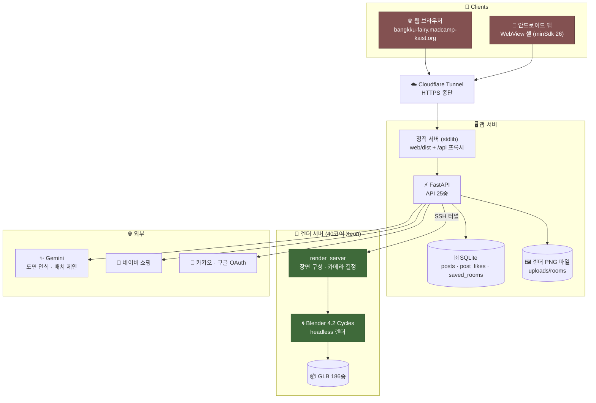
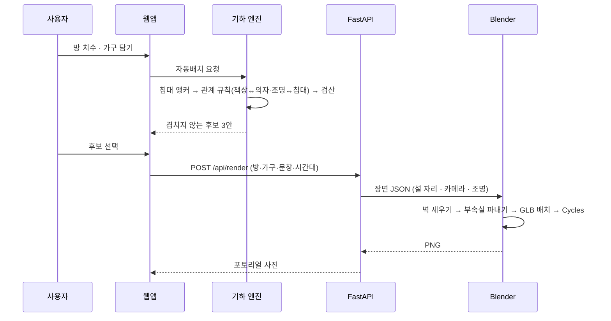
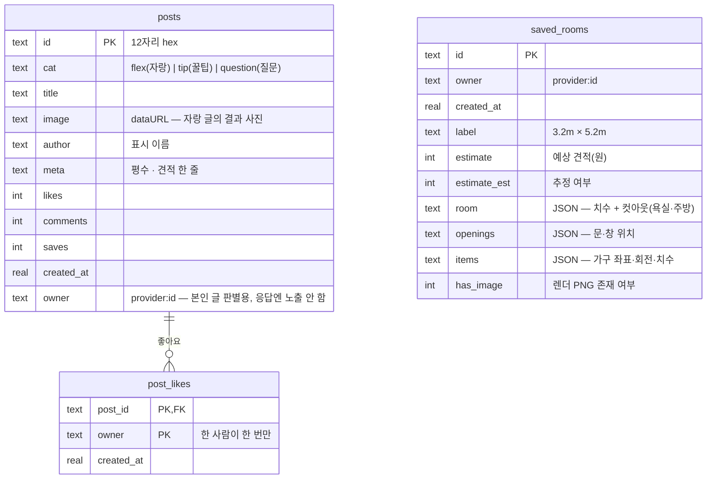

# 🧚 방꾸요정 (bangkku-fairy)

## 🤼  팀원 소개

---

> **[이름]**
> omok00 · [학교/학번 기입]

> **[이름]**
> ywlee1127 · 숙명여대 [학번 기입]

> **[이름]**
> xistoh162108 · [학교/학번 기입]

## 📖  프로젝트 소개

---

*(📸 `docs/notion-shots/10-result.png` — 완성된 배치 사진)*

**방꾸요정은 가구를 사기 전에 "이게 내 방에 들어갈까"를 실치수로 확인하는 앱입니다.**
방 도면이나 치수를 넣으면 실제 상품 치수의 3D 가구를 겹치지 않게 자동 배치하고,
그 방을 포토리얼 사진으로 렌더해 보여준 뒤, 네이버쇼핑 실상품으로 연결합니다.

> 📱 **https://bangkku-fairy.madcamp-kaist.org** · 안드로이드 APK 제공 · 3D 가구 **203종**

## 💭  기획 의도

---

*(📸 `docs/notion-shots/07-planner-2d.png` — 실치수 2D 평면 배치)*

### 원룸 가구 실패는 취향이 아니라
### **치수**에서 납니다

자취를 시작하는 사람의 첫 가구 구매는 대개 한 번 실패합니다.
침대가 문을 막고, 책상을 놓으면 옷장 서랍이 안 열리고, 퀸 침대를 들였더니 걸어다닐 곳이 없습니다.
문제는 취향이 아니라 **사기 전에 "들어갈지"를 볼 방법이 없다는 것**입니다.

기존 도구는 이 자리를 비워둡니다. 카탈로그 3D 앱은 예쁜 렌더를 주지만 내 방이 아니고,
생성형 AI 인테리어는 그럴듯한 그림을 주지만 치수도 실제 상품도 아닙니다.
방꾸요정은 그 사이를 채웁니다 — **실제 파는 물건을, 실제 내 방 치수에, 겹치지 않게** 놓아 봅니다.

배치는 AI가 그림을 그리는 것이 아니라 **기하가 결정**합니다.
가구는 축정렬 사각형으로 환원되고, 겹침·벽 이탈·문 스윙 침범은 전부 좌표 계산으로 판정됩니다.
"겹치지 않는 배치"라는 약속은 모델의 감이 아니라 검산으로 지켜집니다.

한국 원룸의 현실도 그대로 반영했습니다. 방은 직사각형이 아니라 욕실·현관·보일러실이 파인 **L자**이고,
침대는 퀸이 아니라 **슈퍼싱글(110×200)** 입니다.

> 예쁜 그림을 만드는 것이 아니라,
> **사기 전에 확인**하게 하는 것이 방꾸요정의 목표입니다.

## ✨   주요 기능

---

#### 📐 **도면·치수로 방 만들기**
실측 도면 5종을 포함한 프리셋 18종 중에서 고르거나, 줄자로 잰 치수를 직접 넣습니다.
직접 찍은 평면도 사진을 올리면 방 윤곽과 욕실·주방·현관 위치까지 읽어냅니다.

#### 🛏️ **3D 가구 203종**
Amazon Berkeley Objects의 **실측 GLB 185종** + 냉장고용 ABO 캐비닛 프록시 1종 + 한국 원룸 표준 규격 17종
(싱글·슈퍼싱글·더블·퀸 / 슬림 책상 80 / 1인 소파 / 3단 서랍장 …).
평면도·3D·렌더가 모두 같은 선언 치수를 쓰므로 세 화면의 가구 크기가 항상 일치합니다.

#### ✨ **자동배치 — 겹치지 않는 후보 3안**
침대를 코너에 앵커로 놓고, 관계 규칙을 순서대로 만족시킵니다.
**책상↔의자 세트**(의자는 책상 앞면에 마주보게, 깊이의 35%만 틈입),
**조명↔침대 헤드**, **TV장↔침대 정면**. 문 스윙 영역과 가구 앞면 여유(서랍 열기·착석)를
비워 두고, 벽 밀착률이 높은 순으로 3안을 제시합니다.

#### 🖐️ **2D 평면 편집**
드래그·90° 회전으로 직접 옮깁니다. 겹침·방 이탈·문 막힘은 즉시 테두리 색으로 표시되고,
가구는 벽과 부속실(욕실·주방) 밖으로 밀려나지 않습니다.

#### 🧊 **3D 뷰**
같은 배치를 실측 GLB로 봅니다. 시점을 돌려가며 높이 관계(책상 위 조명, 침대 옆 협탁)를 확인합니다.

#### 📷 **포토리얼 렌더**
Blender Cycles로 실제 사진처럼 렌더합니다. 시간대 4종(아침·낮·노을·밤) × 각도 3종
(와이드·아늑·반대편), 조명 켜기/끄기와 색온도(웜·쿨)를 고를 수 있습니다.
햇빛은 **창문 구멍으로만** 들어오고, 밤에는 스탠드가 유일한 광원이 됩니다.

#### 🔄 **360° 둘러보기**
방 안 눈높이에서 사방을 돌아봅니다. 파노라마를 한 번 구우면 그 뒤로는 서버를 다시 부르지 않아
드래그가 즉각 반응합니다.

#### 💬 **배치 도우미**
"침대를 창가로", "책상 빼줘" 같은 문장으로 배치를 고칩니다. 결과는 기하 엔진이 다시 검산합니다.

#### 🛒 **마켓 — 실상품 연결**
배치에 쓴 가구를 네이버쇼핑 실상품과 연결합니다. 예상 견적이 배치와 함께 갱신됩니다.

#### 💾 **배치함 · 방꾸 이야기**
완성한 배치를 계정에 저장하고, 사진을 눌러 **그 배치로 다시 들어가** 이어서 꾸밉니다.
커뮤니티에 결과를 공유합니다.

## 📱  User Interface

---

> *(📸 `docs/notion-shots/03-home.png`)*
>
> 🏠  **홈 — 방꾸 도장**
>
>
> 취향입력 → 방 입력 → 배치 완성 → 가구 구매의 4단계가 도장으로 채워집니다.
> 이전 단계가 끝나야 다음 도장이 켜지므로 지금 무엇을 할 차례인지가 항상 보입니다.

> *(📸 `docs/notion-shots/04-roominput.png`)*
>
> 📏  **방 만들기 — 세 가지 길**
>
>
> 실측 도면에서 고르거나, 직접 찍은 평면도를 올리거나, 평수로 추정합니다.
> 어느 길로 들어와도 결과는 같은 방 사각형 + 컷아웃(욕실·주방·현관)입니다.

> *(📸 `docs/notion-shots/05-floorplans.png`)*
>
> 📐  **도면 고르기 — 실측 5종 포함**
>
>
> 인허가 평면도에서 실측한 소형주택 5종과 평수 프리셋. 실측 도면은 욕실·주방·현관이
> 파인 L자 형상 그대로이고, 2D 편집기에 실제 도면이 밑그림으로 깔립니다.

> *(📸 `docs/notion-shots/06-catalog.png`)*
>
> 🛏️  **가구 담기 — 203종**
>
>
> 종류·사이즈·분위기·가격대로 거릅니다. 침대는 폭 기준 규격 뱃지(Single/Super Single/
> Double/Queen)가 붙어 내 방에 들어갈 크기인지 바로 읽힙니다. 다시 누르면 빠지는 토글입니다.

> *(📸 `docs/notion-shots/07-planner-2d.png`)*
>
> 🖐️  **2D 평면 배치**
>
>
> 0.5m 격자 위에 실치수로 놓입니다. 가구마다 카테고리·치수 배지가 붙고, 집는 동안에는
> 초록으로 바뀝니다. 문은 스윙 영역까지 그려져 그 앞을 막으면 바로 표시됩니다.

> *(📸 `docs/notion-shots/08-autolayout.png`)*
>
> ✨  **자동배치 후보 3안**
>
>
> 각 안마다 벽 밀착률과 배치 근거가 한 줄로 붙습니다 —
> "침대를 왼쪽 벽 안쪽에 붙여 휴식존을 확보하고, 책상은 채광이 좋은 창가에 배치".

> *(📸 `docs/notion-shots/09-room3d.png`)*
>
> 🧊  **3D 뷰**
>
>
> 같은 배치를 실측 GLB로. 선택한 가구는 3D에서도 함께 하이라이트됩니다.

> *(📸 `docs/notion-shots/10-result.png`)*
>
> 📷  **완성 — 포토리얼 렌더**
>
>
> 시간대·각도·조명을 바꾸면 그 조건으로 다시 찍습니다. 아래 시트에 예상 견적이 함께 뜨고,
> 배치함 저장·커뮤니티 공유·닮은 상품 찾기로 이어집니다.

> *(📸 `docs/notion-shots/11-pano.png`)*
>
> 🔄  **360° 둘러보기**
>
>
> 방 안에 서서 고개를 돌리듯 드래그합니다. 서 있을 자리는 벽·부속실에서 떨어지고
> 가구와도 겹치지 않는 지점을 서버가 골라 줍니다.

> *(📸 `docs/notion-shots/12-market.png`)*
>
> 🛒  **마켓**
>
>
> 배치에 쓴 가구와 닮은 네이버쇼핑 실상품. "우리 방에 맞는 것만" 필터로 큰 가구를 걸러냅니다.

> *(📸 `docs/notion-shots/13-mypage.png`)*
>
> 💾  **마이 — 배치함**
>
>
> 저장한 배치가 사진으로 남습니다. 누르면 크게 보고, **그 배치로 다시 들어가** 이어서 꾸밉니다.

> *(📸 `docs/notion-shots/14-community.png`)*
>
> 🎀  **방꾸 이야기**
>
>
> 완성한 방 자랑·꿀팁·질문. 사진을 누르면 확대해서 봅니다.

## 💻  Tech Stack

---

| **영역** | **기술** |
| --- | --- |
| **Web Frontend** | React 18 + Vite · **react-konva**(2D 평면) · **react-three-fiber**(3D 뷰) |
| **배치 엔진** | 순수 JS 기하 모듈 — AABB 겹침·90° 스냅·벽 세그먼트·앞면 여유 판정 |
| **Backend** | FastAPI (Python) — API **25종** · 무의존 stdlib 정적 서버 + `/api` 프록시 |
| **DB** | SQLite (커뮤니티·배치함) · 렌더 PNG는 파일로 저장하고 DB엔 경로만 |
| **포토리얼 렌더** | **Blender 4.2 Cycles**(CPU) headless — 전용 GPU 서버의 40코어 Xeon |
| **3D 자산** | Amazon Berkeley Objects GLB **186종** (실측 185 + 냉장고 프록시 1, 약 109MB, CC BY-NC 4.0) |
| **LLM** | Gemini — 도면 이미지 인식 · 배치 제안 · 배치 근거 문장. 이미지/텍스트 **각각 2단 폴백 체인** |
| **커머스** | 네이버 쇼핑 검색 API |
| **인증** | 카카오 · 구글 OAuth 2.0, HMAC-SHA256 서명 토큰 |
| **모바일** | Kotlin WebView 셸 (minSdk 26 · dex 038 — 갤럭시 S7까지) |
| **인프라** | Cloudflare Tunnel · systemd 상주 유닛 · VM 간 SSH 터널 |

- **기하가 배치를 결정합니다.** 회전을 0/90/180/270으로 스냅해 모든 가구를 축정렬 사각형으로 유지하고,
  겹침·이탈·문 침범을 사각형 4좌표 비교만으로 판정합니다. 비직사각형(L자) 방도 "바운딩 사각형 + 컷아웃"으로
  환원되어 같은 판정식이 그대로 성립합니다.
- **세 화면이 같은 치수를 씁니다.** 2D 평면·3D 뷰·Blender 렌더 모두 아이템의 선언 치수에 맞춰 GLB를 스케일합니다.
  그래서 평면도에서 110cm인 침대는 사진에서도 110cm입니다.
- **LLM은 보조입니다.** 도면 인식과 문장 생성에만 쓰고, 배치의 정답은 기하 엔진이 냅니다.
  LLM이 제안한 배치도 반드시 검산을 통과해야 화면에 올라갑니다.
- **폴백이 곧 MVP입니다.** 렌더 서버가 없으면 3D 뷰로, LLM 할당량이 끊기면 규칙 기반으로,
  로그인이 없으면 브라우저 저장으로 — 어느 층이 빠져도 앱은 계속 동작합니다.

## 💻  System Architecture

---

**배치가 사진이 되기까지**

## 💻   DB Schema

---

개인 배치와 커뮤니티만 서버에 둡니다. 렌더 사진은 한 장에 1~2MB라 **DB가 아니라 파일**로 저장하고
행에는 경로만 남깁니다 — 목록 응답이 수 MB가 되는 것을 막기 위해서입니다.

- `saved_rooms`의 `room`·`openings`·`items`가 통째로 남기 때문에, 저장한 배치를 **그대로 편집 화면으로 되돌릴 수** 있습니다.
- 비로그인 사용자는 같은 구조로 브라우저에 저장되고, 로그인하면 서버 기록이 정본이 됩니다.

## 📊  숫자로 보는 프로젝트

---

| 지표 | 값 |
| --- | --- |
| 3D 가구 | **203종** (ABO 실측 GLB 185 + 냉장고용 ABO 캐비닛 프록시 1 + 원룸 표준 규격 17) |
| 3D 자산 용량 | 약 109MB (GLB 186개 · 텍스처 포함) |
| 방 도면 프리셋 | **18종** (인허가 평면도 실측 **5종** 포함) |
| API 엔드포인트 | **25종** |
| 앱 화면 | 9개 (스플래시·로그인·온보딩·홈·방입력·배치·결과·마켓·마이) |
| 포토리얼 렌더 | 1400×1050 · 96 samples · **약 20초** |
| 360° 파노라마 | 3072×1536 · **약 48초** · 205KB (JPEG) |
| 기하 엔진 테스트 | **58개** (겹침·벽·문 스윙·자동배치 관계 규칙) |
| 안드로이드 | minSdk 26 · dex 038 — 갤럭시 S7(2016) 설치 확인 |

## 🙇‍♂️  회고

---

**[omok00]**

> ***[한 줄 소개]***
>
> - [작성해 주세요]
> - 이스터에그
>
>     [작성해 주세요]

**[ywlee1127]**

> ***[한 줄 소개]***
>
> - [작성해 주세요]
> - 이스터에그
>
>     [작성해 주세요]

**[xistoh162108]**

> ***[한 줄 소개]***
>
> - [작성해 주세요]
> - 이스터에그
>
>     [작성해 주세요]
