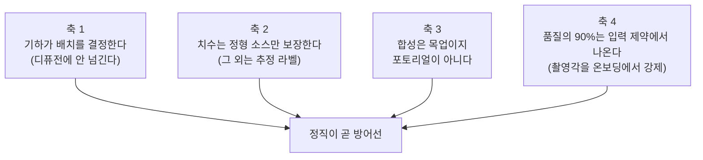
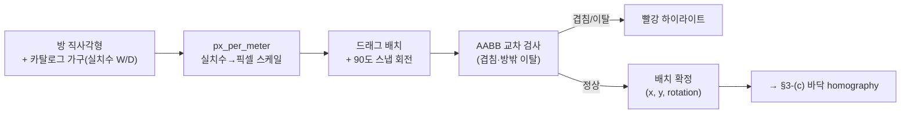
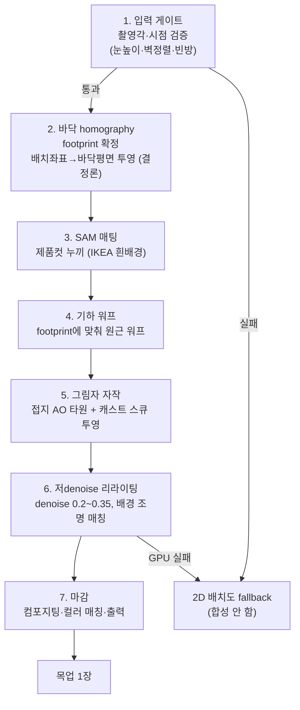
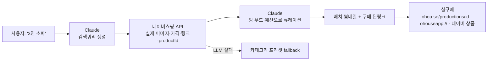
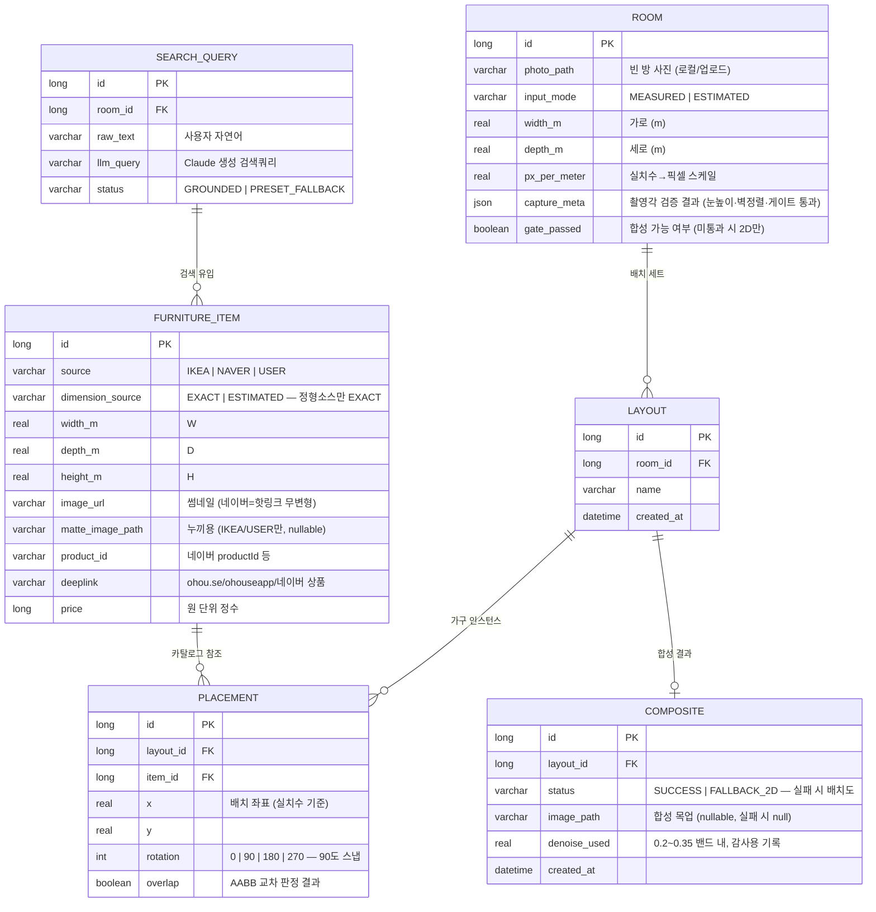
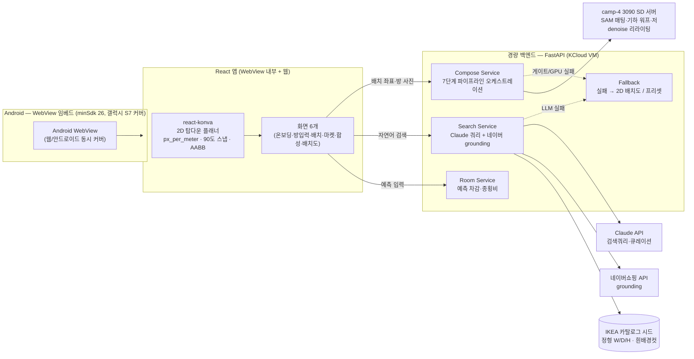

# 🧚 방꾸요정 — 기능 명세서

> **개발 팀을 위한 "무엇을 · 어떻게 · 언제" 문서.** 왜 이 제품인지(시장·타깃·경쟁·차별화)는 기획서에서 끝냈다. 이 문서는 실제로 짤 기능과 그 동작·데이터·일정, 그리고 **정직 원칙을 코드/스키마/파이프라인으로 어떻게 강제하는가**만 다룬다. 하드 넘버(예측 차감 4~6㎡, 종횡비 1:1.3~1.5, 90도 스냅, denoise 0.2~0.35, 촬영 눈높이 1.4~1.6m, minSdk 26, MVP/Stretch/Future 경계)를 단일 기준으로 따른다. 불변식 정본은 **§8에 모아 둔다.**

---

## 1. 개요 & 핵심 사용자 루프

**빈 원룸 사진 한 장 + 방 크기를 넣으면, 실제 파는 가구를 실치수로 2D 배치해보고, 그 가구가 놓인 방 이미지를 합성해 보여주고, 구매 링크로 바로 연결하는 앱.**

타깃은 지방서 상경해 처음 원룸을 얻은 자취 새내기(19~23)다. 이들의 페인은 하나로 수렴한다: **가구를 사기 전에 "이게 내 방에 들어갈까 / 어울릴까"를 확인할 방법이 없다** — 치수 감이 없고, 배치가 상상되지 않는다. 방꾸요정은 이 둘을 각각 다른 설계로 받아친다: 치수는 **기하(homography·AABB)가 결정론적으로** 풀고, 어울림은 **실제 매물 사진의 목업 합성**으로 눈에 보이게 한다.

핵심 루프는 하나의 체인이다:

**방 사진 업로드 + 크기 입력(실측 또는 예측) → 단일 직사각형 방 생성 → 마켓에서 실치수 가구 검색(LLM 래핑 + 네이버 grounding) → react-konva 탑다운 2D 배치(90도 스냅·겹침 하이라이트) → "이 배치로 빈 방 이미지 생성" → 7단계 합성 파이프라인이 목업 1장 반환 → 구매 딥링크로 실구매 연결**

이 문서가 강제하는 네 축:

네 축 모두 하나의 엔지니어링 원칙으로 수렴한다: **배치·치수·접지는 기하가 확정하고, 디퓨전은 배경·매팅·저denoise 리라이팅만 맡는다. AI·GPU 장애는 예외가 아니라 대체 경로(2D 배치도·카테고리 프리셋)로 흡수되어 사용자 플로우를 끊지 않는다.**

---

## 2. 기능 목록 (우선순위)

| 기능 | 설명 | 단계 |
|---|---|---|
| 방 입력 (실측/예측) | 빈 방 사진 업로드 + 벽 한 변 실측 입력(줄자) **또는** 평수/㎡ 예측(화장실·주방 4~6㎡ 차감 → 종횡비 1:1.3~1.5 → 가로·세로). 원룸을 단일 직사각형으로 가정. | MVP |
| 촬영 가이드 온보딩 | 눈높이 1.4~1.6m · 정면/한쪽 벽 정렬 · 저박스형 품목 전제를 **입력 단계에서 강제**. 품질의 90%가 여기서 결정된다. | MVP |
| 2D 배치 엔진 | react-konva 탑다운, `px_per_meter` 실치수 스케일, **90도 스냅 회전만** 허용, 겹침·방밖이탈을 **AABB로 판정**해 하이라이트. | MVP |
| 마켓 연동 | LLM이 검색쿼리 생성 → 네이버쇼핑 API가 실제 이미지·가격·링크·productId 반환(grounding) → LLM이 무드·예산으로 큐레이션. | MVP |
| 실치수 카탈로그 시드 | IKEA Measurements(정형 W/D/H) + 흰배경 스튜디오컷을 누끼·합성용 1차 소스로 시드. 소파·침대·서랍장·TV장·러그로 품목 한정. | MVP |
| 합성 파이프라인 | 7단계(입력게이트 → 바닥 homography footprint 확정 → SAM 매팅 → 기하 워프 → 그림자 자작 → 저denoise 리라이팅 → 마감). 목업 1장 생성. | MVP |
| 실구매 딥링크 | 오늘의집 `ohou.se/productions/{id}`·앱스킴 `ohouseapp://`·네이버 상품페이지로 딥링크. 계약 불필요, 즉시 가능. | MVP |
| 2D 배치도 fallback | 합성 실패 시 탑다운 배치도라도 표시. LLM 실패 시 카테고리 프리셋. **fallback은 Stretch가 아니라 MVP.** | MVP |
| 배치 저장·공유 카드 | 배치를 저장하고, 3090 서버로 공유 카드 생성. 실패 시 텍스트 카드. | Stretch |
| 다중 가구 배치 | 여러 가구 동시 배치 + 자동 정리(겹침 회피 배열). | Stretch |
| 쿠팡 파트너스 수수료화 | 이미지+딥링크+수수료를 한 번에. **API 활성화에 누적판매 15만원 조건 → 1주 내 안 열릴 위험, 수동 딥링크 폴백.** | Stretch |
| 스타일/무드 추천 | 방 무드·예산 기반 큐레이션 프리셋. | Stretch |

Stretch는 위→아래 우선순위순이며, 시간 부족 시 아래부터 자른다(자르는 순서는 D0에 합의). **Future(중기·장기) 후보는 §10에 구조화한다.**

---

## 3. 기능 상세

### 3-(a). 방 입력 — 치수 감이 없는 사용자에게 두 경로를 준다

원룸을 **단일 직사각형으로 가정**한다. L자·복층·분리형은 범위 밖 — 단순화가 곧 결정론적 배치의 전제다. 방 크기는 두 경로로 확정한다.

| 경로 | 입력 | 산출 | 치수 신뢰 |
|---|---|---|---|
| **실측 (MEASURED)** | 줄자로 **벽 한 변**을 재서 입력(m) | 그 한 변을 기준으로 사진 속 바닥 스케일을 보정 → 나머지 변은 방 종횡비로 파생. `px_per_meter` 확정 | 사용자 실측 기반 — 배치 스케일의 1차 신뢰 |
| **예측 (ESTIMATED)** | 평수 또는 ㎡ 입력 | ① 전용면적에서 **화장실·주방 4~6㎡ 차감**(원룸 표준) → ② 거주 공간에 **원룸 표준 종횡비 1:1.3~1.5 적용** → ③ 가로·세로 산출 | 추정 — 화면에 **"추정 치수" 라벨** 상시 |

- **예측 휴리스틱은 근사임을 숨기지 않는다.** 4~6㎡ 차감폭과 1:1.3~1.5 종횡비는 원룸 표준의 통계적 근사일 뿐, 특정 방의 실측이 아니다. 예측 경로로 만든 방은 배치 화면에서 **"실측하면 정확해집니다" 유도**를 항상 띄운다.
- **촬영 가이드는 입력이 아니라 관문이다.** 온보딩에서 (i) 폰을 **눈높이 1.4~1.6m**로, (ii) **정면 또는 한쪽 벽에 정렬**해, (iii) 방을 **비운 상태**로 찍도록 강제한다. 이유는 §3-(c)에 있다 — homography는 바닥만 워프하므로 시점이 어긋나면 합성이 구조적으로 무너지고, 디퓨전으로 못 고친다. **품질의 90%는 여기서 나온다.**
- 입력 게이트(§3-(c)-1)가 촬영각을 통과 못 시키면 배치는 되지만 합성은 막고 2D 배치도만 제공한다 — 못 찍은 사진에 억지 합성으로 "붙여넣은 티"를 내지 않는다.

### 3-(b). 2D 배치 엔진 — 임의각도를 버려 겹침 판정을 결정론으로 만든다

react-konva 탑다운 2D 플래너다. 방 직사각형과 가구를 **실치수 → 화면 픽셀** 단일 스케일(`px_per_meter`)로 그린다. 핵심 설계 결정은 **자유도를 의도적으로 깎는 것**이다.

- **회전은 90도 스냅만 허용한다.** 임의 각도를 허용하면 겹침 판정에 SAT(분리축 정리)가 필요하고, 방밖 이탈·모서리 클리핑 계산이 복잡해진다. 90도 스냅으로 제한하면 모든 가구가 축정렬 사각형이 되어 **겹침·방밖 판정이 AABB(축정렬 바운딩박스) 교차 검사로 끝난다** — 순수 함수 수십 줄, 단위 테스트 대상. 원룸 가구 배치에서 45도 배치 수요는 사실상 없으므로 자유도 손실이 무시 가능하다.
- **겹침·이탈은 실시간 하이라이트.** 드래그 중 두 가구의 AABB가 교차하거나 방 사각형을 벗어나면 해당 가구를 빨강으로 표시한다. "이 소파가 이 방에 들어가긴 하는가"를 배치 순간에 눈으로 답한다 — 이게 치수 감이 없는 타깃의 핵심 페인 해소다.
- **배치 좌표가 합성의 입력이다.** 각 가구의 `(x, y, rotation)`과 실치수 W/D는 그대로 §3-(c)의 바닥 homography footprint 계산으로 넘어간다. **배치는 기하가 결정하고 디퓨전은 이 결정을 받아쓰기만 한다** — 디퓨전이 가구 위치를 재해석할 경로가 없다.
- 가구 치수는 **정형 소스(IKEA)면 실치수**, 네이버·중고면 **추정 치수 라벨**로 구분해 렌더한다(§8 불변식 (a)).

### 3-(c). 합성 파이프라인 — 하이브리드: 기하가 확정, 디퓨전은 마감만

이 파이프라인의 전제는 기획서에서 논증한 품질의 계단식 특성이다: **조건이 맞으면 준포토리얼(가구 쇼핑몰 상세 합성컷 수준), 벗어나면 "붙여넣은 티"로 급락한다.** 그래서 배치·스케일·접지는 **기하로 결정론적으로 확정**하고, 디퓨전은 배경·매팅·저denoise 리라이팅만 맡는다. Modsy식 잡지 렌더는 구조적으로 불가하며, 시도하지 않는다.

7단계다.

| 단계 | 하는 일 | 정직 제약 |
|---|---|---|
| **1. 입력 게이트** | 방 사진의 촬영각(눈높이·벽 정렬·빈방 여부)을 검증한다. 벗어나면 합성을 **막고** 2D 배치도로 보낸다. | 못 찍은 사진에 억지 합성을 하지 않는다. 품질 하한을 게이트가 보장한다. |
| **2. 바닥 homography footprint 확정** | 방 바닥 평면의 4점 대응으로 homography를 잡고, §3-(b)의 배치 좌표 `(x, y, rotation, W, D)`를 **바닥 평면에 결정론적으로 투영**해 가구가 놓일 footprint(원근 사다리꼴)를 확정한다. | **디퓨전에 넘기지 않는다.** 위치·스케일은 여기서 끝난다. |
| **3. SAM 매팅** | IKEA 흰배경 스튜디오컷에서 가구를 누끼 딴다. 흰배경·정형 컷이라 매팅이 쉽고 저작권이 단순하다. | 누끼 합성용 이미지는 **IKEA/사용자 업로드만** 쓴다. 네이버 이미지는 약관상 배치 썸네일 표시용(§8 (g)). |
| **4. 기하 워프** | 누끼딴 제품컷을 2단계의 footprint에 원근 워프로 앉힌다. 제품컷 시점과 방 시점을 매칭한다. | homography는 **바닥만 워프**한다. 시점이 어긋나면 가구가 2.5D 판때기로 보이며 이후 단계로 못 고친다 → 그래서 1단계 게이트가 관문이다. |
| **5. 그림자 자작** | 접지부에 **소프트 AO 타원을 Multiply 30~60%**로 깔고, 캐스트 그림자를 **주광 반대 방향으로 스큐 투영**한다. | 그림자는 디퓨전이 아니라 자작이다 — 접지감(방에 "놓인" 느낌)이 합성 신뢰의 핵심이라 결정론적으로 만든다. |
| **6. 저denoise 리라이팅** | **denoise 0.2~0.35 밴드**로 배경 조명·색온도에 가구를 화합시킨다. | **밴드 초과 금지**(§8 (e)). 0.35를 넘으면 디퓨전이 가구 형태·치수를 재해석해 기하가 확정한 배치를 파괴한다. |
| **7. 마감** | 컴포지팅·컬러 매칭·출력. 목업 1장 반환. | 결과는 **"목업"으로 라벨**한다 — 포토리얼로 과잉 약속하지 않는다(§8 (b)). |

- **품목 한정이 품질 제약이다.** 낮은 박스형(낮은 소파·침대·서랍장·TV장) + 러그로 한정한다. 키 큰·복잡한 형상은 바닥 homography 워프로 표현이 어렵고 2.5D 티가 난다. 카탈로그 시드부터 이 품목으로 제한한다.
- **fallback**: 입력 게이트 실패 또는 GPU 실패 시 합성을 포기하고 **2D 탑다운 배치도**를 결과로 준다. 배치도는 이미 기하로 확정돼 있으므로 "이 배치로 이 방이 채워진다"는 정보 가치는 유지된다.

### 3-(d). 마켓 연동 — LLM 단독은 환각하므로 실제 상품 API를 grounding으로 깐다

LLM 단독은 URL·치수·가격을 환각해 실패한다. 그래서 **LLM은 검색쿼리 생성과 큐레이션만** 맡고, **실제 상품 데이터는 네이버쇼핑 검색 오픈API**가 grounding으로 공급한다.

- **grounding이 환각 방어선.** 사용자가 "3인 소파"라 말하면 Claude가 검색쿼리를 만들고, 네이버 API가 **진짜** 상품(이미지·가격·링크·productId)을 반환하며, Claude는 그 실제 목록 안에서만 방 무드·예산으로 골라 준다. LLM이 상품 URL이나 치수를 지어낼 경로가 없다.
- **실구매는 딥링크로 즉시 가능.** 오늘의집 `ohou.se/productions/{id}`(웹) 또는 앱스킴 `ohouseapp://`, 네이버 상품페이지로 연결한다 — **계약 불필요.** 인앱 결제는 공개 커머스 API가 없어 불가하며, 시도하지 않는다.
- **수수료화는 Stretch·리스크 있음.** 쿠팡 파트너스는 이미지+딥링크+수수료를 한 번에 주지만, API 활성화에 **누적판매 15만원 조건**이 걸려 1주 내 안 열릴 위험이 있다 → 수동 딥링크 폴백을 항상 유지한다.
- **데이터 소스는 용도별로 분리한다**(§6 표). 누끼 합성·실치수는 IKEA, grounding·검색·가격·링크는 네이버, 오늘의집은 **트래픽 보내는 단방향 딥링크로만**(크롤링 금지 — Akamai 봇차단·치수 비정형·DB권 리스크).
- **fallback**: LLM 실패 시 카테고리 프리셋(미리 시드한 IKEA 대표 아이템)으로 배치를 잇는다.

---

## 4. 화면 명세

| 화면 | 핵심 요소 | 동작·제약 |
|---|---|---|
| **① 온보딩 — 촬영 가이드** | 눈높이 1.4~1.6m · 벽 정렬 · 빈방 예시컷 + 가림 프레임 오버레이 | **입력 관문.** 가이드를 건너뛰면 합성 품질을 보장하지 않는다고 고지. 촬영각이 곧 품질임을 첫 화면에서 못박는다. |
| **② 방 입력** | 사진 업로드 + [실측] / [예측] 탭 | 실측: 벽 한 변 m 입력. 예측: 평수/㎡ 입력 → 차감·종횡비로 가로·세로 자동. 예측 방엔 **"추정 치수" 배지 + 실측 유도.** |
| **③ 2D 배치 플래너** | 방 직사각형(실치수 스케일) + 가구 드래그 | react-konva 탑다운. 90도 스냅 회전. 겹침·방밖은 **빨강 하이라이트**. 각 가구에 실치수/추정 치수 라벨. |
| **④ 마켓 탐색** | 자연어 검색창 + 네이버 결과 그리드(실제 이미지·가격) | Claude 큐레이션 결과를 무드·예산순 정렬. 탭 → 배치 플래너로 실치수 삽입. LLM 실패 시 카테고리 프리셋. |
| **⑤ 합성 결과** | 목업 이미지 1장 + 배치된 가구별 구매 딥링크 | 상단에 **"목업 — 실제 조명·재질과 다를 수 있음" 배지.** 각 가구 → `ohou.se`/`ohouseapp://`/네이버 딥링크. 합성 실패 시 ⑥로. |
| **⑥ 2D 배치도 fallback** | 탑다운 배치도(치수 라벨 포함) | 합성 실패·입력게이트 미통과 시. 배치는 기하로 이미 확정돼 있어 "들어간다/어울린다"의 절반(치수)은 유지. |

**신뢰 UX 원칙 — 모든 치수·이미지는 출처로 내려간다:** 화면의 모든 가구 치수는 탭하면 출처(IKEA 정형 W/D/H **또는** 네이버 추정)로 드릴다운되고, 합성 결과는 항상 "목업"으로 라벨된다. **실치수(정형 소스)와 추정치수(네이버/중고)를 시각적으로 구분하고, 포토리얼로 과잉 약속하지 않는다.** 확인 비용이 0에 수렴할 때 "내 방에 들어갈까"의 불안이 배치로 대체된다.

---

## 5. 데이터 모델

| 엔티티 | 한 줄 설명 |
|---|---|
| **Room** | 원룸 1개. 단일 직사각형. `input_mode`로 실측/예측, `gate_passed`로 합성 가능 여부를 구분한다. |
| **FurnitureItem** | 마켓 카탈로그 아이템. `dimension_source`가 EXACT(IKEA)/ESTIMATED(네이버)를 가르고, `matte_image_path`는 IKEA/사용자 업로드만 채워진다(네이버 이미지는 누끼 금지). |
| **Placement** | 배치 인스턴스. `rotation`은 90도 스냅 4값만, `overlap`은 AABB 판정 결과. 합성 파이프라인의 입력 좌표. |
| **Layout** | 한 방의 배치 세트(저장·재현 단위). |
| **Composite** | 합성 결과. `status`로 성공/2D 배치도 fallback을 구분하고, `denoise_used`로 밴드 준수를 감사한다. |
| **SearchQuery** | 마켓 검색 1건. `status`로 grounding 성공/프리셋 fallback을 추적한다. |

원칙: **치수·배치·접지는 기하가 확정하고 스키마로 그 출처를 강제한다.** `dimension_source`·`gate_passed`·`denoise_used`는 정직 불변식(§8)을 데이터로 못박는 컬럼이다 — 규칙을 지키는 게 아니라 어길 자리를 없앤다.

---

## 6. 외부 연동 / API

경량 백엔드는 FastAPI 한 대(KCloud VM, 기존 madcamp 인프라). **모든 외부 연동은 실패를 예외가 아니라 대체 경로로 흡수한다.**

| 소스 | 용도 | 방식 | 제약·리스크 |
|---|---|---|---|
| **IKEA** | 누끼 합성 + 실치수 배치의 **1차 소스** | Measurements 정형 W/D/H + JSON-LD + 흰배경 스튜디오컷 시드 | 자사제품이라 저작권 단순, 매팅 유리. 카탈로그 시드로 선반영. |
| **네이버쇼핑 검색 API** | grounding·검색·가격·링크·productId | 오픈API, LLM 쿼리 → 실제 상품 반환 | 심사 없이 즉시·합법. **이미지는 핫링크·무변형 표시**(약관) → 배치 썸네일용, 누끼 합성용 아님. |
| **오늘의집** | 실구매 트래픽 | **단방향 딥링크만** (`ohou.se/productions/{id}`, `ohouseapp://`) | **크롤링 금지** — Akamai 봇차단·치수 비정형·최대 경쟁자·DB권 리스크. |
| **쿠팡 파트너스** | 수수료화 (Stretch) | 이미지+딥링크+수수료 통합 API | **누적판매 15만원 조건** → 1주 내 미개방 위험. 수동 딥링크 폴백 상시. |
| **자체 3090 SD 서버** | 합성·SAM 매팅·저denoise 리라이팅 | SSH 터널, camp-4 초상 파이프라인 재활용 | GPU 실패 → 2D 배치도 fallback. |
| **Claude API** | 검색쿼리 생성·큐레이션 | FastAPI 프록시(키 앱에 미탑재) | 실패 → 카테고리 프리셋 fallback. |

**서버 엔드포인트(경량):**

| # | Method | Path | 입력 → 출력 | 실패 처리 |
|---|---|---|---|---|
| 1 | POST | `/api/room/estimate` | 평수/㎡ → 가로·세로(차감·종횡비 적용) | 로컬 계산, 실패 없음 |
| 2 | POST | `/api/search` | 자연어 → Claude 쿼리 → 네이버 grounding → 큐레이션 목록 | 실패 시 `status: PRESET_FALLBACK` |
| 3 | POST | `/api/compose` | Layout(배치 좌표·방 사진) → 7단계 합성 목업 | GPU/게이트 실패 시 `status: FALLBACK_2D` |
| 4 | GET | `/api/deeplink/{item_id}` | productId → 실구매 딥링크 | 폴백: 네이버 상품페이지 |
| 5 | POST | `/api/card` | Layout → 3090 공유 카드 (Stretch) | 실패 시 `status: TEXT_CARD` |

---

## 7. 아키텍처 & 기술 스택

- **웹/안드로이드 동시 커버**: React + react-konva로 만든 2D 플래너를 **Android WebView에 임베드**해 한 코드베이스로 웹과 앱을 동시에 커버한다. **minSdk 26으로 갤럭시 S7(팀 기기)을 커버**하고, targetSdk는 최신 가능.
- **AR 실측은 제외한다.** 갤럭시 S7은 ARCore Depth를 지원하지 않는다 — 실측은 줄자(벽 한 변) 입력으로, 예측은 평수 휴리스틱으로 대체한다. AR은 신형폰 한정 Stretch(§10)로 미룬다.
- **기하 코어는 디퓨전 밖**: `px_per_meter` 스케일링, AABB 겹침 판정, 바닥 homography footprint, 그림자 자작은 전부 **결정론적 순수 함수 + 단위 테스트**다. SD 서버는 SAM 매팅·기하 워프·저denoise 리라이팅만 맡는다.

| 구분 | 기술 | 용도 |
|---|---|---|
| Frontend | React + react-konva | 2D 탑다운 플래너, 실치수 스케일·90도 스냅·AABB |
| App | Android WebView (minSdk 26) | 웹 앱 임베드로 S7 커버, targetSdk 최신 |
| Backend | FastAPI (KCloud VM) | 예측 계산·검색 프록시·합성 오케스트레이션·fallback |
| 이미지 생성 | 자체 3090 SD 서버 (camp-4 파이프라인 재활용) | SAM 매팅·기하 워프·저denoise(0.2~0.35) 리라이팅 |
| LLM | Claude API (FastAPI 프록시) | 검색쿼리 생성·무드/예산 큐레이션, 항상 프리셋 fallback |
| 마켓 | 네이버쇼핑 검색 오픈API | grounding(실제 이미지·가격·링크·productId) |
| 카탈로그 | IKEA 시드(정형 W/D/H·흰배경컷) | 누끼 합성·실치수 배치 1차 소스 |

---

## 8. 품질 제약 & 정직 원칙 (불변식 정본)

이 문서 전체를 관통하는 불변식이며, **§3 등 본문은 여기를 참조만 한다.** 화면·발표·코드 어디서도 어기지 않는다. 정직이 마케팅 수사가 아니라 **리스크 관리 전략**이라는 점이 방꾸요정의 설계적 일관성이다 — 심사 Q&A "이거 정확해요? / 진짜 이렇게 나와요?"에 대한 답이 모두 이 불변식으로 수렴한다.

**(a) 치수 정확도는 정형 소스만 보장한다.** IKEA 등 Measurements 정형 W/D/H를 가진 아이템만 실치수를 보장하고, 네이버·중고는 항상 **"추정" 라벨**로 렌더한다. 스키마 `dimension_source`(EXACT | ESTIMATED)로 강제 — 라벨 없는 렌더 경로가 없다.

**(b) 합성 이미지는 "목업"이지 포토리얼이 아니다.** 결과 화면 상단에 "목업 — 실제 조명·재질과 다를 수 있음" 배지를 상시 노출한다. UI·발표에서 "실제 방처럼", "포토리얼"로 **과잉 약속 금지.** 예상 품질은 "그럴듯한 목업 상단"이며, 조건이 맞을 때만 준포토리얼이다.

**(c) 촬영각(입력 제약)이 품질을 좌우한다.** 눈높이 1.4~1.6m·정면/한쪽 벽 정렬·빈방 촬영을 **온보딩에서 강제**한다. 입력 게이트를 통과 못 하면 합성을 막고 2D 배치도로 보낸다 — 품질의 90%가 입력에서 나온다.

**(d) 배치·치수는 기하가 결정하고 SD가 결정하지 않는다.** `px_per_meter` 스케일·AABB 겹침·바닥 homography footprint·그림자 자작이 위치와 스케일을 **결정론적으로 확정**한다. 디퓨전이 가구 위치·치수를 재해석할 경로는 스키마·파이프라인 어디에도 없다.

**(e) 저denoise 밴드를 초과하지 않는다.** 리라이팅 denoise는 **0.2~0.35** 밴드에서만 돈다. `Composite.denoise_used`로 기록·감사한다. 0.35를 넘으면 디퓨전이 기하가 확정한 배치를 파괴한다.

**(f) Fallback은 MVP다.** 합성 실패 시 **2D 탑다운 배치도**, LLM 실패 시 **카테고리 프리셋**으로 플로우를 잇는다. GPU·LLM을 뽑아도 핵심 루프(방 입력 → 배치 → 결과)는 성립해야 한다. fallback 경로는 데모 리허설에 포함한다.

**(g) 이미지 출처를 용도별로 강제한다.** 네이버 이미지는 약관상 **핫링크·무변형 표시**만 허용 → **배치 썸네일 표시용.** 누끼 합성용 이미지는 **IKEA/사용자 업로드만** 쓴다(`matte_image_path`가 네이버 소스엔 채워지지 않는다).

**모든 수치는 단일 기준.** 아래 하드 넘버는 이 문서·코드·UI·발표에서 하나의 값으로만 존재한다. 바꾸려면 이 표를 먼저 고친다.

| 항목 | 값 | 근거 |
|---|---|---|
| 방 모델 | 단일 직사각형 | 원룸 한정 단순화 → 결정론적 배치의 전제 |
| 예측 차감 | 화장실·주방 4~6㎡ | 원룸 표준 근사(추정 라벨) |
| 예측 종횡비 | 1:1.3~1.5 | 원룸 표준 근사(추정 라벨) |
| 회전 | 90도 스냅 4값(0/90/180/270) | AABB 판정 유지, 임의각 SAT 회피 |
| 겹침·이탈 판정 | AABB 교차 | 축정렬 사각형 전제, 순수 함수 |
| 촬영각 | 눈높이 1.4~1.6m, 정면/한쪽 벽 | homography 바닥 워프 조건, 품질의 90% |
| homography | 바닥만 워프 | 시점 어긋나면 2.5D 판때기, 디퓨전 복구 불가 |
| 접지 AO | 소프트 타원 Multiply 30~60% | 그림자 자작(접지감) |
| 리라이팅 denoise | 0.2~0.35 밴드 | 초과 시 배치 파괴 |
| 품목 | 낮은소파·침대·서랍장·TV장·러그 | 저박스형 한정, 워프 표현 가능 범위 |
| 누끼 합성 소스 | IKEA/사용자 업로드 | 저작권·매팅·약관 |
| grounding 소스 | 네이버쇼핑 API | 즉시·합법·환각 방어 |
| minSdk | 26 | 갤럭시 S7 커버 |
| 쿠팡 API 조건 | 누적판매 15만원 | 1주 미개방 위험 → 수동 딥링크 폴백 |

**merge 기준.** 프론트·백엔드·SD 서버가 다른 가정으로 갈라지지 않도록 D0에 스키마·API·임계값과 위 표를 단일 기준으로 확정하고, Stretch를 자르는 순서도 D0에 합의한다.

---

## 9. 개발 로드맵

**MVP 완료 기준 — 1주차 종료 시 이 시나리오가 데모 가능해야 한다:** "원룸 평수 입력 → 방 직사각형 생성 → IKEA 시드 카탈로그(+네이버 검색)에서 소파/침대를 실치수로 드래그 배치(겹침 하이라이트) → '이 배치로 빈 방 이미지 생성' → 합성 목업 1장 → '구매' 딥링크." **end-to-end 1회 흐름 완성. 그리고 GPU/LLM을 뽑아도 같은 시나리오가 2D 배치도·프리셋으로 성립해야 한다.**

### MVP (1주차, 일자별)

- [ ] **D0 — 기준 확정.** §5 스키마·§6 API·§8 하드 넘버 표 확정. IKEA 시드 카탈로그(소파·침대·서랍장·TV장·러그, 정형 W/D/H + 흰배경컷) 수집 개시. 이후 각자 착수.
- [ ] **D0~D1 — homography 접합을 먼저 뚫는다.** *배치 좌표 → 바닥 homography footprint → 워프 합성*의 접합을 제일 먼저 검증한다. 여기가 제품의 성패이자 최대 리스크(시점 어긋나면 2.5D)라 **조기에 실패를 확인**한다. 한 장이라도 "가구가 방에 놓인" 목업이 나오면 나머지는 붙이기다.
- [ ] **D1.** 방 입력: 실측(벽 한 변)·예측(차감·종횡비) + 촬영 가이드 온보딩. `px_per_meter` 확정.
- [ ] **D2.** 2D 배치 엔진: react-konva 탑다운 + 90도 스냅 + AABB 겹침 하이라이트. 순수 함수 단위 테스트(스케일·겹침·이탈).
- [ ] **D3 — 접합.** 배치 좌표 → §3-(c) 7단계 파이프라인 통합. SAM 매팅 + 기하 워프 + 그림자 자작 + 저denoise 리라이팅을 3090 서버에 올린다. 입력 게이트 + 2D 배치도 fallback.
- [ ] **D4.** 마켓 연동: Claude 쿼리 → 네이버 grounding → 큐레이션 → 배치 삽입. LLM 실패 시 카테고리 프리셋 fallback.
- [ ] **D5.** 실구매 딥링크(`ohou.se`/`ohouseapp://`/네이버). Android WebView 임베드(minSdk 26, S7 실기 확인). 목업 배지·추정치수 라벨 등 정직 UI.
- [ ] **D6.** MVP 통합 리허설 + **fallback 경로 리허설(GPU/LLM 뽑고 재현)** + 버그 정리.

### 역할 분담

| | 개발자 A — 기하·합성 | 개발자 B — 화면·서버·마켓 |
|---|---|---|
| 담당 | homography footprint·SAM 매팅·기하 워프·그림자 자작·저denoise 파이프라인 | react-konva 플래너·방 입력·FastAPI·네이버 grounding·딥링크·WebView |
| 시작 | **D0부터 homography 접합을 뚫는다** — 최대 리스크의 조기 검증 | 시드 데이터로 플래너·화면 병행 개발 |
| 접합 | D3에 배치 좌표로 파이프라인 접합 | D3에 A의 합성 결과를 화면에 통합 |

### Stretch (2주차) — 우선순위순, 시간 부족 시 아래부터 자른다

- [ ] 배치 저장·공유 카드 (3090 생성, 실패 시 텍스트 카드)
- [ ] 다중 가구 배치 + 자동 정리
- [ ] 쿠팡 파트너스 수수료화 (누적판매 15만원 미달 시 수동 딥링크 유지)
- [ ] 스타일/무드 추천 프리셋

---

## 10. 추후 추가 기능 (근거리·중기·장기)

사용자가 명시 요청한 확장 후보를 실현 시점과 의존성으로 구조화한다. **코어(§2~9)에 의존을 걸지 않는다** — 이 목록은 방향이지 약속이 아니다.

### 근거리 (Stretch, 2주차 후보)

| 기능 | 내용 | 조건·리스크 |
|---|---|---|
| 줄자/AR 실측 | 신형폰 ARCore Depth로 벽 자동 실측 | **신형폰 한정** — S7 미지원이라 코어는 줄자 입력 유지 |
| 다중 가구 배치 + 자동 정리 | 여러 가구 동시 배치, 겹침 회피 자동 배열 | AABB 기반 그리디 배열 |
| 쿠팡 파트너스 수수료화 | 딥링크에 수수료 부착 | 누적판매 15만원 미달 시 수동 폴백 |
| 배치 저장·공유 카드 | 3090으로 공유 카드 생성 | 실패 시 텍스트 카드 |
| 스타일/무드 추천 | 방 무드·예산 기반 큐레이션 프리셋 | Claude 큐레이션 확장 |

### 중기 (Future)

| 기능 | 내용 | 근거 |
|---|---|---|
| **진단 + 저예산 처방 모드** | 빈방 사진 → 형광등·빈 벽·죽은 공간 진단 → **"3만원으로 뭘 먼저 사야 하나"** 저예산 우선순위 처방 | 경쟁분석이 지목한 진짜 빈칸이자 저예산 자취 새내기 특화의 방어선 |
| 중고 매물 누끼 배치 | 당근 등 중고 매물 사진을 사용자가 업로드 → SAM 누끼 → 실치수 배치 | 오늘의집·IKEA Place가 못 하는 "아무 제품이나" 배치의 확장 (치수는 추정 라벨) |
| SOTA 삽입 모델 | AnyDoor/Insert Anything 등으로 하모나이즈 품질 상향 | 저denoise 리라이팅의 상위 대체 — 코어 파이프라인과 A/B |
| 커뮤니티 | 배치·집들이 공유, 피드 | 리텐션 레이어 |
| 3D 뷰 | 탑다운 2D를 3D로 확장 | 오늘의집 아키스케치 대비 격차 축소 |

### 장기

- 예산 슬라이더 기반 **방 전체 코디 처방** (한 방을 통째로 예산 안에서 큐레이션)
- 가구 브랜드 제휴 피드

**엔지니어링 함의**: 생성형 render 자체는 레드오션이므로 **코어로 내세우지 않는다** — 코어 파이프라인은 기하 결정론 + 저denoise 목업으로 확정하고, 생성형 render의 품질 상향은 중기 후보(SOTA 삽입)로만 A/B 검증한다. 코어와 확장이 점유하는 축(매물 사진 기반 실치수 배치 + 원룸 저예산 특화 + 실구매 연동)이 왜 비어 있는 축인지에 대한 경쟁·차별화 논거는 **기획서 경쟁분석/차별화 절 참조.**

---

## 11. 기능별 완료 기준 (Acceptance Criteria)

| 기능 | 완료 기준 (검증 가능한 조건) |
|---|---|
| 방 입력 (실측/예측) | 실측: 벽 한 변 입력 → `px_per_meter` 확정, 배치 가구가 실치수 비율로 그려짐. 예측: 평수 입력 → 4~6㎡ 차감·1:1.3~1.5 종횡비로 가로·세로 산출, **"추정 치수" 배지 노출**을 코드 리뷰로 확인. |
| 촬영 가이드 온보딩 | 온보딩 없이 방 입력으로 진입 불가. 촬영각 미충족 사진은 입력 게이트에서 걸려 **합성이 막히고 2D 배치도로 전환**됨을 확인. |
| 2D 배치 엔진 | 실치수 스케일로 방·가구 렌더, 90도 스냅만 허용(임의각 불가), 두 가구 AABB 교차 시 빨강 하이라이트. 스케일·겹침·이탈 순수 함수 단위 테스트 골든 케이스 통과. |
| 합성 파이프라인 | 촬영각 통과 방 + 배치 → 7단계 거쳐 목업 1장 생성, 가구가 바닥에 접지(AO)되어 "놓인" 것으로 보임. **`denoise_used`가 0.2~0.35 밴드 내**·상단 "목업" 배지·포토리얼 과잉약속 부재를 코드 리뷰로 확인. |
| 마켓 연동 | "3인 소파" 입력 → Claude 쿼리 → 네이버 API 실제 상품(이미지·가격·productId) 반환 → 배치 삽입. **LLM 키 제거 시 카테고리 프리셋으로 성립**(status=PRESET_FALLBACK). |
| 실구매 딥링크 | 합성 결과의 각 가구 → `ohou.se/productions/{id}`/`ohouseapp://`/네이버 상품페이지로 실제 이동. 딥링크 실패 시 네이버 폴백. |
| Fallback | **GPU 뽑은 상태에서 합성 요청 → 2D 배치도(FALLBACK_2D) 렌더.** LLM 뽑은 상태에서 검색 → 프리셋 렌더. 두 경로 모두 핵심 루프가 끊기지 않음. |
| WebView (S7) | react-konva 플래너가 **갤럭시 S7 실기(minSdk 26)** WebView에서 드래그·스냅·하이라이트 동작 확인. |

**MVP 데모 시나리오 (D6 리허설에서 무단절 통과해야 함):**
1. 원룸 평수 입력 → 방 직사각형 생성(추정 치수 배지)
2. IKEA 시드(+네이버 검색)에서 소파·침대를 실치수로 드래그 배치 → 겹침 하이라이트 확인
3. "이 배치로 빈 방 이미지 생성" → 합성 목업 1장(목업 배지)
4. 배치된 가구의 "구매" → 딥링크 이동
5. **GPU/LLM을 뽑고 1~4 재현** → 합성이 2D 배치도로, 검색이 카테고리 프리셋으로 성립