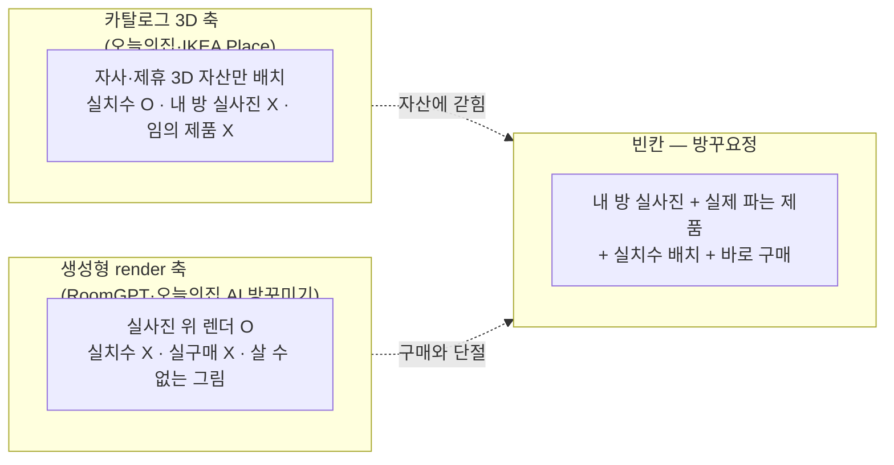
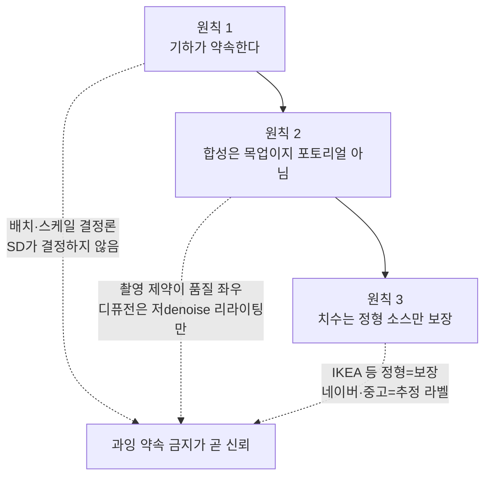
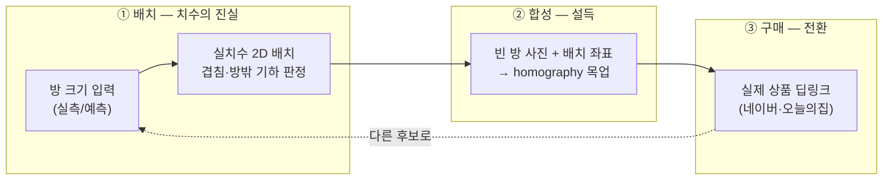
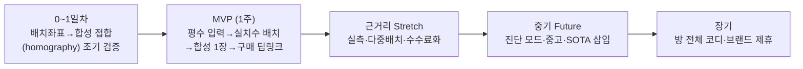

# 🧚 방꾸요정 — 기획서

> **"원룸 가구 실패의 대부분은 취향이 아니라 치수에서 나온다 — 사기 전에 '내 방에 들어갈지'를 볼 방법이 없어서다."**

---

## 📌 제품 개요

**빈 원룸 사진과 방 크기만 넣으면, 실제로 파는 가구를 실치수로 배치해 보고 그대로 구매하는 앱.**

방꾸요정(코드네임)은 자취 새내기가 가구를 사기 전에 겪는 단 하나의 병목 — "이게 내 방에 들어갈까, 어울릴까" — 을 푼다. 사용자가 빈 방 사진과 방 크기(줄자 실측 또는 평수 예측)를 넣으면, 실제 마켓의 가구를 **실치수 스케일로** 2D 배치하고, 그 가구가 놓인 방 이미지를 합성해 보여준 뒤, 구매 링크로 바로 연결한다. 시중 도구가 카탈로그 3D 자산을 예쁘게 렌더하거나(오늘의집·IKEA) 실치수·실구매와 무관한 이미지를 생성하는(RoomGPT) 자리에서, 방꾸요정은 **실제 파는 물건을, 실제 내 방에, 실제 치수로** 놓아 보고 바로 사게 한다. 렌더가 목적이 아니라 **구매 전 검증**이 목적이다.

이 문서는 **왜 이 제품인가**(문제·타깃·경쟁·차별화·가치·목표)만 다룬다. 배치 엔진·homography 합성 파이프라인·API·스키마 등 **어떻게 짜는가**는 기능명세서로 미룬다. 구현 수치의 정본(스케일·denoise 밴드·공용면적 차감·표준 종횡비 등)도 모두 **기능명세서 §8의 단일 수치 표**에 산다 — 이 문서는 개념의 고도로만 서술하며, 값을 병렬로 들고 있지 않는다.

---

## 🔍 배경 — 문제 정의

### 자취 새내기가 가구를 사기 전에 못 하는 것

지방에서 상경해 처음 원룸을 얻은 새내기의 구매 과정은 세 지점에서 무너진다.

| 못 하는 것 | 무엇이 무너지는가 |
|---|---|
| **① 치수 감이 없다** | "폭 1,600mm 3인 소파"가 내 방에서 얼마나 자리를 먹는지 숫자로 감이 안 온다. 본가는 부모가 다 꾸며 놓은 완성된 공간이라, 빈 방을 채워 본 경험 자체가 백지다. 그래서 "생각보다 컸다 / 문이 안 닫힌다"로 반품·처분 비용을 치른다. |
| **② 배치가 상상이 안 된다** | 가구 하나하나의 치수를 알아도, 침대·책상·서랍장을 이 방에 어떻게 같이 놓을지가 머릿속에서 안 그려진다. 줄자로 벽을 재도 "그래서 여기 뭐가 들어가지?"에서 멈춘다. |
| **③ 사기 전엔 눈으로 확인할 수 없다** | 가구는 부피가 크고 반품이 번거로워 "일단 사보고 아니면 무르기"가 가장 비싼 실수다. 그런데 사기 전에 **내 방에 놓인 모습**을 볼 방법이 상용 도구엔 없다. |

세 실패의 공통 원인은 하나다: **구매 결정을 도와주는 도구가 전부 "내 방"이 아니라 "카탈로그 방"에서 논다.** 3D 배치 도구는 자기네가 가진 3D 자산만 놓을 수 있고, 생성형 AI는 실치수·실구매와 단절된 예쁜 그림을 준다. 정작 필요한 것은 **내 빈 방 실사진 위에, 실제 파는 물건을, 실제 치수로 놓아 보고 그대로 사는** 경로다.

### 시장의 빈칸

**빈칸의 정의**: 실제 판매 중인 가구를(중고까지 확장 가능) 내 방 실사진 위에 실치수로 배치하고 그대로 구매까지 잇는 상용 앱은 없다. 3D 카탈로그 진영은 자산에 갇혀 임의 제품·중고를 못 놓고, 생성형 render 진영은 실치수·실구매와 단절돼 "예쁜데 못 사는 그림"에서 멈춘다. 방꾸요정은 이 비어 있는 축 — **실사진 × 실치수 × 실구매** — 을 점유한다.

---

## 👤 타깃 사용자 & 페르소나

**핵심 타깃: 지방에서 상경해 처음 원룸에 사는 자취 새내기(19~23세).**

본가는 부모가 꾸며 준 완성된 공간이라 이들의 공간 미감은 사실상 백지다. 방을 채워 본 적이 없으니 치수 감이 없고(문제 ①), 배치가 상상이 안 되며(②), 사기 전에 확인할 방법이 없어(③) 첫 가구 구매에서 비싼 실수를 한다. 예산은 빠듯하고 실패는 뼈아프다.

### 페르소나 1 — 민재 (20세, 대학 새내기, 첫 원룸)

- **상황**: 5평 원룸에 침대와 책상만 놓인 상태. 소파를 하나 사고 싶은데 "3인이 좋을까 2인이 좋을까", 애초에 "소파를 놓으면 방이 꽉 차지 않을까"를 모른다. 줄자로 벽을 재도 그 숫자가 소파 폭이랑 어떻게 붙는지 감이 없다.
- **니즈**: 예쁜 렌더가 아니라 **"진짜 들어가?"의 답**. 내 방 치수 위에 실제 소파를 얹어서 남는 공간을 눈으로 보고 싶다.
- **방꾸요정이 주는 것**: 평수만 넣으면 방 직사각형이 뜨고, 실제 파는 소파를 실치수로 끌어다 놓으면 **겹치거나 방을 벗어날 때 즉시 하이라이트**된다. "들어가는지"는 그림의 분위기가 아니라 기하가 결정론적으로 답한다.

### 페르소나 2 — 수아 (22세, 자취 2개월차, 저예산)

- **상황**: 방이 휑한데 뭘 어디서부터 사야 할지 모른다. 오늘의집을 봐도 남의 집 사진이라 내 방에 대입이 안 되고, 예산은 몇만 원 단위다.
- **니즈**: 일반론("서랍장 사세요")이 아니라 **내 방·내 예산 기준의 구체적 후보**와, 그게 진짜 어울리는지의 확인.
- **방꾸요정이 주는 것**: "예산 안에서 3인 소파"라고 말하면 LLM이 네이버쇼핑 실제 상품(진짜 이미지·가격·링크)을 골라 방 무드·예산으로 큐레이션하고, 배치 썸네일과 구매 딥링크를 함께 준다. 조언이 아니라 **살 수 있는 후보**로 답한다.

---

## ⚔️ 경쟁 분석

각 진영이 장악한 것과, 정확히 어디서 무너지는지. 우리의 각도는 **"카탈로그 3D vs 실사진 실치수"** 한 축이다.

| 경쟁자 | 장악한 것 | 무너지는 지점 | 근거 |
|---|---|---|---|
| **오늘의집 (아키스케치)** | 3D 방 배치 네이티브 + 최대 커머스 트래픽 | **카탈로그 3D 자산에 갇힌다.** 내 방 실사진이 아니라 3D로 재구성한 방이고, 자사·제휴 3D 모델만 놓을 수 있어 임의 제품·중고는 배치 불가. | 3D 자산 라이브러리 기반 배치 도구. 최대 경쟁자이자 이미 실측 3D 배치를 함(우리의 최대 리스크). |
| **IKEA Place** | 실치수 AR 배치의 원조 | **자사 카탈로그 3D + AR 기기 벽.** IKEA 제품 3D만 놓이고, ARCore/ARKit 미지원 구형폰은 아예 배제된다. 실치수는 정확하나 살 수 있는 게 IKEA뿐. | AR 앱, 자사 3D 카탈로그 한정. 팀 데모 기기 갤럭시 S7은 ARCore Depth 미지원이라 이 경로 자체가 불가. |
| **RoomGPT · 오늘의집 AI 방꾸미기** | 생성형 인테리어 render의 대중화 | **실치수·실구매와 단절된 그림.** 방을 그럴듯하게 다시 그리지만 가구 치수는 환각이고, 나온 가구는 실제로 살 수 있는 제품이 아니다. "예쁜데 못 산다." | 이미지 생성형 리모델링. render 자체는 이미 레드오션. |
| **네이버쇼핑 · 쿠팡 등 커머스** | 실제 판매·가격·리뷰 | **배치·치수 검증이 없다.** 상품 페이지는 "이 가구가 있다"만 말하고 "내 방에 들어가는지"는 사용자에게 떠넘긴다. | 커머스 채널. 우리는 이들을 경쟁이 아니라 **grounding·구매 연동 소스**로 쓴다. |

**시장의 빈칸(재확인)**: 실사진 위 실치수 배치(3D 진영이 못 하는 것)와 실제 구매 연결(생성형 진영이 못 하는 것)을 한 흐름에 묶은 앱은 없다. 정확도·비주얼 경쟁이 아니라 **"내 방 실사진 × 임의의 실제 제품 × 실치수 × 바로 구매"** 라는 조합이 비어 있다.

> **핵심 리스크는 미리 못 박는다**: 오늘의집은 최대 경쟁자이자 이미 3D 실측 배치를 보유했다. 우리가 이길 수 있는 자리는 "3D를 더 잘"이 아니라 **"3D 자산이 아니라 실사진, 자사 자산이 아니라 아무 제품이나, 그리고 저예산 자취 새내기 특화"** 라는 다른 축이다. 정면(3D 배치 품질)으로 붙지 않는다.

---

## ⚔️ 차별화 전략 — "정직한 하이브리드" 3원칙

정면 돌파(더 예쁜 3D 렌더, 더 정교한 생성)는 각각 오늘의집과 RoomGPT에 이미 막혔다. 그래서 우회한다. 우회의 원칙은 **과잉 약속을 하지 않는 정직**이다. (아래 원칙은 개념만 밝힌다 — 스케일·denoise 밴드·면적 차감·종횡비 같은 구체 수치의 정본은 기능명세서 §8이다.)

### 원칙 1 — 기하가 약속하고, 디퓨전은 약속하지 않는다

가구의 배치와 스케일은 **바닥 homography 기하로 결정론적으로 확정**한다. 사용자가 실측(줄자로 벽 한 변 입력) 또는 예측(평수/㎡ 입력 → 욕실·주방 공용면적 차감 → 원룸 표준 종횡비 적용 → 가로·세로 산출)으로 준 방 크기를 기준으로, 실제 가구 치수를 방 스케일에 맞춰 배치한다. **디퓨전 모델은 배치·치수를 절대 건드리지 않는다** — 배경 리라이팅과 매팅만 맡는다. "이게 진짜 들어가?"의 답은 그림의 분위기가 아니라 겹침·방밖이탈을 판정하는 기하가 낸다. AR 실측은 제외한다(팀 데모 기기 S7이 ARCore Depth 미지원).

### 원칙 2 — 합성 이미지는 "목업"이지 포토리얼이 아니다

예상 품질은 정직하게 **"그럴듯한 목업의 상단"** 이다. 입력 조건이 맞으면 준포토리얼(가구 쇼핑몰 상세 합성컷 수준)까지 가고, 벗어나면 붙여넣은 티가 나며 급락하는 **계단식**이다. 품질의 대부분은 생성 모델이 아니라 **입력 제약**에서 나온다: 방 촬영각을 눈높이·정면/한쪽벽으로 강제하고, 제품컷 시점을 맞추며, 품목을 낮은 박스형(낮은 소파·침대·서랍장·TV장)과 러그로 한정한다. homography는 바닥만 워프하므로 시점이 어긋나면 가구가 2.5D 판때기로 보이고, 이건 디퓨전으로 못 고친다. **Modsy식 잡지 렌더는 이 구조에서 원천적으로 불가능하다** — 그래서 UI에서 포토리얼을 약속하지 않고, render를 코어로 내세우지도 않는다.

### 원칙 3 — 치수 보장은 정형 소스에만 건다

실치수 배치·누끼 합성의 1차 소스는 **IKEA**다(정형 W/D/H 치수 + JSON-LD + 흰배경 스튜디오컷이라 누끼·합성에 유리 + 자사 제품이라 저작권이 단순). 반면 검색·가격·구매 링크는 **네이버쇼핑 오픈API**로 grounding한다(심사 없이 즉시·합법). 네이버·중고 매물의 치수는 비정형이라 **"추정" 라벨**을 달고, 정확도를 IKEA와 동급으로 약속하지 않는다. 최대 경쟁자인 **오늘의집은 크롤링하지 않는다**(Akamai 봇차단 + 치수 비정형 + DB권 리스크) — 링크로 트래픽을 보내는 단방향 딥링크로만 접점을 둔다.

---

## 💎 제품 컨셉 & 핵심 가치

방꾸요정은 세 겹의 흐름이다. 아래가 신뢰를 만들고, 가운데가 설득하고, 위가 전환한다.

### 아래층 — 실치수 배치 (믿을 수 있는 치수)

방꾸요정의 블랙박스. 방 크기를 기준으로 실제 가구를 실치수로 놓고, 겹치거나 방을 벗어나면 기하가 즉시 답한다. **핵심 가치는 "사기 전에 진짜 들어가는지 확인"** — 심사 Q&A "그 치수 맞아요?"에 IKEA 정형 데이터로 답할 수 있는 것만 보장으로 올린다. 이 층은 디퓨전이 없어도 성립한다.

### 가운데층 — 합성 목업 (설득)

배치된 가구를 빈 방 사진에 얹어 "내 방에 놓인 모습"을 만든다. 그림자는 자체 생성으로 접지감을 만들고, 디퓨전은 저denoise 리라이팅만 한다 — 어느 쪽도 배치·치수를 손대지 않는다. **목업이지 포토리얼이 아니라는 걸 UI가 먼저 말한다.** 합성이 실패해도 아래층의 2D 탑다운 배치도로 흐름이 이어진다.

### 위층 — 실구매 연결 (전환)

"3인 소파" 한마디면 LLM이 검색쿼리를 만들고 → 네이버쇼핑 API가 진짜 이미지·가격·링크·상품ID를 반환하고 → LLM이 방 무드·예산으로 큐레이션한다. **LLM 단독은 URL·치수를 환각하므로 반드시 실제 상품 API를 grounding으로 깐다.** 구매는 딥링크(오늘의집 `ohou.se/productions/{id}`, 네이버 상품페이지)로 계약 없이 즉시 연결한다. **핵심 가치는 "실제 파는 걸 바로 산다".**

세 층을 관통하는 한 문장: **기하가 치수를 약속하고, 목업이 설득하고, 딥링크가 전환한다.**

---

## 🎯 목표 & 성공 지표

이 프로젝트의 목표는 실사용 데이터 확보가 아니다(1주 캠프에서 성립 불가). **발표 데모에서 end-to-end 흐름이 성립하는 것**, 그리고 **정직 원칙이 방어선으로 작동하는 것**이다.

### 발표 데모 성립 기준 (정량)

1주차 종료 시 아래 시나리오가 무대에서 무단절 재현 가능해야 한다:

> "원룸 평수 입력 → 방 직사각형 생성 → IKEA 시드 카탈로그(+네이버 검색)에서 소파·침대를 실치수로 드래그 배치(겹침 하이라이트) → '이 배치로 빈 방 이미지 생성' 버튼 → 합성 사진 1장 → '구매' 딥링크." **그리고 3090 이미지 서버나 Claude가 죽어도 같은 시나리오가 2D 배치도 + 카테고리 프리셋으로 성립해야 한다.**

- 개발 **0~1일차에 배치 좌표 → 합성 접합(homography)을 가장 먼저 뚫는다** — 이 접합이 안 되면 제품이 성립하지 않으므로 조기 검증이 최우선이다.
- 촬영 가이드(눈높이·정면/한쪽벽)를 준수한 방 사진으로 데모해 합성 품질의 계단식 하락 구간을 피한다.
- "합성은 목업이지 포토리얼이 아니다"라는 제약을 약점이 아니라 **제품 정직성의 증거**로 프레이밍한다.

### 정성 지표

- 심사 Q&A "그 치수·배치 정확해요?"에 정직 프레이밍으로 방어되는가: "배치·치수는 **기하가 결정**하고 디퓨전이 손대지 않는다. 치수 보장은 IKEA 등 정형 소스에만 걸고, 네이버·중고는 추정 라벨을 단다. 합성은 목업이라고 화면이 먼저 말한다." (심사위원이 지적하기 전에 우리가 먼저 강등한다.)
- "오늘의집·IKEA랑 뭐가 다르냐"에 한 문장으로 답되는가: **카탈로그 3D가 아니라 내 방 실사진에, 아무 제품이나 실치수로, 바로 사게.**
- 배치 → 합성 → 구매의 e2e 1회 흐름이 심사자 앞에서 끊기지 않는가.

**명시적 비목표**: 실사용자 확보, 리텐션 수치, 포토리얼 렌더 품질 경쟁, 오늘의집급 3D 배치 정교함 — 모두 이 프로젝트의 목표가 아니다.

---

## ⚠️ 제품 관점 리스크 개요

구현 세부 대응은 기능명세서로 미루고, 여기서는 제품이 안고 가는 세 구조적 리스크만 짚는다.

| 리스크 | 왜 위험한가 | 제품 차원의 대응 |
|---|---|---|
| **합성 품질의 계단식 하락** | 촬영각이 어긋나면 가구가 2.5D 판때기로 보이고 디퓨전으로 못 고친다. "붙여넣은 티"가 데모를 죽이는 킬러다. | **품질의 대부분은 입력 제약에서 나온다.** 촬영 가이드(눈높이·정면/한쪽벽)를 온보딩에서 강제하고, 품목을 낮은 박스형+러그로 한정한다. UI가 "목업"임을 먼저 고지해 과잉 기대를 차단하고, 실패 시 2D 배치도로 폴백한다. 포토리얼을 약속하지 않는 것이 품질 공격의 답이다. |
| **오늘의집이라는 최대 경쟁자** | 최대 커머스 트래픽 + 이미 3D 실측 배치를 보유. 정면(3D 배치 품질)으로 붙으면 진다. | **다른 축으로 우회.** 3D 자산이 아니라 실사진, 자사 자산이 아니라 임의 제품(중고 확장), 범용이 아니라 저예산 자취 새내기 특화. 오늘의집은 경쟁하지 않고 **단방향 딥링크로 트래픽을 보내는** 채널로만 둔다. |
| **법적·데이터 권리** | 크롤링·이미지 무단 변형·저작권은 커머스 데이터를 다룰 때 즉각적 리스크다. | 누끼 합성용 이미지는 **저작권이 단순한 IKEA(자사 제품)·사용자 업로드**만 쓴다. 네이버 이미지는 핫링크·무변형 표시 약관을 지켜 **배치 썸네일 표시용**으로만. 오늘의집은 크롤링하지 않고 딥링크만(Akamai 봇차단 + DB권 리스크 회피). 인앱 결제는 하지 않는다(공개 커머스 API 부재). |

이 세 리스크에 대한 답이 모두 "과잉 약속을 하지 않는 정직"으로 수렴한다는 점이 방꾸요정의 설계적 일관성이다 — 정직이 마케팅 수사가 아니라 리스크 관리 전략이다.

---

## 🗓️ 로드맵 개요

여기서는 **MVP 경계 · 자르는 순서 원칙 · 전략적 하이라이트**만 밝힌다. 항목별 상세 태스크·구현 범위·일자 배분은 **기능명세서 §10에 위임**한다 — 이 절은 그 목록을 복제하지 않고, 왜 이 리듬인가만 짚는다.

### MVP (1주차) — 데모 성립선

원룸 평수 입력 → 방 직사각형 생성 → IKEA 시드 카탈로그(+네이버 검색)에서 소파·침대를 실치수로 드래그 배치(겹침 하이라이트) → "빈 방 이미지 생성" → 합성 사진 1장 → "구매" 딥링크. **end-to-end 1회 흐름 완성**이 MVP의 전부이자 완료선이다. 0~1일차에 배치 좌표 → 합성 접합을 먼저 뚫어 제품 성립 여부를 조기 검증한다. 폴백(합성 실패 → 2D 배치도, LLM 실패 → 카테고리 프리셋)은 Stretch가 아니라 **MVP**다.

### 추후 추가 기능 — 근거리 / 중기 / 장기

전략적 하이라이트는 **진단 모드**다. 경쟁분석이 지목한 진짜 빈칸이자 방어선 — "뭘 살지 이미 아는 사람"이 아니라 "뭐부터 사야 할지 모르는 새내기"의 페인을 정면으로 친다. 나머지 후보는 아래 세 단계로 나눈다(각 항목의 구현 태스크는 기능명세서 §10).

| 단계 | 기능 후보 | 왜 이 순서인가 |
|---|---|---|
| **근거리 (Stretch)** | 줄자/AR 실측(신형폰 한정) · 여러 가구 다중 배치 + 자동 정리 · 쿠팡 파트너스 수수료화 · 배치 저장·공유 카드 · 스타일/무드 추천 | MVP의 단일 배치·수동 흐름을 다품목·수익화·공유로 확장. 쿠팡 파트너스는 API 활성화에 누적판매 조건이 있어 1주 내 안 열릴 위험이 있으므로 수동 딥링크를 기본으로 두고 수수료화는 근거리로 뒤로 뺀다. |
| **중기 (Future)** | **진단 모드**(빈방 사진 → 형광등·빈벽·죽은공간 진단 + 저예산 우선순위 처방) · 중고(당근 등) 매물 사진 업로드 → 누끼 배치 · SOTA 삽입 모델(AnyDoor/Insert Anything)로 하모나이즈 품질 업 · 커뮤니티(배치·집들이 공유) · 3D 뷰 | 진단 모드는 위에서 밝힌 방어선. 중고 업로드·SOTA 삽입은 "임의 제품 실치수 배치"라는 우리 각도를 IKEA 밖으로 확장한다. |
| **장기** | 예산 슬라이더 기반 방 전체 코디 처방 · 가구 브랜드 제휴 피드 | 개별 배치 도구에서 **저예산 자취 코디 플랫폼**으로. 제휴 피드는 수익 모델을 딥링크 수수료에서 브랜드 제휴로 확장하는 축이다. |

**Stretch를 자르는 순서는 위 표의 아래에서 위로 미리 합의한다** — 시간이 부족하면 장기·중기부터 잘라 근거리 Stretch와 MVP를 지킨다.

---

## 🛠️ 기술 스택 개요

구현 세부는 기능명세서로 미루되, 포지셔닝을 지탱하는 스택만 밝힌다. React + react-konva(축척 2D 플래너)를 Android WebView로 임베드해 **웹·안드로이드를 한 번에** 커버하고, minSdk 26으로 구형 S7까지 포함한다(targetSdk는 최신). 합성·리라이팅은 자체 3090 SD 이미지 서버, 검색쿼리·큐레이션은 Claude API, 상품 grounding은 네이버쇼핑 검색 API, 백엔드는 기존 madcamp KCloud 인프라 위 경량 FastAPI로 둔다. **모든 외부 의존(3090·Claude·네이버)은 죽어도 폴백 경로로 핵심 흐름이 성립하도록** 설계한다 — 이 원칙의 코드/스키마 강제는 기능명세서에서 다룬다.