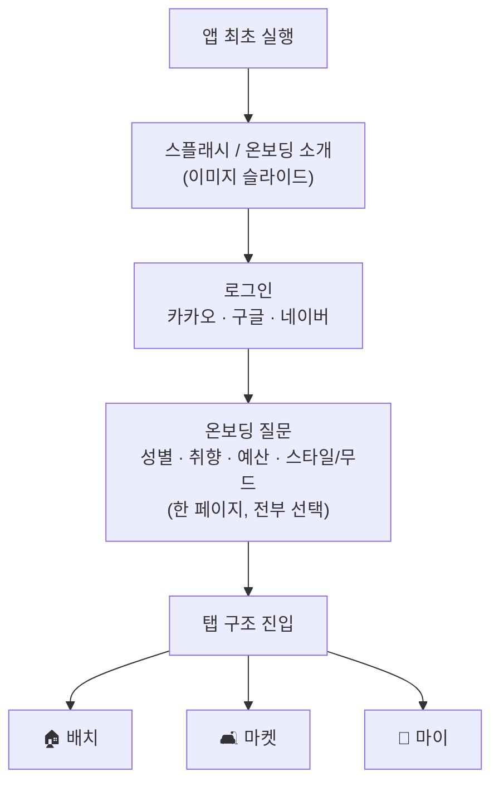
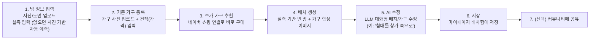

# 🧚 방꾸요정 — 앱 구조 (온보딩 · 탭 구조)

> 클로드 디자인 프로토타입 제작용 화면 구조 정리. [기능명세서](방꾸요정-기능명세서.md) §4 화면 명세를 탭 기반 IA로 재구성한 버전. 기능의 동작·데이터·정직 원칙은 기능명세서가 정본이고, 이 문서는 **화면 배치·내비게이션 구조**만 다룬다.

---

## 1. 진입 전 단계 (앱 최초 실행)

| 단계 | 화면 | 내용 |
|---|---|---|
| 1 | 스플래시/온보딩 소개 | 앱 설명 이미지 슬라이드 (배민 스타일) |
| 2 | 로그인 | 카카오 / 구글 / 네이버 |
| 3 | 온보딩 질문 | **성별 · 취향 · 예산 · 스타일/무드**를 한 페이지에서 전부 선택 가능하게 |

---

## 2. 탭 구조 (3탭)

### 🏠 배치 (홈)

방 하나를 처음부터 끝까지 완성하는 메인 플로우. 스텝형으로 진행.

- 탭 진입 시 **"새로 시작하기" / "진행 중이던 배치 이어하기"** 분기 처리.

### 🛋️ 마켓

방 작업과 무관하게 가구 자체를 둘러보는 공간 (쿠팡 형식).

| 기능 | 내용 |
|---|---|
| 가구 둘러보기 | 스타일/무드별 큐레이션 |
| 필터링 | 분위기, 가격대, 사이즈 등 |
| 내 방에 미리보기 | 가구 선택 시 내 방 사진에 합성해서 보여줌 (홈탭 없이도 가볍게 체험 가능) |
| 구매 연결 | 네이버 쇼핑 등 딥링크 |

### 👤 마이

| 기능 | 내용 |
|---|---|
| 프로필 설정 | 스타일/예산 태그 수정 |
| 배치함 | 저장한 배치안 목록, 비교/재수정 |
| 방 실측 정보 수정 | — |
| 계정/설정 | 로그인 정보, 알림 등 |
| 커뮤니티 게시물 관리 | 내가 꾸민 집 커뮤니티 게시물 관리 |

---

## 3. 커뮤니티 (위치 미정)

완성된 배치 이미지 기반 "자랑하기" 피드. 프로필 설정 후 노출.

**결정 필요한 옵션 3가지:**

| 옵션 | 형태 |
|---|---|
| A | 4번째 탭으로 독립 |
| B | 마이페이지 하위 |
| C | 홈(배치 탭) 피드에 통합 |

> 참고: 탭바가 3~4개를 넘어가면 각 탭의 존재감이 약해지고, 커뮤니티 콘텐츠(다른 유저 배치)가 충분히 쌓이기 전까진 독립 탭(A)이 빈 공간처럼 보일 위험이 있음. **마켓 탭 안에 "커뮤니티 배치 둘러보기" 토글로 넣거나(B/C의 중간), 우선 B로 시작해서 이용량이 늘면 A로 승격**하는 방향을 이전 논의에서 검토했음 — 최종 결정은 D0에서.

---

## 4. 온보딩 질문 상세

| 질문 | 답변 | UI | 스킵 |
|---|---|---|---|
| 성별을 알려주세요 | 여성 / 남성 / 선택 안 함 | 3버튼 선택 | 가능 |
| 방에서 주로 뭘 하며 시간을 보내세요? | 잠만 자요 / 재택·과제 작업 / 취미생활 / 손님 초대 / 요리·홈카페 (복수선택) | 카드 다중선택 (최대 3개) | 가능 |
| 어떤 분위기의 방을 원하세요? | 포근한 북유럽 / 시크한 인더스트리얼 / 화사한 내추럴 / 미니멀 화이트 / 빈티지 레트로 / 러블리 파스텔 (최대 2개) | 이미지 카드 2x3 | 가능 |
| 가구 구매에 쓸 예산은 어느 정도인가요? | 10만원 이하 / 10~30 / 30~50 / 50~100 / 100+ | 슬라이더 or 5단계 버튼 | 가능 (기본값 30~50만원) |

> 참고: 예산·스타일/무드는 §3-d 가구 추천 큐레이션에 직접 쓰이는 값이라 다운스트림이 명확함. 성별·취향은 현재 기능명세서 로직에 직접 연결된 곳이 없어 — 프로토타입 단계에선 넣어도 무방하나, 실개발 단계에서 실제로 추천 필터에 반영할지(예: 취향 → 책상 필요 여부) 여부를 D0에서 정해야 함.
